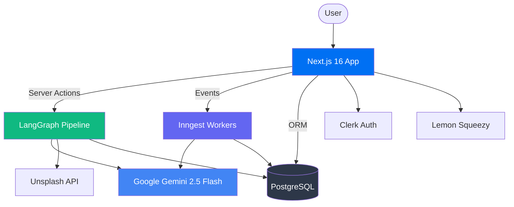

<div align="center">

# ✦ Verto AI

### AI-Powered Presentation & Design Platform

*Transform your ideas into stunning, professional presentations in seconds — powered by a multi-agent AI pipeline.*

[](https://nextjs.org)
[](https://typescriptlang.org)
[](https://react.dev)
[](https://prisma.io)
[](https://langchain-ai.github.io/langgraphjs/)

</div>

---

## What is Verto AI?

Verto AI is a full-stack SaaS platform that uses a **multi-agent LangGraph pipeline** to generate complete, visually polished presentations from a single topic prompt. Users describe what they want, and an 8-agent AI workflow produces structured outlines, layout-aware content, real images, and a fully interactive slide deck — all in under a minute.

Beyond generation, Verto provides a **visual slide editor** with drag-and-drop components, real-time theme switching, PDF export, public sharing, and a separate **mobile design generation** system powered by Inngest background jobs.

## Key Features

| Feature | Description |
|---------|-------------|
| 🤖 **AI Presentation Generation** | 8-agent LangGraph pipeline: outline → layout → content → images → slides |
| 🎨 **Visual Slide Editor** | Drag-and-drop with 24 component types, undo/redo, theme switching |
| 📱 **Mobile Design Generation** | Inngest-powered background AI generation of mobile UI screens |
| 📡 **Real-Time Progress** | SSE streaming + database-persisted step tracking during generation |
| 📄 **PDF Export** | Client-side export via html2canvas + jsPDF |
| 🔗 **Public Sharing** | Owner-controlled publish/unpublish with public share links |
| 💳 **Subscriptions** | Lemon Squeezy integration with webhook-based status sync |
| 🌙 **Dark/Light Themes** | Full theming system with multiple built-in presentation themes |

## Architecture at a Glance



## Tech Stack

| Layer | Technology | Version |
|-------|-----------|---------|
| **Framework** | Next.js (App Router, Turbopack) | 16.0.7 |
| **Language** | TypeScript (strict mode) | 5.x |
| **UI Runtime** | React (with React Compiler) | 19.2.1 |
| **AI / LLM** | Google Gemini 2.5 Flash via AI SDK + LangChain | — |
| **Orchestration** | LangGraph (stateful multi-agent workflow) | 0.4.8 |
| **Database** | PostgreSQL via Prisma ORM | Prisma 6.7 |
| **Auth** | Clerk | 6.19.2 |
| **State** | Zustand (persisted, undo/redo) | 5.0.4 |
| **Background Jobs** | Inngest | 3.49.3 |
| **Payments** | Lemon Squeezy | — |
| **UI Components** | Radix UI + shadcn/ui + Tailwind CSS v4 | — |
| **Animations** | Framer Motion + GSAP | — |
| **Validation** | Zod + react-hook-form | — |
| **Export** | html2canvas + jsPDF | — |

## Quick Start

### Prerequisites

- **Node.js** 18+ 
- **bun** (package manager) — `npm install -g bun`
- **PostgreSQL** database (local or hosted via Supabase/Neon)
- **Clerk** account for authentication
- **Google AI** API key for Gemini

### Setup

```bash
# 1. Clone the repository
git clone <repo-url> && cd verto-ai

# 2. Install dependencies
bun install

# 3. Configure environment
cp .env.example .env
# Fill in DATABASE_URL, CLERK keys, GOOGLE_GENERATIVE_AI_API_KEY, etc.

# 4. Setup database
npx prisma migrate dev
npx prisma generate

# 5. Start development server
bun run dev
# → http://localhost:3000

# 6. (Optional) Start Inngest dev server for mobile design generation
bun run inngest:dev
# → Inngest dashboard at http://localhost:8288
```

## Project Structure

```
verto-ai/
├── prisma/
│   └── schema.prisma              # Database schema (6 models)
├── src/
│   ├── actions/                   # Server Actions (11 files)
│   │   ├── projects.ts            # Project CRUD
│   │   ├── generatePresentation.ts # V2 generation entry point
│   │   ├── presentation-generation.ts # Run tracking
│   │   ├── project-access.ts      # Ownership enforcement
│   │   ├── project-share.ts       # Publish/share controls
│   │   ├── subscription.ts        # Subscription management
│   │   └── ...
│   ├── agentic-workflow-v2/       # ★ Core AI Pipeline
│   │   ├── actions/               # LangGraph graph definition
│   │   ├── agents/                # 8 specialized agents
│   │   ├── lib/                   # State, LLM config, validators
│   │   └── utils/                 # Image providers, retry logic
│   ├── app/                       # Next.js App Router
│   │   ├── (auth)/                # Sign-in / Sign-up routes
│   │   ├── (protected)/           # Authenticated routes
│   │   │   ├── (pages)/           # Dashboard, create, settings
│   │   │   ├── presentation/      # Slide editor
│   │   │   └── present/           # Presentation mode
│   │   ├── api/                   # API routes (SSE, webhooks)
│   │   ├── share/                 # Public share route
│   │   └── landing-v2/            # Marketing landing page
│   ├── components/                # React components
│   │   ├── global/                # Sidebar, editor, workflow UI
│   │   ├── presentation/          # PresentationViewer
│   │   ├── LandingPageV2/         # Landing page sections
│   │   └── ui/                    # shadcn/ui primitives
│   ├── hooks/                     # Custom React hooks
│   ├── lib/                       # Utilities, types, constants
│   │   └── streaming/             # SSE event emitter
│   ├── mobile-design/             # Mobile design subsystem
│   │   └── inngest/               # Background generation functions
│   ├── store/                     # Zustand stores (6 stores)
│   └── provider/                  # Theme provider
└── docs/                          # Project documentation
```

## Documentation

| Document | Description |
|----------|-------------|
| [Architecture Overview](docs/01-architecture-overview.md) | System diagrams, request flows, module dependencies |
| [Technology Stack](docs/02-technology-stack.md) | Every dependency with version and rationale |
| [Agentic Workflow](docs/03-agentic-workflow.md) | Deep-dive into the 8-agent AI pipeline |
| [Data Model](docs/04-data-model.md) | Database schema, relationships, JSON structures |
| [API Reference](docs/05-api-reference.md) | Server actions, API routes, webhooks |
| [Frontend Architecture](docs/06-frontend-architecture.md) | Components, state, routing, rendering |
| [Development Guide](docs/07-development-guide.md) | Setup, workflows, debugging, conventions |
| [Deployment Guide](docs/08-deployment-guide.md) | Production deployment & infrastructure |
| [Security](docs/09-security.md) | Auth, authorization, data protection |
| [Testing Strategy](docs/10-testing-strategy.md) | Smoke tests, future testing approach |
| [Contributing Guide](docs/contributing.md) | Guidelines for code style and PR process |
| [Glossary](docs/glossary.md) | Definitions of terms and concepts |
| [Templates Specification](docs/templates-specs.md) | Deep-dive into the templates feature |
| [Engineering Walkthrough](docs/V2_ENGINEERING_WALKTHROUGH.md) | Technical walkthrough of the V2 architecture |
| [Walkthrough Guide](docs/WALKTHROUGH_GUIDE.md) | Step-by-step guide to the codebase |

## Scripts

| Script | Command | Description |
|--------|---------|-------------|
| `dev` | `bun run dev` | Start dev server (Turbopack) |
| `inngest:dev` | `bun run inngest:dev` | Start Inngest local dev server |
| `build` | `bun run build` | Production build |
| `start` | `bun run start` | Start production server |
| `lint` | `bun run lint` | Run ESLint |

> **Note**: `prisma generate` runs automatically before `dev` via the `predev` script.

## License

Private — All rights reserved.
