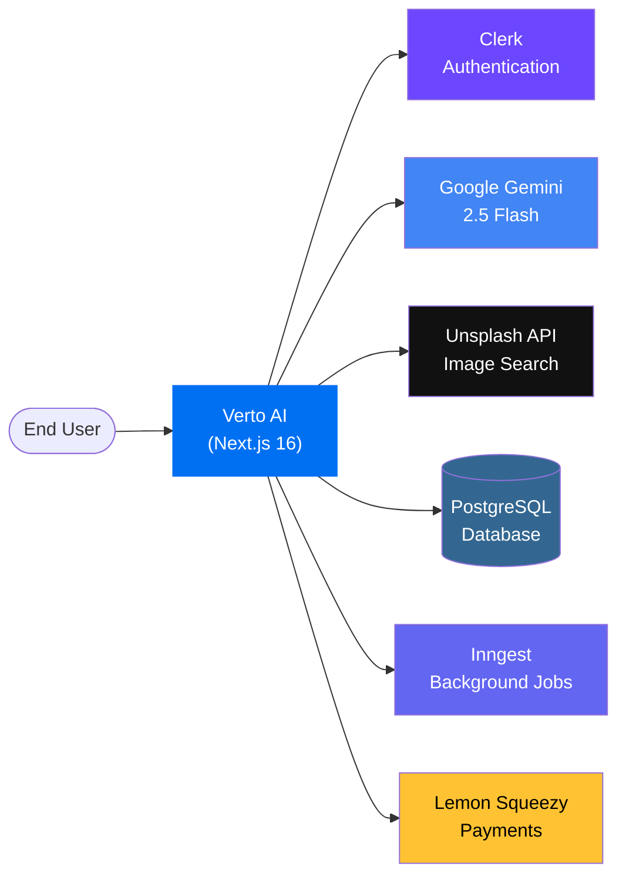
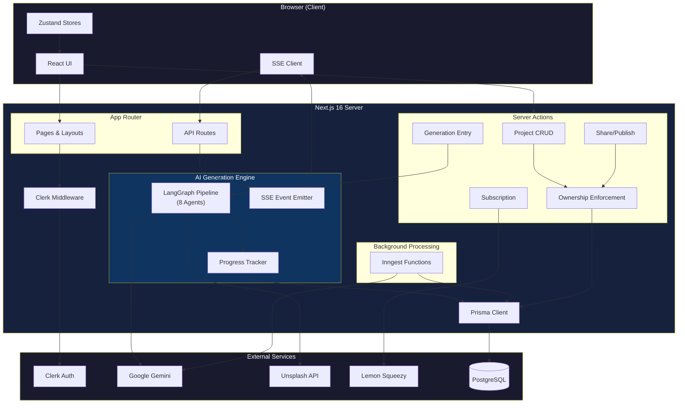
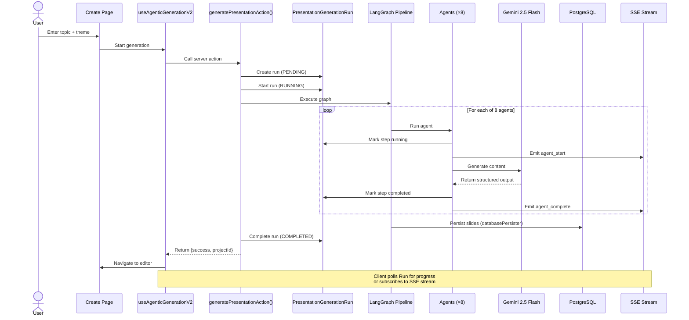
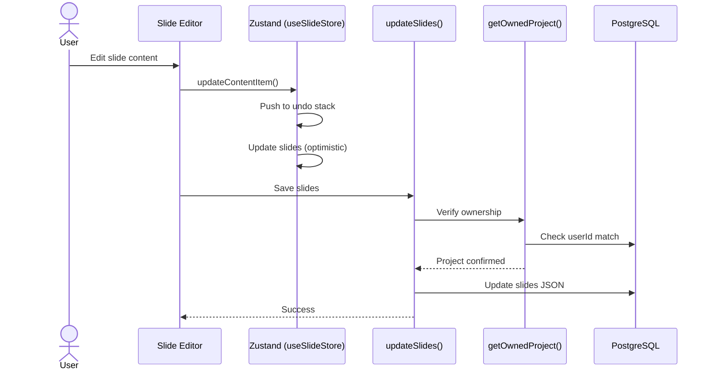
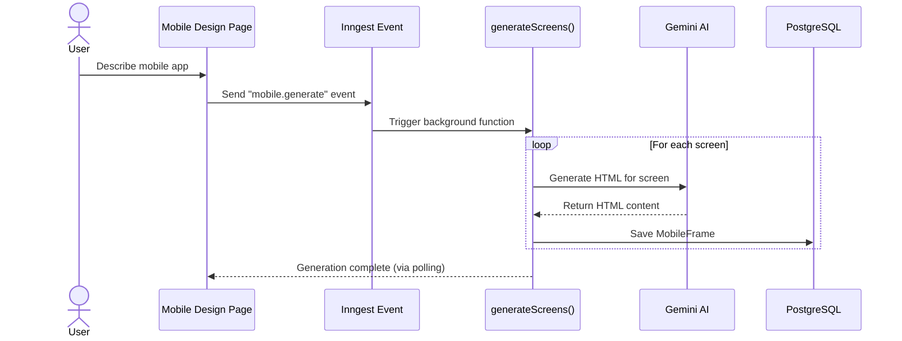
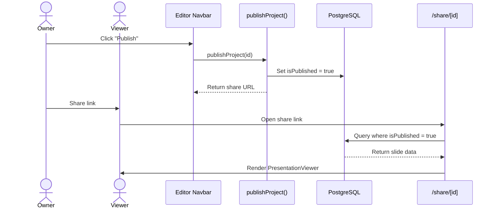
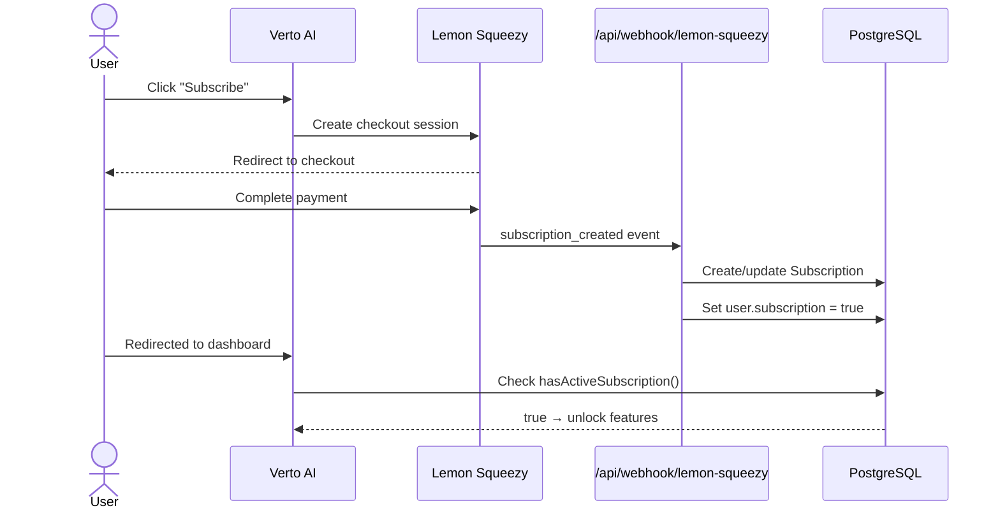
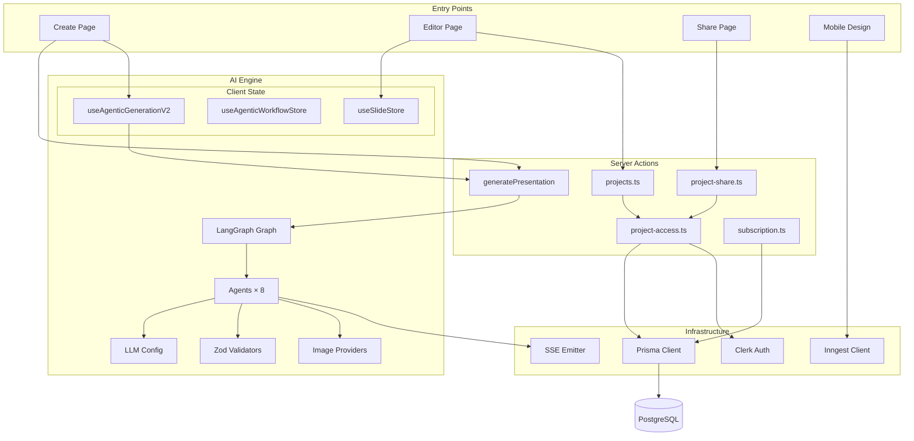

# Architecture Overview

> This document describes the high-level architecture of Verto AI. It is intended to give new contributors a mental model of the system before diving into code.

---

## Table of Contents

- [System Context](#system-context)
- [High-Level Architecture](#high-level-architecture)
- [Core Subsystems](#core-subsystems)
- [Request Flow Diagrams](#request-flow-diagrams)
- [Module Dependency Map](#module-dependency-map)
- [Key Architectural Principles](#key-architectural-principles)

---

## System Context

Verto AI is a Next.js 16 full-stack application that integrates with several external services to deliver its functionality.



| Service | Purpose | Integration Point |
|---------|---------|------------------|
| **Clerk** | User authentication & identity | Middleware + `@clerk/nextjs` |
| **Google Gemini** | LLM for content generation | AI SDK (`@ai-sdk/google`) + LangChain |
| **Unsplash** | Stock image search for slides | REST API via `imageProviders.ts` |
| **PostgreSQL** | Primary data store | Prisma ORM |
| **Inngest** | Background job processing | Event-driven functions for mobile design |
| **Lemon Squeezy** | Subscription billing | Webhook-based status sync |

---

## High-Level Architecture



---

## Core Subsystems

### 1. AI Generation Engine (`src/agentic-workflow-v2/`)

The heart of Verto AI. A **LangGraph state machine** that orchestrates 8 specialized agents to transform a topic into a complete slide deck.

**Key files**:
- `actions/advanced-genai-graph.ts` — Graph definition and execution
- `agents/` — 8 agent implementations
- `lib/state.ts` — Shared state schema
- `lib/llm.ts` — Model configuration
- `lib/validators.ts` — Zod schemas for LLM output validation

→ **Deep dive**: [03-agentic-workflow.md](03-agentic-workflow.md)

### 2. Slide Editor (`src/app/(protected)/presentation/`)

A visual editor built on a **recursive component tree**. Slides are stored as nested `ContentItem` JSON, rendered by `MasterRecursiveComponent`, and managed by a Zustand store with undo/redo.

**Key files**:
- `[presentationId]/page.tsx` — Editor page
- `_components/editor/MasterRecursiveComponent.tsx` — Recursive renderer
- `_components/editor/Editor.tsx` — Editor layout
- `src/store/useSlideStore.tsx` — Slide state with undo/redo

### 3. Server Actions (`src/actions/`)

All backend operations are implemented as Next.js **Server Actions** — no traditional REST endpoints. Every action authenticates the user via Clerk and enforces project ownership.

**Key files**:
- `project-access.ts` — `getOwnedProject()` helper (centralized ownership check)
- `projects.ts` — CRUD operations
- `generatePresentation.ts` — Generation entry point
- `presentation-generation.ts` — Run lifecycle tracking

→ **Deep dive**: [05-api-reference.md](05-api-reference.md)

### 4. Mobile Design System (`src/mobile-design/`)

A separate subsystem for generating mobile UI screens using AI. Unlike presentations, this uses **Inngest background functions** for generation because it produces raw HTML frames.

**Key files**:
- `inngest/functions/generateScreens.ts` — Screen generation function
- `inngest/functions/regenerateFrame.ts` — Individual frame regeneration

### 5. Payment & Subscription (`src/actions/subscription.ts`, `payment.ts`)

Lemon Squeezy integration for subscription billing. The flow is:
1. User initiates checkout via `buySubscription()` → redirects to Lemon Squeezy
2. Webhook (`/api/webhook/lemon-squeezy`) receives events → updates local `Subscription` model
3. Feature gating via `hasActiveSubscription()`

---

## Request Flow Diagrams

### 1. Presentation Generation

The primary user journey: topic → complete slide deck.



### 2. Slide Editing

Real-time editing with optimistic Zustand updates and server persistence.



### 3. Mobile Design Generation

Background processing via Inngest for mobile screen generation.



### 4. Share & Present

Owner-controlled publication with public access.



### 5. Payment Flow

Lemon Squeezy checkout with webhook-based sync.



---

## Module Dependency Map



---

## Key Architectural Principles

### 1. Server-First

All data mutations happen through **Next.js Server Actions**, not REST APIs. This eliminates API boilerplate, provides automatic CSRF protection, and keeps business logic close to the data layer.

> Exception: The SSE streaming endpoint (`/api/generation/stream`) and webhooks use API Routes because they require long-lived connections or external POST callbacks.

### 2. Agent-Based AI Orchestration

Presentation generation is decomposed into **8 specialized agents** rather than one monolithic LLM prompt. Each agent has:
- A single responsibility
- Its own LLM temperature/token config
- Zod validation on outputs
- Independent error handling and retry logic

This makes the pipeline testable, debuggable, and extensible.

### 3. Database-Persisted Progress

Generation progress is tracked in the `PresentationGenerationRun` table, not simulated on the client. The server writes real step status as each agent completes, and the client polls this record. This means:
- Progress survives page refreshes
- Multiple devices see the same state  
- Failures are recorded with the exact failing step

### 4. Recursive Component Rendering

Slides are stored as a recursive tree of `ContentItem` nodes. The `MasterRecursiveComponent` walks this tree and renders the appropriate component for each node type. This enables:
- Arbitrarily nested layouts (columns within columns)
- Consistent rendering between editor, presentation mode, and export
- Drag-and-drop at any nesting level

### 5. Owner-Controlled Access

Every project mutation checks ownership via `getOwnedProject()`:
```
Client → Server Action → getOwnedProject(id) → verify userId match → proceed or reject
```
Public access is opt-in: projects are only visible via share links when `isPublished = true`.

### 6. Layout-First Content Generation

The AI pipeline selects **layouts before writing content**. This ensures content is structurally aware of its target layout — e.g., a comparison layout produces `comparisonPointsA/B`, a stats layout produces `statValue/statLabel`. This eliminates post-generation reformatting.

---

*Next: [02-technology-stack.md](02-technology-stack.md) — detailed technology decisions and dependency reference.*
