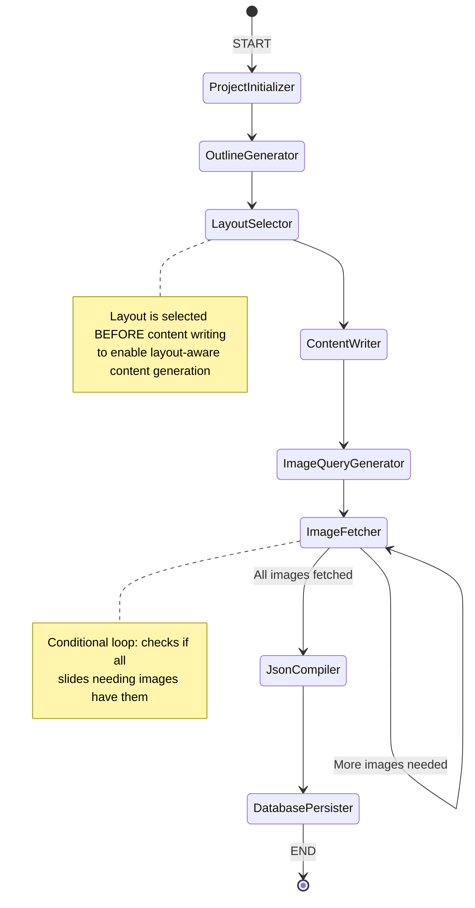
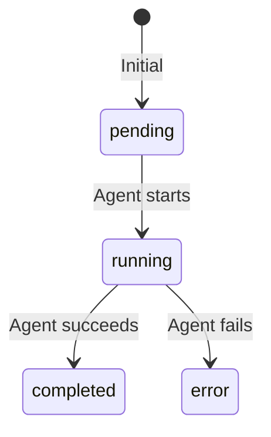
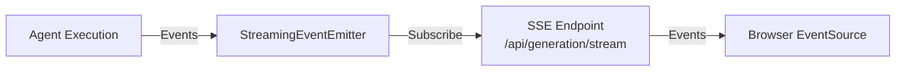
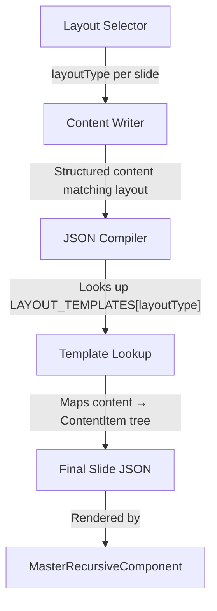

# Agentic Workflow — AI Presentation Generation Pipeline

> This is the most complex subsystem in Verto AI. It describes the multi-agent LangGraph pipeline that transforms a plain-text topic into a complete, visually polished slide deck.

---

## Table of Contents

- [Overview](#overview)
- [Architecture Diagram](#architecture-diagram)
- [State Schema](#state-schema)
- [Agent Reference](#agent-reference)
- [Graph Execution](#graph-execution)
- [Progress Tracking](#progress-tracking)
- [Streaming Integration](#streaming-integration)
- [Error Handling & Retry Logic](#error-handling--retry-logic)
- [LLM Configuration](#llm-configuration)
- [Layout Template System](#layout-template-system)

---

## Overview

The Agentic Workflow V2 is a **LangGraph-based state machine** that orchestrates 8 specialized AI agents to generate presentations. Each agent is responsible for a single step in the pipeline, receives shared state, and contributes its output back to that state.

| Property | Value |
|----------|-------|
| **Entry point** | `generateAdvancedPresentation()` in `src/agentic-workflow-v2/actions/advanced-genai-graph.ts` |
| **Server action wrapper** | `generatePresentationAction()` in `src/actions/generatePresentation.ts` |
| **Framework** | LangGraph (`@langchain/langgraph@^0.4.8`) |
| **LLM** | Google Gemini 2.5 Flash |
| **Agent count** | 8 sequential agents |
| **State model** | `AdvancedPresentationState` |
| **Recursion limit** | 150 (to allow image fetcher loops) |

### Input → Output

```
Input:  { userId, topic, additionalContext?, themePreference, outlines? }
Output: { success, projectId, slides[], outlines[], slideCount }
```

---

## Architecture Diagram



### Detailed Flow with Data

```mermaid
graph LR
    A[Project Initializer] -->|projectId| B[Outline Generator]
    B -->|outlines[]| C[Layout Selector]
    C -->|layoutType per slide| D[Content Writer]
    D -->|structured content per slide| E[Image Query Generator]
    E -->|imageQuery per slide| F[Image Fetcher]
    F -->|imageUrl per slide| G[JSON Compiler]
    G -->|Slide[] final JSON| H[Database Persister]
    
    style A fill:#6366f1,color:#fff
    style B fill:#8b5cf6,color:#fff
    style C fill:#a78bfa,color:#fff
    style D fill:#7c3aed,color:#fff
    style E fill:#6d28d9,color:#fff
    style F fill:#5b21b6,color:#fff
    style G fill:#4c1d95,color:#fff
    style H fill:#3b0764,color:#fff
```

---

## State Schema

All agents share and mutate a single state object: `AdvancedPresentationState`

**Defined in**: `src/agentic-workflow-v2/lib/state.ts`

### AdvancedPresentationState

| Field | Type | Default | Description |
|-------|------|---------|-------------|
| `generationRunId` | `string?` | `undefined` | Tracks the generation run for progress |
| `projectId` | `string \| null` | `null` | Created by Project Initializer |
| `userId` | `string` | `""` | Clerk user ID |
| `userInput` | `string` | `""` | The presentation topic/title |
| `additionalContext` | `string?` | `undefined` | Extra context provided by user |
| `themePreference` | `string` | `"light"` | Theme name from constants |
| `streamEventHandler` | `function?` | `undefined` | SSE event emission callback |
| `outlines` | `string[] \| null` | `null` | Generated or user-provided outlines |
| `slideData` | `SlideGenerationData[]` | `[]` | Per-slide tracking during generation |
| `finalPresentationJson` | `Slide[] \| null` | `null` | Final compiled slide JSON |
| `error` | `string \| null` | `null` | Error message if failed |
| `currentStep` | `string` | `"Initializing"` | Current agent name |
| `progress` | `number` | `0` | 0-100 progress percentage |
| `retryCount` | `number` | `0` | Retry attempt counter |

### SlideGenerationData

Per-slide tracking object populated incrementally by each agent:

| Field | Populated By | Description |
|-------|-------------|-------------|
| `outline` | Outline Generator | Slide topic/theme |
| `slideTitle` | Content Writer | Generated title |
| `subtitle` | Content Writer | Generated subtitle |
| `slideContent` | Content Writer | Main body content |
| `layoutType` | Layout Selector | Selected layout template |
| `imageQuery` | Image Query Gen. | Search query for images |
| `imageUrl` | Image Fetcher | URL of fetched image |
| `finalJson` | JSON Compiler | Compiled ContentItem tree |
| `validationStatus` | JSON Compiler | `'pending' \| 'valid' \| 'invalid'` |

#### Structured Content Fields (Premium Layouts)

These optional fields are populated by the Content Writer when a specialized layout is selected:

| Field | Layouts Using It |
|-------|-----------------|
| `statValue`, `statLabel` | bigNumberLayout, statsRow |
| `stats[]` | statsRow, bentoGrid |
| `comparisonLabelA/B`, `comparisonPointsA/B` | comparisonLayout |
| `quoteText`, `quoteAttribution` | quoteLayout |
| `processSteps[]` | processFlow, timelineLayout |
| `gridItems[]` | iconGrid, bentoGrid |
| `ctaButtonText` | callToAction, creativeHero |
| `sectionNumber` | sectionDivider |
| `columnHeadings[]` | columnsWithHeadings |

---

## Agent Reference

### 1. Project Initializer

| Property | Value |
|----------|-------|
| **File** | `agents/projectInitializer.ts` |
| **Uses LLM** | No |
| **Input** | `userId`, `userInput`, `themePreference` |
| **Output** | `projectId` |
| **Progress** | 10% |

Creates the `Project` record in PostgreSQL via Prisma. Sets the title, theme, and user association. This ensures all subsequent agents have a `projectId` to reference.

---

### 2. Outline Generator

| Property | Value |
|----------|-------|
| **File** | `agents/outlineGenerator.ts` |
| **Uses LLM** | Yes — Gemini 2.5 Flash |
| **Temperature** | 0.8 (creative) |
| **Max Tokens** | 2,000 |
| **Input** | `userInput`, `additionalContext` |
| **Output** | `outlines[]`, `slideData[]` (initialized) |
| **Validation** | `outlineSchema` (Zod) |
| **Progress** | 20% |

Generates a structured list of slide topics/outlines from the user's input. If the user provides pre-made outlines, this agent respects them instead of generating new ones. Validates output with Zod to ensure proper array structure.

**Zod schema**:
```typescript
outlineSchema = z.object({
  outlines: z.array(z.string()).min(3).max(20)
})
```

---

### 3. Layout Selector

| Property | Value |
|----------|-------|
| **File** | `agents/layoutSelector.ts` |
| **Uses LLM** | Yes — Gemini 2.5 Flash |
| **Temperature** | 0.3 (consistent) |
| **Max Tokens** | 1,000 |
| **Input** | `outlines[]`, `slideData[]` |
| **Output** | `slideData[].layoutType` |
| **Validation** | `layoutSelectionSchema` (Zod) |
| **Progress** | 30% |

**Runs BEFORE content writing.** Selects the best layout template for each slide based on its outline topic. This is a critical architectural decision — content is generated *after* layout selection so it can be structurally aware of its target layout.

Available layout types include: `titleSlide`, `contentWithImage`, `twoColumn`, `threeColumn`, `fourColumn`, `imageGallery`, `bigNumberLayout`, `comparisonLayout`, `quoteLayout`, `processFlow`, `timelineLayout`, `iconGrid`, `bentoGrid`, `callToAction`, `sectionDivider`, `creativeHero`, and more.

---

### 4. Content Writer

| Property | Value |
|----------|-------|
| **File** | `agents/contentWriter.ts` |
| **Uses LLM** | Yes — Gemini 2.5 Flash |
| **Temperature** | 0.7 (balanced) |
| **Max Tokens** | 8,000 |
| **Input** | `outlines[]`, `slideData[].layoutType` |
| **Output** | `slideData[].slideTitle`, `.slideContent`, structured fields |
| **Validation** | `bulkContentSchema` (Zod) |
| **Progress** | 45% |

Generates layout-aware content for all slides in a single LLM call. Because it knows the selected layout, it produces the right structured data:
- For a `comparisonLayout` → generates `comparisonPointsA`, `comparisonPointsB`
- For a `bigNumberLayout` → generates `statValue`, `statLabel`
- For a `quoteLayout` → generates `quoteText`, `quoteAttribution`

This layout-awareness eliminates post-generation reformatting and ensures premium visual output.

---

### 5. Image Query Generator

| Property | Value |
|----------|-------|
| **File** | `agents/imageQueryGenerator.ts` |
| **Uses LLM** | Yes — Gemini 2.5 Flash |
| **Temperature** | 0.7 |
| **Max Tokens** | 2,000 |
| **Input** | `slideData[]` (with content and layout) |
| **Output** | `slideData[].imageQuery` |
| **Validation** | `imageQuerySchema` (Zod) |
| **Progress** | 60% |

Generates targeted search queries for slides that require images (based on layout type). Only generates queries for layouts flagged as `requiresImage: true`.

---

### 6. Image Fetcher

| Property | Value |
|----------|-------|
| **File** | `agents/imageFetcher.ts` |
| **Uses LLM** | No |
| **Input** | `slideData[].imageQuery` |
| **Output** | `slideData[].imageUrl` |
| **Progress** | 75% |
| **Special** | Conditional loop via `shouldFetchMoreImages()` |

Fetches real images from the configured **image provider** (Unsplash by default). Uses a provider abstraction pattern:

**Provider hierarchy** (defined in `utils/imageProviders.ts`):
1. **UnsplashImageProvider** — Real Unsplash API search (requires `UNSPLASH_ACCESS_KEY`)
2. **FallbackImageProvider** — Categorized placeholder images (used when Unsplash is unavailable)

The `shouldFetchMoreImages()` conditional edge function checks if all image-requiring slides have URLs. If not, the graph loops back to this agent.

**Image provider interface**:
```typescript
interface ImageProvider {
  readonly id: string;
  searchImages(query: string, options?: ImageSearchOptions): Promise<ImageSearchResult[]>;
}
```

---

### 7. JSON Compiler

| Property | Value |
|----------|-------|
| **File** | `agents/jsonCompiler.ts` (54KB — largest agent) |
| **Uses LLM** | Yes — Gemini 2.5 Flash |
| **Temperature** | 0.2 (precise) |
| **Max Tokens** | 8,000 |
| **Input** | `slideData[]` (complete with content, layout, images) |
| **Output** | `finalPresentationJson` (Slide[]) |
| **Progress** | 85% |

The most complex agent. Maps structured content + layout type → recursive `ContentItem` tree (the slide JSON format used by the editor). This involves:

1. Looking up the **layout template** for each slide's `layoutType`
2. Mapping structured content fields into the template's content structure
3. Producing a valid `Slide[]` array with proper `id`, `slideName`, `type`, `className`, and nested `content` tree
4. Validating the output structure

The output of this agent is the final slide JSON that gets rendered by `MasterRecursiveComponent` in the editor.

---

### 8. Database Persister

| Property | Value |
|----------|-------|
| **File** | `agents/databasePersister.ts` |
| **Uses LLM** | No |
| **Input** | `projectId`, `finalPresentationJson`, `outlines` |
| **Output** | Updated Project record |
| **Progress** | 100% |

Saves the final compiled slides JSON and outlines to the `Project` record in PostgreSQL. After this agent completes, the presentation is available in the editor.

---

## Graph Execution

### The `wrapNode()` Pattern

Every agent is wrapped by `wrapNode()` in `advanced-genai-graph.ts`. This wrapper provides:

1. **Progress tracking** — Marks step as `running` in `PresentationGenerationRun`
2. **SSE streaming** — Emits `agent_start` and `agent_complete` events
3. **Error handling** — Catches errors, marks run as `FAILED`, emits error events

```typescript
const wrapNode = (nodeName, agentName, handler) => {
  return async (state) => {
    // 1. Mark step running + emit agent_start
    await markPresentationGenerationStepRunning(runId, nodeName);
    streamingEmitter.emitAgentStart(runId, nodeName, agentName);
    
    // 2. Execute agent
    const result = await handler(state);
    
    // 3. Mark step completed + emit agent_complete
    await markPresentationGenerationStepCompleted(runId, nodeName);
    streamingEmitter.emitAgentComplete(runId, nodeName, result);
    
    return result;
  };
};
```

### State Channel Configuration

LangGraph uses **channels** to define how state updates are merged. All fields use a simple "last write wins" strategy:

```typescript
const channels = {
  projectId:  { value: (_x, y) => y, default: () => null },
  outlines:   { value: (_x, y) => y, default: () => null },
  slideData:  { value: (_x, y) => y, default: () => [] },
  // ... etc
};
```

### Graph Edge Definition

```typescript
graph
  .addEdge(START, "projectInitializer")
  .addEdge("projectInitializer", "outlineGenerator")
  .addEdge("outlineGenerator", "layoutSelector")       // Layout BEFORE content
  .addEdge("layoutSelector", "contentWriter")
  .addEdge("contentWriter", "imageQueryGenerator")
  .addEdge("imageQueryGenerator", "imageFetcher")
  .addConditionalEdges("imageFetcher", shouldFetchMoreImages, {
    imageFetcher: "imageFetcher",   // Loop back
    jsonCompiler: "jsonCompiler",    // Proceed
  })
  .addEdge("jsonCompiler", "databasePersister")
  .addEdge("databasePersister", END)
```

---

## Progress Tracking

Progress is tracked via the `PresentationGenerationRun` model in PostgreSQL.

### Step Definitions

Defined in `src/agentic-workflow-v2/lib/progress.ts`:

| Step ID | Display Name | Description | Progress % |
|---------|-------------|-------------|-----------|
| `projectInitializer` | Project Setup | Preparing your presentation workspace | 10% |
| `outlineGenerator` | Structure | Organizing the presentation flow | 20% |
| `contentWriter` | Content Writing | Creating engaging text for all slides | 40% |
| `layoutSelector` | Design Layout | Selecting the best look for your slides | 55% |
| `imageQueryGenerator` | Visual Search | Finding the right visuals for each slide | 65% |
| `imageFetcher` | Image Integration | Adding beautiful visuals | 75% |
| `jsonCompiler` | Assembly | Formatting and polishing your slides | 85% |
| `databasePersister` | Finalization | Saving your masterpiece | 100% |

### Step Status Lifecycle



Each step snapshot:
```typescript
type GenerationStepSnapshot = {
  id: GenerationStepId;
  name: string;
  description: string;
  progress: number;
  status: "pending" | "running" | "completed" | "error";
  details?: string;
};
```

### Client-Side Polling

The client uses `useAgenticGenerationV2` hook to poll `getPresentationGenerationRun(runId)` at regular intervals. When the run reaches `COMPLETED` status, the hook navigates to the editor.

---

## Streaming Integration

Real-time SSE (Server-Sent Events) streaming provides instant feedback during generation.

### Architecture



### StreamEvent Types

Defined in `src/lib/streaming/EventEmitter.ts`:

```typescript
interface StreamEvent {
  type: 'progress' | 'token' | 'agent_start' | 'agent_complete' | 'error' | 'complete';
  agentId?: string;
  agentName?: string;
  content?: string;
  stepId?: string;
  progress?: number;
  output?: unknown;
  message?: string;
  projectId?: string;
  timestamp: number;
}
```

| Event Type | Emitted When | Data |
|-----------|-------------|------|
| `agent_start` | Agent begins execution | `agentId`, `agentName` |
| `progress` | Agent step progress | `stepId`, `progress` (0-100) |
| `token` | LLM emits a token | `agentId`, `content` |
| `agent_complete` | Agent finishes | `agentId`, `output` |
| `error` | Agent or system error | `message` |
| `complete` | All agents done | `projectId` |

### StreamingEventEmitter

Singleton class (`streamingEmitter`) with:
- **`subscribe(runId, callback)`** — Registers listener, replays event history
- **`emit(runId, event)`** — Emits to all listeners for a run
- **Event history** — Stores up to 1,000 events per run for replay on reconnect
- **Auto-cleanup** — Removes listeners and history when all subscribers disconnect

### SSE Endpoint

`GET /api/generation/stream?runId=xxx`

Uses `ReadableStream` for SSE. The client connects via `EventSource` or the `useStreamingGeneration` hook.

---

## Error Handling & Retry Logic

### Retry Utilities

Defined in `src/agentic-workflow-v2/utils/retryLogic.ts`:

**`retryWithBackoff(fn, config)`** — Retries a function with exponential backoff:
```typescript
const DEFAULT_RETRY_CONFIG = {
  maxRetries: 3,
  initialDelay: 1000,
  maxDelay: 10000,
  backoffMultiplier: 2,
};
```

**`executeAgentSafely(agentFn, agentName)`** — Wraps an agent with:
- Try/catch error boundary
- Structured error messages with agent name context
- Recoverable vs non-recoverable error classification

**`isRecoverableError(error)`** — Classifies errors:
- Recoverable: rate limits, timeouts, transient network errors
- Non-recoverable: validation errors, authentication failures

### Error Recording

When any agent fails:
1. `failPresentationGenerationRun()` is called with the error message and failing step ID
2. The `PresentationGenerationRun.status` is set to `FAILED`
3. The specific step's status in the `steps` JSON is set to `error`
4. An `error` SSE event is emitted
5. The client shows the error with the failing step name

---

## LLM Configuration

**Model**: `google("gemini-2.5-flash")` via `@ai-sdk/google`

**File**: `src/agentic-workflow-v2/lib/llm.ts`

### Per-Agent Configuration

```typescript
export const modelConfigs = {
  outline:     { temperature: 0.8, maxOutputTokens: 2000  },  // Creative
  content:     { temperature: 0.7, maxOutputTokens: 8000  },  // Balanced
  layout:      { temperature: 0.3, maxOutputTokens: 1000  },  // Consistent
  imageQuery:  { temperature: 0.7, maxOutputTokens: 2000  },  // Creative
  jsonCompiler:{ temperature: 0.2, maxOutputTokens: 8000  },  // Precise
};
```

**Rationale**:
- **High temperature (0.7-0.8)**: Used for creative tasks (outlines, content, image queries) where variety and originality matter
- **Low temperature (0.2-0.3)**: Used for structural tasks (layout selection, JSON compilation) where consistency and correctness are paramount

---

## Layout Template System

The layout template system defines all available slide structures and their rendering properties.

**Defined in**: `src/agentic-workflow-v2/lib/layoutTemplates.ts`

### LayoutTemplate Interface

```typescript
interface LayoutTemplate {
  type: string;           // Layout ID (e.g., "twoColumn")
  slideName: string;      // Display name
  className: string;      // CSS class for the slide
  requiresImage: boolean; // Whether the layout needs an image
  contentStructure: ContentStructureType;
}
```

### Content Structure Types

| Structure | Description | Example Layouts |
|-----------|-------------|-----------------|
| `title-only` | Title slide with minimal content | titleSlide |
| `title-content` | Title + body text | contentWithImage |
| `two-column` | Two content columns | twoColumn |
| `three-column` | Three content columns | threeColumn |
| `four-column` | Four content columns | fourColumn |
| `image-text` | Image alongside text | imageGallery |
| `image-grid` | Grid of images | imageGallery |
| `stat-showcase` | Big numbers/statistics | bigNumberLayout, statsRow |
| `comparison` | Side-by-side comparison | comparisonLayout |
| `quote` | Blockquote with attribution | quoteLayout |
| `timeline` | Sequential steps/timeline | timelineLayout |
| `image-overlay` | Text overlaid on image | creativeHero |
| `feature-grid` | Grid of features/icons | iconGrid, bentoGrid |
| `divider` | Section divider | sectionDivider |
| `process` | Process flow steps | processFlow |
| `cta` | Call-to-action | callToAction |

### How Layouts Flow Through the Pipeline



1. **Layout Selector** picks a layout type for each slide
2. **Content Writer** generates content structured for that layout type
3. **JSON Compiler** looks up the layout template and maps content → ContentItem tree
4. **MasterRecursiveComponent** renders the ContentItem tree in the editor

---

*Next: [04-data-model.md](04-data-model.md) — database schema and relationships.*
