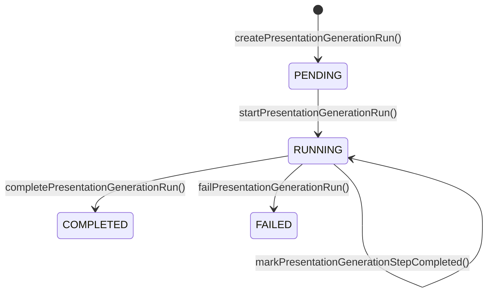

# Data Model Reference

> Complete documentation of the PostgreSQL database schema, model relationships, JSON structures, and migration history.

---

## Table of Contents

- [ER Diagram](#er-diagram)
- [Models](#models)
- [Enums](#enums)
- [JSON Schemas](#json-schemas)
- [Database Configuration](#database-configuration)
- [Migration Guide](#migration-guide)

---

## ER Diagram

```mermaid
erDiagram
    User ||--o{ Project : "owns (OwnedProjects)"
    User }o--o{ Project : "purchased (PurchasedProjects)"
    User ||--o{ MobileProject : "owns"
    User ||--o{ PresentationGenerationRun : "creates"
    User ||--o| Subscription : "has"
    MobileProject ||--o{ MobileFrame : "contains"

    User {
        uuid id PK
        string clerkId UK
        string name
        string email UK
        string profileImage
        boolean subscription
        datetime createdAt
        datetime updatedAt
        string lemonSqueezyApiKey
        string storeId
        string webhookSecret
    }

    Project {
        string id PK
        string title
        json slides
        uuid userId FK
        string[] outlines
        boolean isDeleted
        boolean isPublished
        datetime publishedAt
        boolean isSellable
        string varientId
        string thumbnail
        string themeName
        enum projectType
        datetime createdAt
        datetime updatedAt
    }

    MobileProject {
        string id PK
        uuid userId FK
        string name
        string theme
        string thumbnail
        boolean isDeleted
        datetime createdAt
        datetime updatedAt
    }

    MobileFrame {
        string id PK
        string title
        text htmlContent
        string projectId FK
        datetime createdAt
        datetime updatedAt
    }

    PresentationGenerationRun {
        string id PK
        uuid userId FK
        string topic
        enum status
        string currentStepId
        string currentStepName
        int progress
        string error
        json steps
        string projectId
        datetime completedAt
        datetime createdAt
        datetime updatedAt
    }

    Subscription {
        string id PK
        uuid userId FK UK
        string lemonSqueezyId UK
        string customerId
        string orderId
        string variantId
        enum status
        datetime renewsAt
        datetime endsAt
        datetime trialEndsAt
        datetime createdAt
        datetime updatedAt
    }
```

---

## Models

### User

The core identity model. Synced from Clerk on first authentication.

| Field | Type | Constraints | Description |
|-------|------|-------------|-------------|
| `id` | `UUID` | PK, auto-generated (`gen_random_uuid()`) | Database primary key |
| `clerkId` | `String` | **Unique** | Clerk external identity ID |
| `name` | `String` | Required | User display name |
| `email` | `String` | **Unique** | Email address |
| `profileImage` | `String?` | Optional | Avatar URL from Clerk |
| `subscription` | `Boolean?` | Default: `false` | Quick-check subscription flag |
| `createdAt` | `DateTime` | Auto | Account creation timestamp |
| `updatedAt` | `DateTime` | Auto | Last update timestamp |
| `lemonSqueezyApiKey` | `String?` | Optional | User's LS API key (marketplace sellers) |
| `storeId` | `String?` | Optional | LS store ID (marketplace sellers) |
| `webhookSecret` | `String?` | Optional | LS webhook secret (marketplace sellers) |

**Relations**:
- `Projects` → `Project[]` (as owner via `OwnedProjects`)
- `PurchasedProjects` → `Project[]` (as buyer via `PurchasedProjects`)
- `MobileProjects` → `MobileProject[]` (via `UserMobileProjects`)
- `GenerationRuns` → `PresentationGenerationRun[]`
- `Subscription` → `Subscription?` (one-to-one)

**Identity sync**: Created/upserted in `onAuthenticateUser()` (`src/actions/user.ts`). On first Clerk authentication, the user is auto-created with their Clerk profile data.

---

### Project

Stores a complete presentation deck including its rendered slide JSON.

| Field | Type | Constraints | Description |
|-------|------|-------------|-------------|
| `id` | `String` | PK, `cuid()` | Unique project identifier |
| `title` | `String` | Required | Presentation title |
| `slides` | `Json?` | Optional | **Complete slide tree as JSON** |
| `userId` | `UUID` | FK → User.id | Owner's database ID |
| `outlines` | `String[]` | Array | Slide outline/topic strings |
| `isDeleted` | `Boolean` | Default: `false` | Soft delete flag |
| `isPublished` | `Boolean` | Default: `false` | Public share visibility |
| `publishedAt` | `DateTime?` | Optional | First publish timestamp |
| `isSellable` | `Boolean` | Default: `false` | Marketplace listing flag |
| `varientId` | `String?` | Optional | LS product variant for selling |
| `thumbnail` | `String?` | Optional | Generated thumbnail URL |
| `themeName` | `String` | Default: `"light"` | Active theme name |
| `projectType` | `ProjectType` | Default: `PRESENTATION` | Differentiates project types |
| `createdAt` | `DateTime` | Auto | Creation timestamp |
| `updatedAt` | `DateTime` | Auto | Last update timestamp |

**Relations**:
- `User` → `User` (owner, via `OwnedProjects`)
- `Purchasers` → `User[]` (buyers, via `PurchasedProjects`)

**Key notes**:
- The `slides` field stores the **entire recursive ContentItem tree** as a JSON blob. See [JSON Schemas](#slide-json-structure) below.
- **Soft delete**: `isDeleted = true` means the project is in the trash but not permanently removed. `deleteAllProjects()` performs hard deletes.
- **Publishing**: `isPublished` controls visibility on the `/share/[id]` route. Setting it to `true` makes the presentation publicly accessible.

---

### MobileProject

Container for AI-generated mobile design screens.

| Field | Type | Constraints | Description |
|-------|------|-------------|-------------|
| `id` | `String` | PK, `cuid()` | Unique project identifier |
| `userId` | `UUID` | FK → User.id, indexed | Owner's database ID |
| `name` | `String` | Required | Project name |
| `theme` | `String?` | Optional | Design theme |
| `thumbnail` | `String?` | Optional | Preview thumbnail |
| `isDeleted` | `Boolean` | Default: `false` | Soft delete flag |
| `createdAt` | `DateTime` | Auto, indexed | Creation timestamp |
| `updatedAt` | `DateTime` | Auto | Last update timestamp |

**Relations**:
- `user` → `User` (owner)
- `frames` → `MobileFrame[]` (cascade delete)

**Indexes**: `userId`, `createdAt`

---

### MobileFrame

Individual screen/frame within a mobile design project. Stores raw HTML.

| Field | Type | Constraints | Description |
|-------|------|-------------|-------------|
| `id` | `String` | PK, `cuid()` | Unique frame identifier |
| `title` | `String` | Required | Screen title/name |
| `htmlContent` | `String` | `@db.Text` | **Full HTML content** of the screen |
| `projectId` | `String` | FK → MobileProject.id, indexed | Parent project |
| `createdAt` | `DateTime` | Auto | Creation timestamp |
| `updatedAt` | `DateTime` | Auto | Last update timestamp |

**Relations**:
- `project` → `MobileProject` (cascade delete — deleting a project deletes all frames)

**Key note**: `htmlContent` uses `@db.Text` for unlimited string length, as AI-generated HTML can be very large.

---

### PresentationGenerationRun

Tracks a single execution of the AI generation pipeline. Used for real-time progress tracking.

| Field | Type | Constraints | Description |
|-------|------|-------------|-------------|
| `id` | `String` | PK, `cuid()` | Unique run identifier |
| `userId` | `UUID` | FK → User.id | Owner who initiated generation |
| `topic` | `String` | Required | The generation topic |
| `status` | `PresentationGenerationStatus` | Default: `PENDING` | Run lifecycle state |
| `currentStepId` | `String?` | Optional | ID of currently executing agent |
| `currentStepName` | `String?` | Optional | Display name of current agent |
| `progress` | `Int` | Default: `0` | 0-100 percentage |
| `error` | `String?` | Optional | Error message if failed |
| `steps` | `Json?` | Optional | **Step snapshot array** (see below) |
| `projectId` | `String?` | Optional | Linked project (set after Project Initializer) |
| `completedAt` | `DateTime?` | Optional | Completion timestamp |
| `createdAt` | `DateTime` | Auto | Run start time |
| `updatedAt` | `DateTime` | Auto | Last update |

**Relations**:
- `user` → `User` (cascade delete)

**Indexes**: `(userId, createdAt)`

**Lifecycle**:



**Steps JSON structure**:
```json
[
  { "id": "projectInitializer", "name": "Project Setup", "description": "...", "progress": 10, "status": "completed" },
  { "id": "outlineGenerator", "name": "Structure", "description": "...", "progress": 20, "status": "completed" },
  { "id": "contentWriter", "name": "Content Writing", "description": "...", "progress": 40, "status": "running" },
  { "id": "layoutSelector", "name": "Design Layout", "description": "...", "progress": 55, "status": "pending" },
  ...
]
```

---

### Subscription

Lemon Squeezy subscription record synced via webhooks.

| Field | Type | Constraints | Description |
|-------|------|-------------|-------------|
| `id` | `String` | PK, `cuid()` | Database ID |
| `userId` | `UUID` | FK → User.id, **Unique** | One subscription per user |
| `lemonSqueezyId` | `String` | **Unique**, indexed | LS subscription ID |
| `customerId` | `String` | Indexed | LS customer ID |
| `orderId` | `String?` | Optional | LS order ID |
| `variantId` | `String` | Required | LS product variant ID |
| `status` | `SubscriptionStatus` | Default: `ACTIVE` | Current status |
| `renewsAt` | `DateTime?` | Optional | Next renewal date |
| `endsAt` | `DateTime?` | Optional | Cancellation end date |
| `trialEndsAt` | `DateTime?` | Optional | Trial expiration date |
| `createdAt` | `DateTime` | Auto | Subscription creation |
| `updatedAt` | `DateTime` | Auto | Last status update |

**Relations**:
- `user` → `User` (one-to-one, cascade delete)

---

## Enums

### ProjectType

```prisma
enum ProjectType {
  PRESENTATION     // Standard slide deck
  MOBILE_DESIGN    // Mobile UI design project
}
```

### PresentationGenerationStatus

```prisma
enum PresentationGenerationStatus {
  PENDING     // Created, not yet started
  RUNNING     // Agents are executing
  COMPLETED   // All agents finished successfully
  FAILED      // An agent encountered a fatal error
}
```

### SubscriptionStatus

```prisma
enum SubscriptionStatus {
  ACTIVE      // Subscription is active
  CANCELLED   // Cancelled, may still be in grace period
  EXPIRED     // Past end date
  PAST_DUE    // Payment failed, in retry period
  PAUSED      // Temporarily paused
  UNPAID      // Payment failed permanently
  ON_TRIAL    // In free trial period
}
```

---

## JSON Schemas

### Slide JSON Structure

The `Project.slides` field stores an array of `Slide` objects, each containing a recursive `ContentItem` tree.

#### Slide

```typescript
interface Slide {
  id: string;          // UUID
  slideName: string;   // Display name (e.g., "Introduction")
  type: string;        // Layout type (e.g., "twoColumn")
  slideOrder?: number; // Position in deck (0-indexed)
  className?: string;  // CSS class for styling
  content: ContentItem; // Root content node (recursive tree)
}
```

#### ContentItem (Recursive)

```typescript
interface ContentItem {
  id: string;
  type: ContentType;
  name: string;
  content: ContentItem[] | string | string[] | string[][];
  
  // Optional properties
  initialRows?: number;
  initialColumns?: number;
  restrictToDrop?: boolean;
  columns?: number;
  placeholder?: string;
  className?: string;
  alt?: string;
  callOutType?: "success" | "warning" | "info" | "question" | "caution";
  link?: string;
  code?: string;
  language?: string;
  bgColor?: string;
  isTransparent?: boolean;
  width?: number;
  height?: number;
  x?: number;
  y?: number;
  isDraggable?: boolean;
  isResizable?: boolean;
  fontSize?: string;
  fontWeight?: string;
  fontStyle?: string;
  textDecoration?: string;
  color?: string;
  textAlign?: string;
  icon?: string;
}
```

#### ContentType Union

All possible component types that can appear in a slide:

| Type | Category | Description |
|------|----------|-------------|
| `column` | Layout | Flex column container |
| `resizable-column` | Layout | Resizable column container |
| `text` | Text | Inline text element |
| `paragraph` | Text | Paragraph block |
| `heading1` | Text | H1 heading |
| `heading2` | Text | H2 heading |
| `heading3` | Text | H3 heading |
| `heading4` | Text | H4 heading |
| `title` | Text | Title element |
| `image` | Media | Image with src in `content` |
| `table` | Data | Table with rows/columns |
| `blockquote` | Text | Styled quote block |
| `numberedList` | List | Ordered list |
| `bulletedList` | List | Unordered list |
| `bulletList` | List | Alternative bullet list |
| `todoList` | List | Checkbox list |
| `code` | Code | Inline code |
| `codeBlock` | Code | Multi-line code block |
| `link` | Interactive | Hyperlink |
| `quote` | Text | Quote element |
| `divider` | Layout | Horizontal rule |
| `calloutBox` | Container | Styled callout with type |
| `customButton` | Interactive | Styled button |
| `multiColumn` | Layout | Multi-column container |
| `imageAndText` | Composite | Image + text layout |
| `blank` | Layout | Empty placeholder |
| `tableOfContents` | Navigation | Auto-generated TOC |
| `statBox` | Data | Statistic display box |
| `timelineCard` | Data | Timeline entry card |

#### Example Slide JSON

```json
{
  "id": "slide-1",
  "slideName": "Introduction",
  "type": "twoColumn",
  "slideOrder": 0,
  "className": "slide-two-column",
  "content": {
    "id": "root-1",
    "type": "column",
    "name": "Root Column",
    "content": [
      {
        "id": "title-1",
        "type": "heading1",
        "name": "Slide Title",
        "content": "Welcome to AI in Education"
      },
      {
        "id": "cols-1",
        "type": "column",
        "name": "Two Columns",
        "className": "flex-row",
        "content": [
          {
            "id": "col-left",
            "type": "column",
            "name": "Left Column",
            "content": [
              {
                "id": "para-1",
                "type": "paragraph",
                "name": "Description",
                "content": "AI is transforming how we learn..."
              }
            ]
          },
          {
            "id": "col-right",
            "type": "column",
            "name": "Right Column",
            "content": [
              {
                "id": "img-1",
                "type": "image",
                "name": "Feature Image",
                "content": "https://images.unsplash.com/...",
                "alt": "AI in education illustration"
              }
            ]
          }
        ]
      }
    ]
  }
}
```

### Theme Schema

```typescript
interface Theme {
  name: string;                    // Theme identifier
  fontFamily: string;              // CSS font-family
  fontColor: string;               // Text color (hex)
  accentColor: string;             // Primary accent color (hex)
  backgroundColor: string;         // Page background (hex)
  slideBackgroundColor?: string;   // Slide background (hex)
  sidebarColor?: string;           // Editor sidebar color
  gradientBackground?: string;     // CSS gradient
  navbarColor?: string;            // Navbar background
  type: 'light' | 'dark';         // Theme mode
}
```

---

## Database Configuration

### Prisma Setup

| Setting | Value |
|---------|-------|
| **Schema file** | `prisma/schema.prisma` |
| **Client output** | `src/generated/prisma` |
| **Provider** | PostgreSQL |
| **Connection** | `DATABASE_URL` env variable |
| **Generator** | `prisma-client-js` |

### Prisma Client Singleton

```typescript
// src/lib/prisma.ts
import { PrismaClient } from "@/generated/prisma";

const prismaClientSingleton = () => new PrismaClient();

const globalForPrisma = globalThis as unknown as {
  prisma: PrismaClient | undefined;
};

const prisma = globalForPrisma.prisma ?? prismaClientSingleton();

if (process.env.NODE_ENV !== "production") {
  globalForPrisma.prisma = prisma;
}

export default prisma;
```

This singleton pattern prevents multiple `PrismaClient` instances in development (caused by Next.js hot reloading).

---

## Migration Guide

### Running Migrations

```bash
# Create and apply a new migration
npx prisma migrate dev --name describe_your_change

# Apply pending migrations (production)
npx prisma migrate deploy

# Reset database (destructive — dev only)
npx prisma migrate reset

# Generate client after schema changes
npx prisma generate

# Open Prisma Studio (GUI)
npx prisma studio
```

### Creating a New Model

1. Define the model in [prisma/schema.prisma](../prisma/schema.prisma)
2. Add relations to existing models if needed
3. Run `npx prisma migrate dev --name add_new_model`
4. Run `npx prisma generate` (or restart dev server — `predev` handles this)
5. Import from `@/generated/prisma` in your code

### Important Notes

- **Generated client path**: [src/generated/prisma](../src/generated/prisma) (non-default). Import types from `@/generated/prisma`.
- **`predev` script**: `prisma generate` runs automatically before `bun run dev`
- **Backup**: A schema backup exists at `prisma/schema.prisma.backup`
- **UUID generation**: User IDs use `gen_random_uuid()` (PostgreSQL native)
- **CUIDs**: All other model IDs use `cuid()` (Prisma default)

---

*Next: [05-api-reference.md](05-api-reference.md) — server actions, API routes, and webhooks.*
