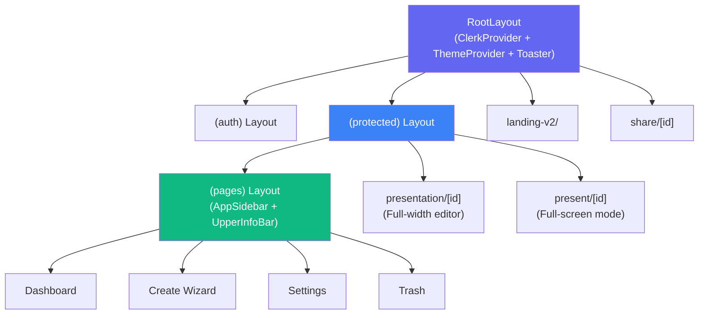
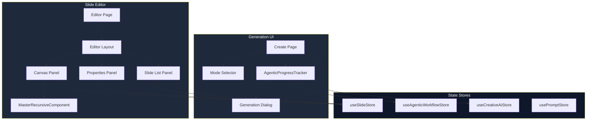
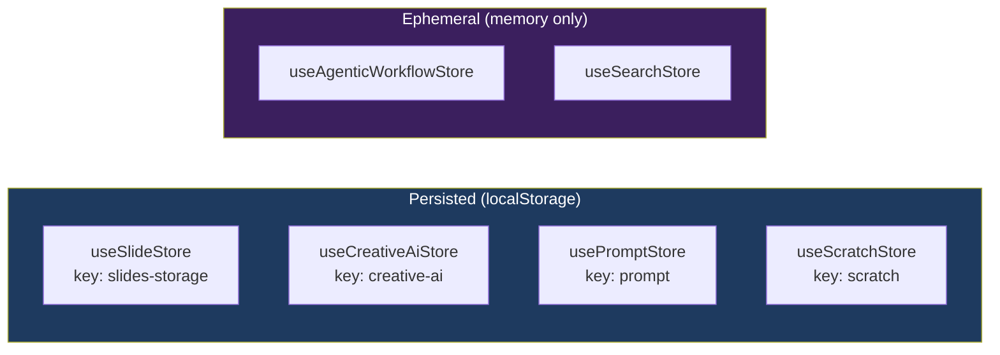

# Frontend Architecture

> Complete reference for the React component tree, state management, routing system, rendering pipeline, and UI patterns used in Verto AI.

---

## Table of Contents

- [Routing Architecture](#routing-architecture)
- [Layout System](#layout-system)
- [Component Architecture](#component-architecture)
- [State Management](#state-management)
- [Custom Hooks](#custom-hooks)
- [Slide Rendering Pipeline](#slide-rendering-pipeline)
- [Theming System](#theming-system)
- [UI Patterns & Conventions](#ui-patterns--conventions)

---

## Routing Architecture

Verto AI uses the **Next.js App Router** with route groups to separate concerns.

```
[src/app/](../src/app/)
├── layout.tsx                         # Root layout (Clerk + Theme + Toaster)
├── page.tsx                           # Landing page redirect
├── globals.css                        # Global styles
│
├── (auth)/                            # Auth route group (public)
│   ├── sign-in/[[...sign-in]]/        # Clerk sign-in
│   └── sign-up/[[...sign-up]]/        # Clerk sign-up
│
├── (protected)/                       # Authenticated route group
│   ├── layout.tsx                     # Protected layout wrapper
│   ├── (pages)/                       # Dashboard pages
│   │   ├── layout.tsx                 # Sidebar + header layout
│   │   └── (dashboardPages)/          # Dashboard sub-routes
│   │       ├── create/                # Presentation creation wizard
│   │       ├── dashboard/             # Project overview
│   │       ├── settings/              # User settings
│   │       └── trash/                 # Deleted projects
│   ├── presentation/[presentationId]/ # Slide editor
│   ├── present/[presentationId]/      # Full-screen present mode
│   ├── mobile-design/                 # Mobile design subsystem
│   └── demo-workflow/                 # Internal demo page
│
├── landing-v2/                        # Marketing landing page
│
├── share/[id]/                        # Public share route (no auth needed)
│
└── api/                               # API routes
    ├── generation/stream/             # SSE endpoint
    ├── inngest/                       # Inngest webhook
    ├── mobile-design/inngest/         # Mobile Inngest webhook
    └── webhook/lemon-squeezy/         # Payment webhook
```

### Route Group Conventions

| Group | Pattern | Purpose |
|-------|---------|---------|
| `(auth)` | Parenthesized | Authentication pages, public |
| `(protected)` | Parenthesized | All authenticated routes |
| `(pages)` | Parenthesized | Dashboard pages sharing sidebar layout |
| `(dashboardPages)` | Parenthesized | Dashboard sub-routes |
| `[presentationId]` | Bracketed | Dynamic segment for project IDs |
| `[[...sign-in]]` | Double-bracketed | Catch-all for Clerk auth routes |

---

## Layout System

### Layout Hierarchy



### Root Layout ([src/app/layout.tsx](../src/app/layout.tsx))

The outermost layout wraps the entire application with providers:

```
ClerkProvider (appearance: dark theme)
  └── <html>
       └── <body>
            └── ThemeProvider (next-themes, dark default)
                 ├── {children}
                 └── <Toaster /> (sonner)
```

**Fonts**: Geist Sans + Geist Mono loaded as local fonts via `next/font/local`.

### Dashboard Layout (`(pages)/layout.tsx`)

Provides the sidebar + header chrome for all dashboard pages:

```
SidebarProvider
  └── AppSidebar
  └── Main Content
       └── UpperInfoBar (breadcrumb, search, user menu)
       └── {children}
```

### Editor Layout

The editor page (`presentation/[presentationId]/page.tsx`) uses a **full-width layout** without the sidebar, featuring:
- Resizable panel layout (`react-resizable-panels`)
- Slide list panel (left)
- Canvas panel (center)
- Properties panel (right)

---

## Component Architecture

### Component Directory Structure

```
src/components/
├── global/                        # Application-wide components
│   ├── app-sidebar/               # Navigation sidebar
│   ├── editor/                    # Slide editor components
│   │   └── compontents/           # Editor sub-components
│   ├── agentic-workflow/          # AI generation progress UI
│   ├── dashboard/                 # Dashboard-specific components
│   ├── projects/                  # Project card components
│   ├── subscription/              # Subscription management UI
│   ├── upper-info-bar/            # Header bar
│   ├── alert-dialog/              # Reusable alert dialogs
│   ├── mode-selector.tsx          # Creation mode selector
│   ├── mode-toggle/               # Dark/light mode toggle
│   └── not-found/                 # 404 page component
│
├── presentation/                  # Presentation viewer
│   └── PresentationViewer.tsx     # Read-only slide renderer
│
├── LandingPageV2/                 # Landing page sections
│   ├── LandingPage.tsx            # Page assembler
│   ├── NavbarV2.tsx               # Landing navigation
│   ├── HeroV2.tsx                 # Hero section
│   ├── FeatureStory.tsx           # Feature showcase
│   ├── SmartFeatures.tsx          # Feature grid
│   ├── MobileShowcase.tsx         # Mobile design showcase
│   ├── TestimonialFlow.tsx        # Testimonials
│   ├── FooterV2.tsx               # Footer
│   ├── SidebarV2.tsx              # Mobile sidebar
│   └── MenuOverlayV2.tsx          # Mobile menu overlay
│
├── landingPage/                   # Legacy landing (deprecated)
│
├── MobileProjectCard.tsx          # Mobile project card component
│
└── ui/                            # shadcn/ui primitives
    ├── button.tsx
    ├── card.tsx
    ├── dialog.tsx
    ├── input.tsx
    ├── select.tsx
    ├── tabs.tsx
    ├── tooltip.tsx
    └── ... (30+ UI primitives)
```

### Key Component Relationships



### MasterRecursiveComponent

The most critical rendering component. It walks the recursive `ContentItem` tree and renders the appropriate component for each node type.

**Location**: `src/components/global/editor/compontents/MasterRecursiveComponent.tsx`

**Pattern**:
```
ContentItem { type: "column", content: ContentItem[] }
  ├── ContentItem { type: "heading1", content: "Title" }
  ├── ContentItem { type: "column", content: ContentItem[] }    ← Recursive
  │   ├── ContentItem { type: "paragraph", content: "Text..." }
  │   └── ContentItem { type: "image", content: "https://..." }
  └── ContentItem { type: "bulletedList", content: ["a", "b"] }
```

Each `ContentItem.type` maps to a specific React component:

| Type | Rendered Component | Editable? |
|------|-------------------|-----------|
| `column` | Flex container | No (layout) |
| `heading1`-`heading4` | `<h1>`-`<h4>` with inline edit | Yes |
| `paragraph` | `<p>` with inline edit | Yes |
| `text` | `<span>` with inline edit | Yes |
| `image` | `<Image>` with upload/URL | Yes |
| `table` | Table grid | Yes |
| `bulletedList` | `<ul>` | Yes |
| `numberedList` | `<ol>` | Yes |
| `blockquote` | Styled quote | Yes |
| `codeBlock` | Syntax-highlighted code | Yes |
| `divider` | `<hr>` | No |
| `calloutBox` | Styled callout with icon | Yes |
| `customButton` | Styled button | Yes |

**Rendering modes**:
- **Editor mode**: Inline editing enabled, drag-and-drop, selection highlighting
- **Presentation mode**: Read-only, full-screen rendering
- **Export mode**: Static rendering for PDF generation
- **Share mode**: Read-only via `PresentationViewer`

---

## State Management

### Store Architecture



### useSlideStore — The Core Store

**File**: `src/store/useSlideStore.tsx`  
**Persistence**: `localStorage` under key `slides-storage`  
**Size**: ~400 lines (largest store)

| Field | Type | Description |
|-------|------|-------------|
| `project` | `Project \| null` | Current project record |
| `slides` | `Slide[]` | Active slide deck |
| `currentSlide` | `number` | Active slide index |
| `currentTheme` | `Theme` | Active theme object |
| `past` | `Slide[][]` | Undo stack |
| `future` | `Slide[][]` | Redo stack |
| `selectedComponentId` | `string \| null` | Currently selected component |

**Key actions**:

| Action | Description | Undo-able? |
|--------|-------------|-----------|
| `setSlides(slides)` | Replace all slides | ❌ |
| `addSlide(slide)` | Insert at `slideOrder` position | ✅ |
| `removeSlide(id)` | Remove by ID | ✅ |
| `updateSlide(id, content)` | Replace slide's root content | ✅ |
| `updateContentItem(slideId, contentId, newContent)` | Update nested content recursively | ✅ |
| `reorderSlides(from, to)` | Drag-reorder slides, update `slideOrder` | ✅ |
| `addComponentInSlide(slideId, item, parentId, index)` | Insert component at position | ✅ |
| `removeComponentFromSlide(slideId, componentId)` | Remove nested component | ✅ |
| `moveComponentInSlide(slideId, componentId, newParentId, newIndex)` | Drag-move component | ✅ |
| `updateComponent(slideId, componentId, updates)` | Partial update to component props | ✅ |
| `undo()` / `redo()` | Navigate undo/redo stacks | — |
| `resetSlideStore()` | Clear everything + localStorage | — |

**Undo/Redo system**:
- Every mutation pushes the previous `slides` to `past[]` and clears `future[]`
- `undo()`: Pop from `past[]`, push current to `future[]`
- `redo()`: Pop from `future[]`, push current to `past[]`
- `past` and `future` are excluded from localStorage persistence via `partialize`

**Recursive content operations**: `updateContentItem`, `addComponentInSlide`, `removeComponentFromSlide`, and `moveComponentInSlide` all use recursive tree-walking functions to find and modify nodes at any nesting depth.

---

### useAgenticWorkflowStore

**File**: `src/store/useAgenticWorkflowStore.tsx`  
**Persistence**: None (ephemeral)

Tracks the state of an active AI generation workflow.

| Field | Type | Description |
|-------|------|-------------|
| `isRunning` | `boolean` | Whether generation is active |
| `currentTopic` | `string` | Topic being generated |
| `progress` | `AgentProgress[]` | Per-step progress array |
| `error` | `string \| null` | Error message |

---

### useCreativeAiStore

**File**: `src/store/useCreativeAiStore.tsx`  
**Persistence**: `localStorage` under key `creative-ai`

Stores the creative AI mode prompt and generated outlines.

| Field | Type | Description |
|-------|------|-------------|
| `currentAiPrompt` | `string` | Current AI prompt text |
| `outlines` | `OutlineCard[]` | Generated outline cards |

---

### usePromptStore

**File**: `src/store/usePromptStore.tsx`  
**Persistence**: `localStorage` under key `prompt`  
**Middleware**: `devtools` + `persist`

Manages the creation page state and prompt history.

| Field | Type | Description |
|-------|------|-------------|
| `page` | `'create' \| 'creative-ai' \| 'create-scratch' \| 'agentic-workflow'` | Current creation mode |
| `prompts` | `Prompt[]` | Prompt history |

---

### useScratchStore

**File**: `src/store/useScratchStore.tsx`  
**Persistence**: `localStorage` under key `scratch`  
**Middleware**: `devtools` + `persist`

Manages outlines for the scratch/manual creation mode.

---

### useSearchStore

**File**: `src/store/useSearchStore.ts`  
**Persistence**: None (ephemeral)

Manages the global command-palette search state.

| Field | Type | Description |
|-------|------|-------------|
| `query` | `string` | Current search query |
| `results` | `DashboardProject[]` | Search results |
| `isSearching` | `boolean` | Loading state |
| `isOpen` | `boolean` | Search palette visibility |
| `selectedIndex` | `number` | Keyboard navigation index |

---

## Custom Hooks

### useAgenticGenerationV2

**File**: `src/hooks/useAgenticGenerationV2.ts`

The primary hook for orchestrating AI presentation generation from the client.

```typescript
function useAgenticGenerationV2(): {
  isGenerating: boolean;
  progress: number;             // 0-100
  currentAgent: string;         // Agent step ID
  currentAgentName: string;     // Display name
  currentAgentDescription: string;
  error: string | null;
  runId: string | null;
  generate: (topic, context?, theme?, outlines?) => Promise<void>;
  reset: () => void;
  agentSteps: AgentStep[];      // All 8 steps with status
}
```

**Flow**:
1. `generate()` creates a `PresentationGenerationRun`
2. Starts polling `getPresentationGenerationRun()` every 1 second
3. Calls `generatePresentationAction()` (blocks until complete)
4. On success: sets slides in store, navigates to editor
5. On failure: sets error state

---

### useStreamingGeneration

**File**: `src/hooks/useStreamingGeneration.ts`

SSE client for real-time generation events.

```typescript
function useStreamingGeneration(): {
  isConnected: boolean;
  isConnecting: boolean;
  events: StreamEvent[];
  currentTokens: Record<string, string>;   // Per-agent token accumulator
  currentAgentId: string | null;
  error: string | null;
  connect: (runId: string) => void;
  disconnect: () => void;
  clear: () => void;
}
```

**Features**:
- Auto-reconnect with 2-second delay on connection loss
- Token accumulation per agent (for streaming text display)
- Event history capped at 500 events
- Cleanup on unmount

---

### use-toast

**File**: `src/hooks/use-toast.ts`

Toast notification management following the shadcn/ui pattern with Sonner.

---

### use-mobile

**File**: `src/hooks/use-mobile.tsx`

Responsive breakpoint detection hook. Returns `true` when viewport width is below the mobile threshold.

---

## Slide Rendering Pipeline

### From Database to Screen

```mermaid
graph LR
    DB[(PostgreSQL<br/>Project.slides)] -->|Prisma| SA[Server Action<br/>getProjectById]
    SA -->|JSON| Store[useSlideStore<br/>setSlides]
    Store -->|slides[]| Editor[Editor Component]
    Editor -->|slide.content| MRC[MasterRecursive<br/>Component]
    MRC -->|Recursive walk| Components[React Components]
    Components -->|DOM| Screen[Rendered Slide]
    
    style DB fill:#2D3748,color:#fff
    style Store fill:#6366f1,color:#fff
    style MRC fill:#10b981,color:#fff
```

### Rendering Contexts

The same `Slide[]` data renders in 4 different contexts:

| Context | Component | Features | Scale |
|---------|-----------|----------|-------|
| **Editor** | `Editor.tsx` + `MasterRecursiveComponent` | Inline editing, DnD, selection, properties panel | Fixed 1280×720 |
| **Present** | Presentation mode page | Full-screen, keyboard navigation | Viewport-scaled |
| **Share** | `PresentationViewer.tsx` | Read-only viewer, public access | Viewport-scaled |
| **Export** | html2canvas capture | Static rendering for PDF | 1280×720 |

### Canvas System

The editor uses a **fixed-scale 1280×720 canvas** system:
- Slides are rendered at fixed dimensions regardless of viewport
- The canvas is wrapped in `react-zoom-pan-pinch` for zoom/pan controls
- Resizable panels (`react-resizable-panels`) divide the editor into slide list, canvas, and properties

---

## Theming System

### Application Theme (Dark/Light Mode)

Managed by `next-themes` via the `ThemeProvider`:

- **Default**: `dark`
- **System detection**: Enabled
- **CSS variable-based**: Uses CSS custom properties
- **Attribute**: `class` attribute on `<html>`

### Presentation Themes

Separate from the application theme. Each presentation has its own theme applied to slides only.

```typescript
interface Theme {
  name: string;
  fontFamily: string;
  fontColor: string;
  accentColor: string;
  backgroundColor: string;
  slideBackgroundColor?: string;
  sidebarColor?: string;
  gradientBackground?: string;
  navbarColor?: string;
  type: 'light' | 'dark';
}
```

**Theme constants** are defined in `src/lib/constants.ts` and include multiple built-in themes (Default, Dark, Professional, etc.).

**Theme application**: The active theme is stored in `useSlideStore.currentTheme` and applied as inline styles to slide containers. Theme changes are persisted to the `Project.themeName` field via `updateTheme()`.

---

## UI Patterns & Conventions

### 1. Server Action Calls from Client

```typescript
// Pattern: Call server action → check status → handle result
const result = await serverAction(params);
if (result.status !== 200) {
  toast.error(result.error || "Something went wrong");
  return;
}
// Use result.data
```

### 2. Optimistic Updates

```typescript
// Pattern: Update store immediately → persist to server
store.updateContentItem(slideId, contentId, newContent);  // Optimistic
await updateSlides(projectId, store.slides);               // Persist
```

### 3. Loading States

Components use `useState` booleans for loading states:
```typescript
const [isLoading, setIsLoading] = useState(false);
// ... setIsLoading(true) before async, setIsLoading(false) in finally
```

### 4. Component File Organization

Each feature domain has its own directory under `components/global/`:
```
components/global/editor/
├── Editor.tsx              # Main editor component
└── compontents/            # Sub-components
    ├── MasterRecursiveComponent.tsx
    ├── SlideList.tsx
    └── ...
```

### 5. Animation Libraries

| Library | Used For | Location |
|---------|----------|----------|
| Framer Motion | App UI animations, page transitions | Throughout app |
| GSAP | Landing page animations | `LandingPageV2/` only |

### 6. Form Handling

Forms use `react-hook-form` with Zod resolver:
```typescript
const form = useForm({
  resolver: zodResolver(schema),
  defaultValues: { ... }
});
```

---

*Next: [07-development-guide.md](07-development-guide.md) — setup, workflows, debugging, and conventions.*
