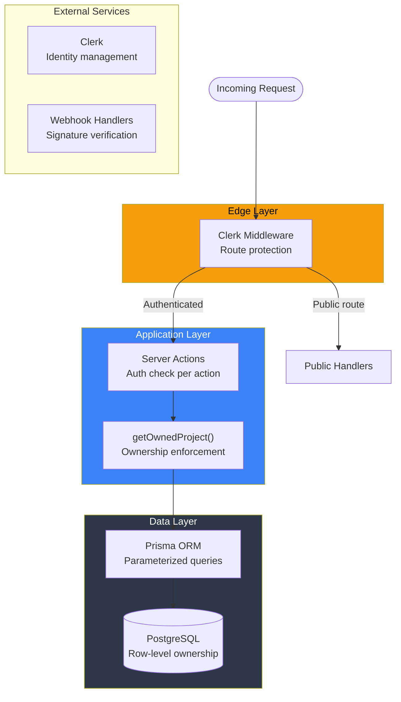
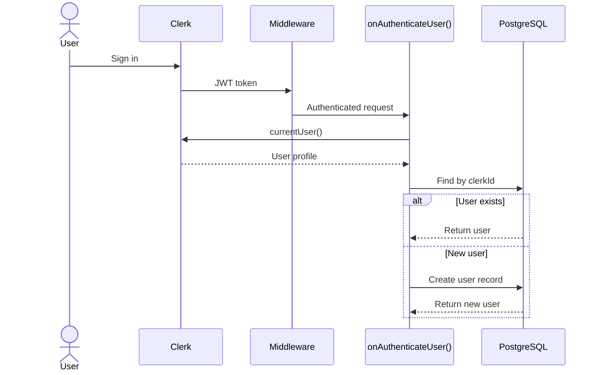

# Security

> Authentication, authorization, data protection, and security best practices implemented in Verto AI.

---

## Table of Contents

- [Security Architecture](#security-architecture)
- [Authentication](#authentication)
- [Authorization](#authorization)
- [Data Protection](#data-protection)
- [API Security](#api-security)
- [Client-Side Security](#client-side-security)
- [Infrastructure Security](#infrastructure-security)
- [Security Checklist](#security-checklist)

---

## Security Architecture



---

## Authentication

### Clerk Integration

Authentication is handled entirely by **Clerk**, a managed identity provider.

| Component | Implementation |
|-----------|---------------|
| Identity provider | Clerk (email, OAuth) |
| Session management | Clerk JWT tokens |
| Route protection | `clerkMiddleware()` at Edge |
| Server-side auth | `currentUser()` / `auth()` from `@clerk/nextjs/server` |
| Client-side auth | `<ClerkProvider>` context |
| Theme | Dark base theme (`@clerk/themes`) |

### Middleware Protection

**File**: `src/middleware.ts`

All routes are protected by default. Only explicitly listed public routes bypass authentication:

```typescript
const isPublicRoute = createRouteMatcher([
  "/sign-in(.*)",
  "/sign-up(.*)",
  "/api/webhook(.*)",
  "/api/inngest(.*)",
  "/api/mobile-design/inngest(.*)",
  "/",
]);

export default clerkMiddleware(async (auth, req) => {
  if (!isPublicRoute(req)) {
    await auth.protect();
  }
});
```

**Key security properties**:
- **Default deny**: All routes require authentication unless explicitly listed
- **Catch-all patterns**: Auth routes use `(.*)` to cover sub-paths
- **Edge execution**: Middleware runs at the Edge, before the request reaches Node.js

### User Provisioning

Users are auto-provisioned on first authentication via `onAuthenticateUser()`:



**No manual user registration** — the database user is created automatically from Clerk profile data. This prevents orphaned or inconsistent user records.

---

## Authorization

### Ownership Model

Verto AI uses a **strict ownership model**: users can only access their own resources. There is no role-based access control (RBAC), no team sharing, and no admin role.

### Centralized Ownership Check

**File**: `src/actions/project-access.ts`

Every project mutation routes through `getOwnedProject()`:

```typescript
async function getOwnedProject(projectId, options?) {
  // 1. Authenticate user
  const auth = await getAuthenticatedAppUser();
  
  // 2. Query with userId in WHERE clause
  const project = await prisma.project.findFirst({
    where: {
      id: projectId,
      userId: auth.user.id,      // ← Ownership enforcement
      isDeleted: false,           // ← Soft-delete filtering (unless includeDeleted)
    },
  });
  
  // 3. Return 404 for not-found OR not-owned (no information leakage)
  if (!project) return { status: 404, error: "Project not found" };
  
  return { status: 200, user: auth.user, project };
}
```

**Security properties**:
- **No enumeration**: Returns 404 for both "doesn't exist" and "belongs to someone else"
- **Single point of enforcement**: All project actions use this helper
- **Soft-delete aware**: Deleted projects are excluded by default

### Authorization Matrix

| Action | Auth Required? | Ownership Check? | Method |
|--------|---------------|-----------------|--------|
| `getAllProjects()` | ✅ | ✅ (via userId filter) | `onAuthenticateUser()` |
| `getProjectById(id)` | ✅ | ✅ | `getOwnedProject()` |
| `createProject(...)` | ✅ | N/A (new resource) | `onAuthenticateUser()` |
| `updateSlides(id, ...)` | ✅ | ✅ | `getOwnedProject()` |
| `updateTheme(id, ...)` | ✅ | ✅ | `getOwnedProject()` |
| `deleteProject(id)` | ✅ | ✅ | `getOwnedProject({ includeDeleted })` |
| `recoverProject(id)` | ✅ | ✅ | `getOwnedProject({ includeDeleted })` |
| `deleteAllProjects(ids)` | ✅ | ✅ (bulk — userId filter) | `onAuthenticateUser()` |
| `publishProject(id)` | ✅ | ✅ | `getOwnedProject()` |
| `unpublishProject(id)` | ✅ | ✅ | `getOwnedProject()` |
| `getSharedProjectById(id)` | ❌ | ❌ | Public (isPublished check) |
| `generatePresentation(...)` | ✅ | N/A | `auth()` from Clerk |
| `getSubscription()` | ✅ | ✅ (via userId) | `onAuthenticateUser()` |
| `buySubscription(userId)` | ✅ | N/A | Caller provides userId |

### Public Access Control

The only publicly accessible project data is through the **share route** (`/share/[id]`):

```typescript
// getSharedProjectById — NO auth required
const project = await prisma.project.findFirst({
  where: {
    id: projectId,
    isDeleted: false,          // Must not be deleted
    isPublished: true,          // Must be explicitly published
    projectType: "PRESENTATION", // Only presentations, not mobile designs
  },
});
```

**Important**: The owner must explicitly publish a project before it becomes publicly accessible. Unpublishing immediately removes public access.

---

## Data Protection

### SQL Injection Prevention

**Prisma ORM** provides automatic protection against SQL injection through parameterized queries. All database queries use Prisma's query builder — no raw SQL is used anywhere in the codebase.

```typescript
// Safe — Prisma parameterizes all values
const project = await prisma.project.findFirst({
  where: { id: userInput, userId: authenticatedUserId },
});

// Never done — raw SQL with string interpolation
// const result = prisma.$queryRaw(`SELECT * FROM project WHERE id = '${userInput}'`)
```

### Sensitive Data Handling

| Data Type | Protection |
|-----------|-----------|
| **Passwords** | Not stored — Clerk manages all credentials |
| **API Keys** | Server-side only (no `NEXT_PUBLIC_` prefix) |
| **Payment data** | Not stored — Lemon Squeezy handles all payment info |
| **User email** | Stored in DB, synced from Clerk |
| **Slide content** | Stored as JSON in DB, access controlled by ownership |
| **Clerk IDs** | Stored in DB, used only for user lookup |
| **LS Subscription IDs** | Stored in DB, used for API lookups |

### Soft Delete

Projects are soft-deleted by default (`isDeleted = true`). This prevents accidental data loss while keeping the data recoverable.

**Hard delete** is only available through `deleteAllProjects()`, which is called from the trash management UI. It performs a `Prisma.deleteMany()` with userId verification.

---

## API Security

### Server Actions

Next.js Server Actions provide built-in security:

- **Automatic CSRF protection**: Server Actions are bound to the session and protected against cross-site request forgery
- **No exposed endpoints**: Unlike REST APIs, Server Actions aren't publicly addressable URLs
- **Type-safe calls**: TypeScript ensures correct parameter shapes at compile time

### Webhook Security

**Lemon Squeezy webhook** (`/api/webhook/lemon-squeezy`):
- Verifies webhook signature using `LEMON_SQUEEZY_WEBHOOK_SECRET`
- Rejects requests with invalid or missing signatures
- Processes only expected event types

**Inngest webhooks** (`/api/inngest`, `/api/mobile-design/inngest`):
- Secured by Inngest's built-in signing key verification
- `INNGEST_SIGNING_KEY` must be set for production

### SSE Endpoint

**`/api/generation/stream`**:
- Requires `runId` query parameter
- The `runId` is generated server-side during generation initiation
- Only the user who initiated the generation has access to their `runId`
- No additional auth check needed on SSE because the `runId` is an opaque secret

### Input Validation

| Input | Validation | Location |
|-------|-----------|----------|
| Topic string | Max 500 chars, non-empty | `generatePresentationAction()` |
| Outlines array | Max 30 items, trimmed | `generatePresentationAction()` |
| Project IDs | Non-empty string | `getOwnedProject()` |
| Search queries | Min 2 chars | `searchProjects()` |
| LLM outputs | Zod schema validation | All agents |

---

## Client-Side Security

### Environment Variable Exposure

Only variables prefixed with `NEXT_PUBLIC_` are included in the client bundle:

| Variable | Client-Visible? | Sensitive? |
|----------|----------------|-----------|
| `NEXT_PUBLIC_HOST_URL` | ✅ | No |
| `NEXT_PUBLIC_CLERK_PUBLISHABLE_KEY` | ✅ | No (public key by design) |
| `NEXT_PUBLIC_CLERK_SIGN_IN_URL` | ✅ | No |
| `DATABASE_URL` | ❌ | **Yes — never expose** |
| `CLERK_SECRET_KEY` | ❌ | **Yes** |
| `GOOGLE_GENERATIVE_AI_API_KEY` | ❌ | **Yes** |
| `LEMON_SQUEEZY_API_KEY` | ❌ | **Yes** |
| `UNSPLASH_ACCESS_KEY` | ❌ | **Yes** |

### LocalStorage

Client-side stores persist to `localStorage`:

| Key | Content | Sensitive? |
|-----|---------|-----------|
| `slides-storage` | Slide content, project reference | Low (user's own data) |
| `creative-ai` | AI prompt and outlines | Low |
| `prompt` | Creation mode and prompt history | Low |
| `scratch` | Manual outlines | Low |

**Risk**: `localStorage` is accessible to any JavaScript on the same origin. No secrets or tokens are stored in these stores.

### XSS Prevention

- **React's default escaping**: All rendered content is escaped by React's JSX
- **No `dangerouslySetInnerHTML`**: Except in the mobile design subsystem (which renders AI-generated HTML in sandboxed frames)
- **Clerk handles auth UI**: Authentication forms are rendered by Clerk's secure components

---

## Infrastructure Security

### HTTPS

- **Vercel**: HTTPS is enforced automatically with free SSL certificates
- **Custom domains**: SSL is auto-provisioned via Let's Encrypt on Vercel
- **API calls**: All external API calls (Gemini, Unsplash, Clerk, LS) use HTTPS

### Database Security

- **Encrypted connections**: Use `?sslmode=require` in `DATABASE_URL` for production
- **Managed access**: Database credentials are only in server environment variables
- **Connection pooling**: Limits concurrent connections and prevents pool exhaustion

### Dependency Security

- **Regular updates**: Keep dependencies updated to patch known vulnerabilities
- **Audit**: Run `bun audit` or `npm audit` periodically
- **Lock file**: `bun.lock` pins exact dependency versions

---

## Security Checklist

### Pre-Launch

- [ ] All API keys use production (not test) values
- [ ] `NEXT_PUBLIC_` variables contain no secrets
- [ ] Lemon Squeezy webhook secret is configured
- [ ] Inngest signing key is configured
- [ ] Database connection uses SSL (`sslmode=require`)
- [ ] Clerk redirect URLs match production domain
- [ ] No `console.log` statements exposing sensitive data in production

### Ongoing

- [ ] Monitor Clerk dashboard for suspicious authentication activity
- [ ] Rotate API keys periodically (Unsplash, Gemini, LS)
- [ ] Keep dependencies updated (`bun update`)
- [ ] Review Vercel deployment logs for errors
- [ ] Monitor database connection pool utilization

---

*Next: [10-testing-strategy.md](10-testing-strategy.md) — testing approach and future strategy.*
