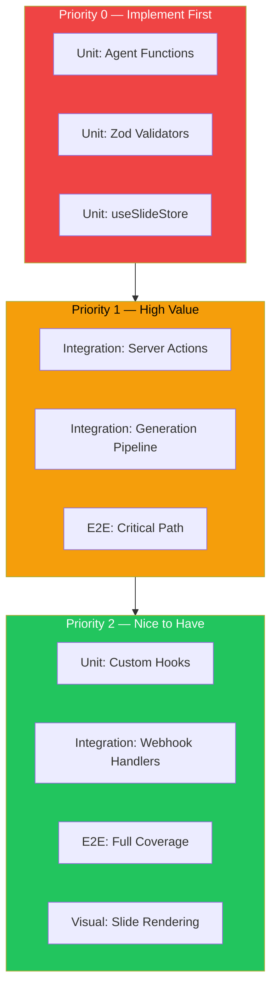
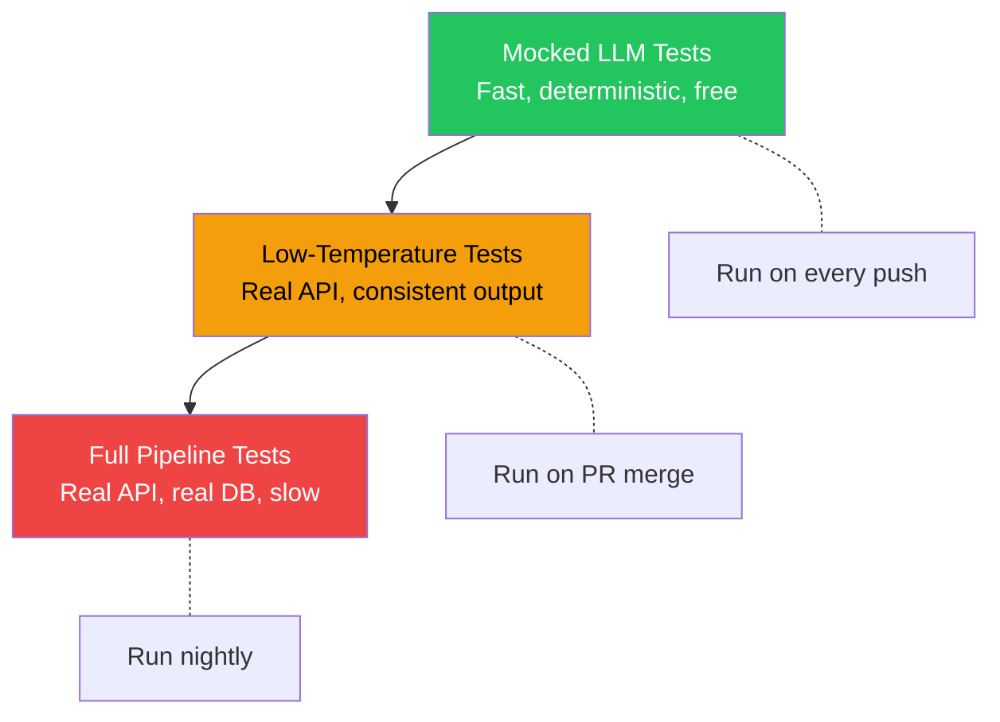

# Testing Strategy

> Current testing state, smoke testing procedures, and a roadmap for implementing comprehensive testing in Verto AI.

---

## Table of Contents

- [Current State](#current-state)
- [Manual Smoke Tests](#manual-smoke-tests)
- [Testing Roadmap](#testing-roadmap)
- [Unit Testing Strategy](#unit-testing-strategy)
- [Integration Testing Strategy](#integration-testing-strategy)
- [E2E Testing Strategy](#e2e-testing-strategy)
- [AI Pipeline Testing](#ai-pipeline-testing)
- [Recommended Tooling](#recommended-tooling)

---

## Current State

Verto AI currently uses **manual testing** and **runtime validation** (Zod schemas). There is no automated test suite yet. The AI pipeline has built-in safeguards through:

1. **Zod validation** on all LLM outputs (outlines, content, layout selections, image queries)
2. **Retry logic** with exponential backoff for transient failures
3. **Step-level error tracking** in `PresentationGenerationRun.steps` JSON
4. **Type-safe server actions** validated by TypeScript at compile time

---

## Manual Smoke Tests

These manual tests should be performed before every deployment to verify core functionality.

### Critical Path Tests

| # | Test | Steps | Expected Result |
|---|------|-------|-----------------|
| 1 | **Sign Up** | Navigate to `/sign-up` → register with email | Account created, redirected to dashboard |
| 2 | **Sign In** | Navigate to `/sign-in` → enter credentials | Authenticated, dashboard loads |
| 3 | **Generate Presentation** | Dashboard → Create → Enter topic → Generate | Progress tracker shows 8 agents, redirected to editor |
| 4 | **Editor Loads** | Open generated presentation in editor | Slides render correctly, navigation works |
| 5 | **Edit Slide** | Click text → edit → save | Content updates, visible immediately |
| 6 | **Add/Delete Slide** | Add slide → delete a different slide | Slide count changes correctly |
| 7 | **Undo/Redo** | Edit → Ctrl+Z → Ctrl+Y | Changes revert and re-apply |
| 8 | **Theme Switch** | Change theme in editor toolbar | All slides update to new theme |
| 9 | **PDF Export** | Click export → select PDF | PDF downloads with all slides |
| 10 | **Publish & Share** | Publish project → copy share link → open in incognito | Public viewer shows slides (no auth needed) |
| 11 | **Unpublish** | Unpublish project → access share link | Returns 404 or "not found" |
| 12 | **Delete & Recover** | Delete project → check trash → recover | Project moves to trash and back |
| 13 | **Search** | Type in search bar → verify results | Projects matching query appear |

### Generation Pipeline Tests

| # | Test | Input | Expected Result |
|---|------|-------|-----------------|
| G1 | **Simple topic** | "Introduction to Machine Learning" | 8-12 slides, relevant content |
| G2 | **Long topic** | 200+ character detailed description | Handles gracefully, content reflects detail |
| G3 | **With outlines** | Provide 5 custom outlines | Slides follow provided outlines |
| G4 | **With context** | Topic + additional context | Context influences generated content |
| G5 | **Different themes** | Generate with "Dark"/"Professional" theme | Theme applied to generated slides |
| G6 | **Edge case: empty** | Empty topic | Error: "Topic is required" |
| G7 | **Edge case: very long** | 501+ character topic | Error: "Topic is too long" |

### Mobile Design Tests (if Inngest is running)

| # | Test | Steps | Expected Result |
|---|------|-------|-----------------|
| M1 | **Generate screens** | Create mobile project → describe app → generate | Screens appear with HTML content |
| M2 | **Regenerate frame** | Select a frame → regenerate | Frame updates with new content |

---

## Testing Roadmap

### Priority Tiers



---

## Unit Testing Strategy

### What to Test

#### Zustand Stores

The `useSlideStore` is the most critical client-side code. Test:

```typescript
// Example test cases for useSlideStore
describe('useSlideStore', () => {
  it('should add a slide at the correct index')
  it('should remove a slide by id')
  it('should update content recursively by id')
  it('should push to undo stack on every mutation')
  it('should undo/redo correctly')
  it('should reorder slides and update slideOrder')
  it('should add component at nested position')
  it('should remove component from nested position')
  it('should move component between parents')
  it('should reset store and clear localStorage')
  it('should exclude past/future from persistence')
})
```

#### Zod Validators

All LLM output schemas should have unit tests:

```typescript
describe('outlineSchema', () => {
  it('should accept valid: 3-20 strings')
  it('should reject: empty array')
  it('should reject: over 20 items')
  it('should reject: non-string items')
})

describe('bulkContentSchema', () => {
  it('should accept: slide with required fields')
  it('should accept: slide with optional structured fields')
  it('should reject: missing slideTitle')
})
```

#### Agent Functions (Pure Logic)

Test agent logic with mocked LLM responses:

```typescript
describe('outlineGenerator', () => {
  it('should generate outlines from topic')
  it('should use provided outlines when available')
  it('should handle LLM returning invalid JSON')
  it('should respect max outline count')
})

describe('layoutSelector', () => {
  it('should assign a valid layout to each slide')
  it('should not assign the same layout to consecutive slides')
})
```

#### Utility Functions

```typescript
describe('imageProviders', () => {
  it('should categorize queries correctly')
  it('should return fallback images when Unsplash is unavailable')
  it('should handle Unsplash rate limits')
})

describe('retryLogic', () => {
  it('should retry on recoverable errors')
  it('should not retry on non-recoverable errors')
  it('should respect max retries')
  it('should use exponential backoff')
})
```

---

## Integration Testing Strategy

### Server Actions

Test server actions with a test database:

```typescript
describe('project actions', () => {
  // Setup: Create test user with mocked Clerk auth
  
  it('should create a project with title and outlines')
  it('should NOT access another user\'s project')
  it('should soft-delete a project')
  it('should recover a soft-deleted project')
  it('should hard-delete multiple projects')
  it('should return 403 for unauthenticated requests')
})
```

### AI Pipeline Integration

Test the full pipeline with a real (or mocked) LLM:

```typescript
describe('generateAdvancedPresentation', () => {
  it('should produce valid slides from a simple topic')
  it('should track progress through all 8 steps')
  it('should handle LLM failure gracefully')
  it('should persist results to database')
  it('should emit SSE events during generation')
})
```

### Webhook Integration

```typescript
describe('Lemon Squeezy webhook', () => {
  it('should reject requests with invalid signature')
  it('should create subscription on subscription_created')
  it('should update subscription on subscription_updated')
  it('should cancel subscription on subscription_cancelled')
  it('should update user.subscription flag')
})
```

---

## E2E Testing Strategy

### Critical User Journeys

```typescript
describe('E2E: Presentation Generation', () => {
  it('should: sign in → create → generate → edit → export')
})

describe('E2E: Project Management', () => {
  it('should: create → list → delete → trash → recover')
})

describe('E2E: Sharing', () => {
  it('should: generate → publish → view share link → unpublish → 404')
})

describe('E2E: Subscription', () => {
  it('should: check subscription → redirect to checkout → (mock webhook) → verify access')
})
```

### E2E Test Configuration

```typescript
// Recommended: Playwright config
export default defineConfig({
  testDir: './tests/e2e',
  use: {
    baseURL: 'http://localhost:3000',
    storageState: './tests/fixtures/auth-state.json',
  },
  projects: [
    { name: 'chrome', use: { ...devices['Desktop Chrome'] } },
    { name: 'mobile', use: { ...devices['iPhone 14'] } },
  ],
});
```

---

## AI Pipeline Testing

### Challenges

Testing AI pipelines has unique challenges:

| Challenge | Mitigation |
|-----------|-----------|
| **Non-deterministic output** | Set temperature to 0 for tests, validate structure not content |
| **API costs** | Mock LLM responses for unit tests, use real API only in integration |
| **Slow execution** | Run full pipeline tests in CI nightly, not on every push |
| **Rate limits** | Use separate API key with higher quota for CI |

### Testing Layers



### Snapshot Testing for Agents

Capture "known-good" LLM responses and use them as fixtures:

```typescript
// 1. Capture: Run agent with real LLM, save response
const response = await outlineGenerator(state);
fs.writeFileSync('fixtures/outline-response.json', JSON.stringify(response));

// 2. Test: Use fixture as mocked LLM response
it('should process outline response correctly', () => {
  const fixture = require('./fixtures/outline-response.json');
  const result = processOutlineResponse(fixture);
  expect(result.outlines).toHaveLength(10);
  expect(result.outlines[0]).toBeTypeOf('string');
});
```

---

## Recommended Tooling

| Tool | Purpose | Why |
|------|---------|-----|
| **Vitest** | Unit + integration tests | Fast, ESM-native, excellent TypeScript support |
| **Playwright** | E2E browser tests | Multi-browser, reliable, great for Next.js |
| **@testing-library/react** | Component tests | Standard for React component testing |
| **MSW (Mock Service Worker)** | API mocking | Intercepts fetch/XHR for realistic mocking |
| **Prisma Test Environment** | Database tests | Isolated test database per test suite |

### Suggested `package.json` Scripts

```json
{
  "scripts": {
    "test": "vitest run",
    "test:watch": "vitest",
    "test:coverage": "vitest run --coverage",
    "test:e2e": "playwright test",
    "test:e2e:ui": "playwright test --ui"
  }
}
```

### Directory Structure

```
tests/
├── unit/
│   ├── stores/
│   │   └── useSlideStore.test.ts
│   ├── validators/
│   │   └── schemas.test.ts
│   ├── agents/
│   │   └── outlineGenerator.test.ts
│   └── utils/
│       ├── imageProviders.test.ts
│       └── retryLogic.test.ts
├── integration/
│   ├── actions/
│   │   └── projects.test.ts
│   ├── pipeline/
│   │   └── generation.test.ts
│   └── webhooks/
│       └── lemonSqueezy.test.ts
├── e2e/
│   ├── generation.spec.ts
│   ├── editor.spec.ts
│   ├── sharing.spec.ts
│   └── auth.spec.ts
└── fixtures/
    ├── auth-state.json
    ├── outline-response.json
    └── content-response.json
```

---

*This concludes the core documentation suite. See [docs-plan.md](docs-plan.md) for Phase 6 (Architecture Decision Records), which covers the rationale behind major technical choices.*
