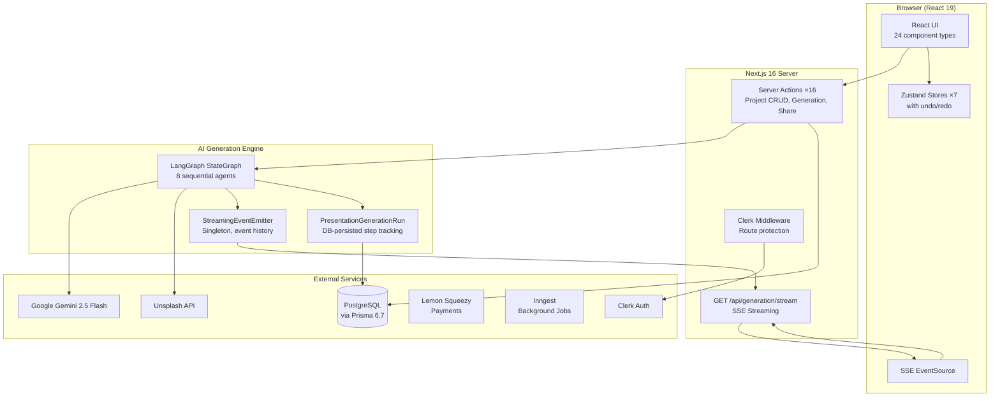
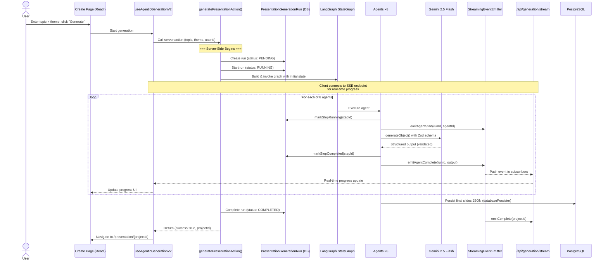

# 02 — Architecture Deep-Dive

> How to explain Verto AI's architecture at every level — from a 60-second whiteboard sketch to a full sequence diagram walkthrough.

---

## Table of Contents

- [60-Second Whiteboard Sketch](#60-second-whiteboard-sketch)
- [High-Level System Architecture](#high-level-system-architecture)
- [Request Lifecycle — "What Happens When You Click Generate"](#request-lifecycle)
- [Module Dependency Map](#module-dependency-map)
- [Data Flow Through the System](#data-flow-through-the-system)
- [Key Architectural Patterns](#key-architectural-patterns)
- [How to Explain Each Layer](#how-to-explain-each-layer)
- [Sample Interview Q&A](#sample-interview-qa)

---

## 60-Second Whiteboard Sketch

> When an interviewer says "Can you draw the architecture?" — use this simplified 5-box diagram.

### What to Draw

```
┌─────────────────────────────────────────────────────────────────┐
│                                                                 │
│   ┌──────────┐     ┌──────────────┐     ┌─────────────────┐    │
│   │  Browser  │────▶│  Next.js 16  │────▶│  LangGraph      │    │
│   │  (React)  │◀────│  Server      │◀────│  Pipeline       │    │
│   │           │     │  Actions     │     │  (8 Agents)     │    │
│   │  Zustand  │     │              │     │                 │    │
│   │  SSE      │     │  Clerk Auth  │     │  Gemini 2.5     │    │
│   └──────────┘     │  Prisma ORM  │     │  Flash          │    │
│                     └──────┬───────┘     └─────────────────┘    │
│                            │                                     │
│                     ┌──────▼───────┐     ┌─────────────────┐    │
│                     │  PostgreSQL  │     │  Unsplash API   │    │
│                     │  (9 models)  │     │  (Images)       │    │
│                     └──────────────┘     └─────────────────┘    │
│                                                                 │
└─────────────────────────────────────────────────────────────────┘
```

### What to Say While Drawing

1. **"The browser"** — React 19 with Zustand for state management, SSE client for real-time updates
2. **"Next.js server"** — All mutations are Server Actions (no REST API), Clerk middleware for auth, Prisma for DB access
3. **"LangGraph pipeline"** — 8 specialized AI agents orchestrated as a state machine, powered by Gemini 2.5 Flash
4. **"PostgreSQL"** — 9 models: User, Project, Subscription, templates, generation runs, etc.
5. **"Unsplash"** — Real stock image API with a provider abstraction for swappability

**Then add the key insight**: *"The arrow between the pipeline and Next.js includes SSE streaming — so progress is emitted in real-time as each agent completes, not polled."*

---

## High-Level System Architecture



### External Service Integration Points

| Service | How It Integrates | File Location |
|---------|------------------|---------------|
| **Clerk** | Middleware (`clerkMiddleware`) + `auth()` in Server Actions | `src/middleware.ts` |
| **Gemini** | `@ai-sdk/google` → `generateObject()` with Zod schemas | `src/agentic-workflow-v2/lib/llm.ts` |
| **Unsplash** | REST API via provider abstraction | `src/agentic-workflow-v2/utils/imageProviders.ts` |
| **PostgreSQL** | Prisma ORM with 9 models | `prisma/schema.prisma` |
| **Lemon Squeezy** | Checkout redirect + webhook-based status sync | `src/actions/subscription.ts`, `/api/webhook/` |
| **Inngest** | Event-driven background functions for mobile design | `src/mobile-design/inngest/` |

---

## Request Lifecycle

> This is the most important diagram for interview discussions. Know this cold.

### "What happens when a user clicks Generate?"



### Key Points to Highlight

1. **Server Actions, not REST** — The generation is triggered by a Server Action call, not an API endpoint
2. **Dual feedback channel** — Progress is both persisted to DB (resilient) and streamed via SSE (instant)
3. **Structured output** — Every LLM call uses `generateObject()` with a Zod schema, ensuring type-safe validated output
4. **Fire-and-forget pattern** — The server action starts graph execution, but the client gets feedback via SSE independently

---

## Module Dependency Map

> How the major directories relate to each other.

```
src/
├── app/                          ← Next.js App Router (pages + API routes)
│   ├── (auth)/                   ← Sign-in/up (public, Clerk-powered)
│   ├── (protected)/              ← All authenticated routes
│   │   ├── presentation/[id]/    ← Slide editor
│   │   ├── present/[id]/         ← Presentation mode
│   │   └── (pages)/              ← Dashboard, create, settings
│   ├── api/                      ← API routes (SSE, webhooks)
│   │   ├── generation/stream/    ← SSE endpoint
│   │   └── webhook/              ← Lemon Squeezy webhooks
│   └── share/                    ← Public share route
│
├── actions/                      ← Server Actions (ALL mutations)
│   ├── project-access.ts         ← getOwnedProject() — centralized auth
│   ├── generatePresentation.ts   ← Generation entry point
│   ├── projects.ts               ← CRUD operations
│   └── subscription.ts           ← Payment management
│
├── agentic-workflow-v2/          ← ★ AI Generation Engine
│   ├── actions/                  ← LangGraph graph definition
│   │   └── advanced-genai-graph.ts ← Graph builder + generateAdvancedPresentation()
│   ├── agents/                   ← 8 agent implementations
│   ├── lib/                      ← State, LLM config, validators, layouts
│   └── utils/                    ← Image providers, retry logic
│
├── store/                        ← Zustand stores (7 stores)
│   └── useSlideStore.tsx         ← Core store: slides, undo/redo, components
│
├── lib/                          ← Shared utilities
│   └── streaming/EventEmitter.ts ← SSE singleton
│
└── components/                   ← React components
    ├── global/editor/            ← Slide editor components
    ├── presentation/             ← PresentationViewer (read-only)
    └── ui/                       ← shadcn/ui primitives
```

### Dependency Flow Rules

1. **Pages** → import **Actions** (never call Prisma directly)
2. **Actions** → import **project-access.ts** (ownership check before any mutation)
3. **Actions** → invoke **agentic-workflow-v2** for generation
4. **Agents** → use **lib/llm.ts** for model access, **lib/validators.ts** for output validation
5. **Components** → read from **Zustand stores** (never call Actions directly — that's the page's job)
6. **Streaming** → the **EventEmitter** is a global singleton attached to `global` to survive HMR

---

## Data Flow Through the System

### Generation Data Flow

```
User Input
  ↓
  "Machine Learning for Beginners"
  ↓
┌─────────────────────────────┐
│ 1. Project Initializer      │ → Creates Project record → projectId
│ 2. Outline Generator        │ → ["Introduction to ML", "Types of ML", ...] → outlines[]
│ 3. Layout Selector          │ → ["creativeHero", "twoColumns", "comparisonLayout", ...] → layoutType per slide
│ 4. Content Writer           │ → {title, content, statValue, comparisonPointsA, ...} → structured content per slide
│ 5. Image Query Generator    │ → ["machine learning neural network diagram", ...] → imageQuery per slide
│ 6. Image Fetcher            │ → ["https://images.unsplash.com/...", ...] → imageUrl per slide
│ 7. JSON Compiler            │ → Slide[] with recursive ContentItem trees → finalPresentationJson
│ 8. Database Persister       │ → Saves to Project.slides (JSON column)
└─────────────────────────────┘
  ↓
Editor renders Slide[] via MasterRecursiveComponent
```

### Slide Data Model Flow

```
Slide {
  id: "uuid"
  slideName: "Comparison Slide"
  type: "comparisonLayout"
  className: "slide-comparison"
  content: ContentItem {          ← Recursive tree
    id: "root"
    type: "column"
    content: [
      ContentItem { type: "heading", content: "Traditional vs Modern" },
      ContentItem { type: "column", content: [
        ContentItem { type: "paragraph", content: "Point A..." },
        ContentItem { type: "paragraph", content: "Point B..." },
      ]}
    ]
  }
}
```

---

## Key Architectural Patterns

### 1. Server-First Mutations

**Pattern**: All data mutations go through Next.js Server Actions. No REST endpoints for CRUD.

**Why**: Eliminates API boilerplate, provides automatic CSRF protection, co-locates business logic with the data layer, and leverages React's built-in integration with Server Actions for optimistic updates.

**Exception**: SSE streaming and webhooks use API Routes because they require long-lived HTTP connections or external POST callbacks.

**Code**: `src/actions/` — 16 server action files

---

### 2. Centralized Ownership Enforcement

**Pattern**: Every project mutation passes through `getOwnedProject(userId, projectId)` before proceeding.

**Why**: Prevents horizontal privilege escalation. A user cannot read, edit, delete, or share another user's project by guessing an ID.

**Code**: `src/actions/project-access.ts`

---

### 3. LangGraph State Machine for AI Orchestration

**Pattern**: 8 agents share a single `AdvancedPresentationState` object, connected as a `StateGraph` with sequential edges and one conditional loop.

**Why**: Enables shared state across agents, conditional branching (image fetcher loop), independent agent testing, and clear separation of concerns.

**Code**: `src/agentic-workflow-v2/actions/advanced-genai-graph.ts`

---

### 4. wrapNode() — Cross-Cutting Concerns

**Pattern**: Every agent is wrapped by `wrapNode()` which handles progress tracking, SSE emission, and error recording.

**Why**: Agents stay focused on their core logic. Progress tracking, streaming, and error handling are applied uniformly without duplicating code in each agent.

**Code**: `wrapNode()` in `advanced-genai-graph.ts` (lines 64-116)

---

### 5. Recursive Component Tree

**Pattern**: Slides are stored as nested `ContentItem` trees. `MasterRecursiveComponent` walks the tree and renders the appropriate component for each node type.

**Why**: Supports arbitrarily nested layouts (columns within columns), consistent rendering across editor/present/export modes, and drag-and-drop at any nesting depth.

**Code**: `src/store/useSlideStore.tsx`, `MasterRecursiveComponent.tsx`

---

### 6. Global Singleton Event Emitter

**Pattern**: `StreamingEventEmitter` is attached to the Node.js `global` object to survive hot module replacement during development.

**Why**: SSE streaming requires a stable reference that persists across module reloads. The emitter stores up to 1,000 events per run for replay on reconnect.

**Code**: `src/lib/streaming/EventEmitter.ts` (line 134-138)

```typescript
const g = global as any;
if (!g._streamingEmitter) {
  g._streamingEmitter = new StreamingEventEmitter();
}
export const streamingEmitter: StreamingEventEmitter = g._streamingEmitter;
```

---

### 7. Zod-Validated Structured Output

**Pattern**: Every LLM call uses `generateObject()` from Vercel AI SDK with a Zod schema, ensuring the AI returns properly typed, validated data.

**Why**: LLMs can return malformed data. Zod validation at every agent boundary catches structural errors immediately, preventing cascading failures downstream.

**Code**: `src/agentic-workflow-v2/lib/validators.ts` — 5 schemas

---

## How to Explain Each Layer

> Quick scripts for when an interviewer asks "Tell me about your [X] layer."

### Frontend
*"React 19 with Zustand for state management. The slide editor uses a recursive component tree — slides are stored as nested ContentItem JSON, and MasterRecursiveComponent walks the tree to render each node. Zustand manages undo/redo via a command pattern where every mutation pushes the current state onto a past stack."*

### API Layer
*"Almost everything is Server Actions — no REST endpoints. The only API Routes are the SSE streaming endpoint for generation progress and the Lemon Squeezy webhook. Server Actions give us CSRF protection for free and eliminate the fetch/serialize boilerplate."*

### AI Engine
*"LangGraph state machine with 8 agents. Each agent receives shared state, does its work, and returns partial state updates that get merged. The key design choice is layout-before-content ordering. The whole graph is compiled once per generation and invoked with a recursion limit of 150 to handle the image fetcher's conditional loop."*

### Database
*"PostgreSQL with Prisma. 9 models total. The most interesting design choice is storing slides as a JSON column on the Project model — this gives us flexibility for the recursive ContentItem tree structure, but it means we can't do SQL queries into slide content. That's an acceptable trade-off because we never query slides by content; they're always loaded by project ID."*

### Auth
*"Clerk with middleware-level route protection. Public routes are explicitly allowlisted; everything else requires authentication. Project-level access is enforced in Server Actions via getOwnedProject(), not at the route level."*

---

## Sample Interview Q&A

### "Why Server Actions instead of API Routes?"

*"Server Actions co-locate the mutation logic with the component that triggers it. They provide automatic CSRF protection, eliminate manual fetch/serialize code, and work natively with React's form actions and transitions. The only places I use API Routes are for SSE streaming (needs a long-lived HTTP connection) and webhooks (needs to accept external POST requests from Lemon Squeezy)."*

### "How do you handle authentication?"

*"Two layers. First, Clerk middleware protects routes — unauthenticated users can only access sign-in, sign-up, and the landing page. Second, every Server Action that touches project data calls `getOwnedProject(userId, projectId)` to enforce ownership. This means even if someone is authenticated, they can't access another user's project by guessing the ID."*

### "Why PostgreSQL instead of MongoDB?"

*"The data model is inherently relational — users have many projects, projects have many generation runs, users have subscriptions with status tracking. PostgreSQL with Prisma gives me type-safe queries, proper foreign keys, and migration management. The one NoSQL-like aspect — the recursive slide JSON — is stored as a JSON column, which PostgreSQL handles natively."*

### "What's the most complex part of the system?"

*"The JSON Compiler agent. It's 54KB of code — the largest file in the project. Its job is to take the structured content from the Content Writer and the layout type from the Layout Selector, look up the layout template, and produce a valid recursive ContentItem tree that the editor can render. It's essentially a compiler: it maps a high-level description (structured content + layout type) into a low-level representation (nested component tree)."*

---

*Next: [03-agentic-pipeline.md](03-agentic-pipeline.md) — deep-dive into your #1 differentiator: the 8-agent LangGraph pipeline.*
