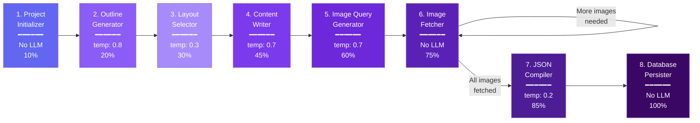
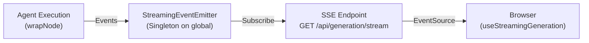

# 03 — Agentic AI Pipeline Deep-Dive

> ⭐ **This is your #1 talking point.** The multi-agent LangGraph pipeline is what separates Verto AI from every other AI presentation tool. Master this section above all others.

---

## Table of Contents

- [Why Multi-Agent? The Problem with Monolithic Prompts](#why-multi-agent)
- [Why LangGraph Over Alternatives](#why-langgraph-over-alternatives)
- [Pipeline Overview](#pipeline-overview)
- [Agent-by-Agent Walkthrough](#agent-by-agent-walkthrough)
- [The Layout-Before-Content Innovation](#the-layout-before-content-innovation)
- [The wrapNode() Pattern](#the-wrapnode-pattern)
- [Conditional Edges — The Image Fetcher Loop](#conditional-edges)
- [State Management Across Agents](#state-management-across-agents)
- [Zod Validation at Every Boundary](#zod-validation-at-every-boundary)
- [Error Handling & Retry Logic](#error-handling--retry-logic)
- [LLM Temperature Strategy](#llm-temperature-strategy)
- [SSE Streaming Architecture](#sse-streaming-architecture)
- [Sample Interview Q&A](#sample-interview-qa)

---

## Why Multi-Agent?

### The Problem with Monolithic Prompts

Most AI presentation tools use a single prompt:

```
"Generate a 10-slide presentation about Machine Learning.
 Return JSON with title, content, and layout for each slide."
```

This fails in predictable ways:

| Problem | Why It Happens |
|---------|---------------|
| **Generic layouts** | One prompt can't reason about 28 layout types while also writing content |
| **No visual variety** | The AI defaults to "title + bullets" for every slide |
| **Structural mismatch** | Content is written without knowing its target layout |
| **No error isolation** | If the prompt fails, you lose everything |
| **No progress feedback** | It's all-or-nothing: spinner → done |
| **Hard to debug** | You can't tell which part of generation went wrong |

### The Multi-Agent Solution

Decompose the problem into 8 specialized agents, each with:
- A **single responsibility**
- Its own **LLM configuration** (temperature, token limits)
- **Zod validation** on output
- **Independent error handling** with retry logic
- **Real-time progress reporting** via SSE

*"When I explain this to interviewers, I say: 'A monolithic prompt is like asking one person to plan, design, write, illustrate, and print a brochure. Multi-agent is like a creative agency where each team member is a specialist.' "*

---

## Why LangGraph Over Alternatives

> **Expect this question**: "Why didn't you just chain async functions?"

| Approach | Pros | Cons | Why Not |
|----------|------|------|---------|
| **Simple `async` chain** | Easy to understand | No shared state, no conditional logic, no built-in retry | Can't do the image fetcher loop |
| **LangChain agents** | Popular, flexible | Agent-based routing is overkill, less control over execution order | We need deterministic ordering, not autonomous agent decisions |
| **Custom state machine** | Full control | Have to build everything (state merging, graph compilation, error handling) | Reinventing the wheel |
| **LangGraph** ✅ | Shared state channels, conditional edges, graph compilation, built-in recursion limits | Learning curve, dependency | Best fit for our structured, multi-step pipeline |

### What LangGraph gives us specifically:

1. **Shared state via channels** — All agents read/write the same `AdvancedPresentationState`
2. **Conditional edges** — `shouldFetchMoreImages()` decides whether to loop or proceed
3. **Graph compilation** — The graph is compiled once, then invoked with initial state
4. **Recursion limit** — Set to 150 to safely handle the image fetcher loop
5. **"Last write wins" merging** — Simple state update strategy: each agent's partial output overwrites the relevant fields

```typescript
// State channel config — "last write wins"
const channels = {
  projectId:  { value: (_x, y) => y, default: () => null },
  outlines:   { value: (_x, y) => y, default: () => null },
  slideData:  { value: (_x, y) => y, default: () => [] },
  // ... all fields use the same pattern
};
```

---

## Pipeline Overview



### Graph Edge Definition (Actual Code)

```typescript
graph
  .addEdge(START, "projectInitializer")
  .addEdge("projectInitializer", "outlineGenerator")
  .addEdge("outlineGenerator", "layoutSelector")       // Layout BEFORE content
  .addEdge("layoutSelector", "contentWriter")
  .addEdge("contentWriter", "imageQueryGenerator")
  .addEdge("imageQueryGenerator", "imageFetcher")
  .addConditionalEdges("imageFetcher", shouldFetchMoreImages, {
    imageFetcher: "imageFetcher",   // Loop back
    jsonCompiler: "jsonCompiler",    // Proceed
  })
  .addEdge("jsonCompiler", "databasePersister")
  .addEdge("databasePersister", END)
```

---

## Agent-by-Agent Walkthrough

> For each agent, know: **what it does, what it takes, what it returns, and one interesting detail.**

---

### Agent 1: Project Initializer

| Property | Value |
|----------|-------|
| **File** | `agents/projectInitializer.ts` |
| **Uses LLM** | ❌ No |
| **Input** | `userId`, `userInput`, `themePreference` |
| **Output** | `projectId` |
| **Progress** | 10% |

**What it does**: Creates the `Project` record in PostgreSQL via Prisma. Sets title, theme, userId.

**Why it matters**: All subsequent agents have a `projectId` to reference. The database record exists from the very first step, so even if generation fails later, the user has a project they can retry.

**Interesting detail**: If a `projectId` is already provided (re-generation), it skips creation and reuses the existing project.

---

### Agent 2: Outline Generator

| Property | Value |
|----------|-------|
| **File** | `agents/outlineGenerator.ts` |
| **Uses LLM** | ✅ Gemini 2.5 Flash |
| **Temperature** | **0.8** (creative) |
| **Max Tokens** | 2,000 |
| **Input** | `userInput`, `additionalContext` |
| **Output** | `outlines[]`, `slideData[]` (initialized) |
| **Validation** | `outlineSchema` — `z.array(z.string()).min(5).max(15)` |
| **Progress** | 20% |

**What it does**: Generates 5-15 structured slide topics from the user's prompt.

**Key design detail**: If the user provides pre-made outlines, this agent **respects them** instead of generating new ones. This supports the "outline editing" use case where users refine AI-generated outlines before full generation.

**Interesting detail**: The prompt instructs the AI to annotate each outline with a content type tag: `"AI Market Growth in 2024 [statistics]"`, `"Traditional vs Modern Approaches [comparison]"`. This helps the Layout Selector make better decisions.

---

### Agent 3: Layout Selector

| Property | Value |
|----------|-------|
| **File** | `agents/layoutSelector.ts` |
| **Uses LLM** | ✅ Gemini 2.5 Flash |
| **Temperature** | **0.3** (consistent) |
| **Max Tokens** | 1,000 |
| **Input** | `outlines[]`, `slideData[]` |
| **Output** | `slideData[].layoutType` |
| **Validation** | `layoutSelectionSchema` — enum of 28 layout types with reasoning |
| **Progress** | 30% |

**What it does**: Analyzes each outline topic and selects the best layout from **28 available types**.

**⭐ This is the key innovation**: This agent runs **BEFORE** the Content Writer. See [The Layout-Before-Content Innovation](#the-layout-before-content-innovation) below.

**The 28 layout types** (from the Zod enum):
- Basic: `blank-card`, `titleAndContent`
- Image + Text: `accentLeft`, `accentRight`, `imageAndText`, `textAndImage`, `splitContentImage`, `fullImageBackground`
- Columns: `twoColumns`, `twoColumnsWithHeadings`, `threeColumns`, `threeColumnsWithHeadings`, `fourColumns`
- Image Grids: `twoImageColumns`, `threeImageColumns`, `fourImageColumns`
- Advanced: `bigNumberLayout`, `comparisonLayout`, `quoteLayout`, `timelineLayout`, `iconGrid`, `sectionDivider`, `processFlow`, `callToAction`
- Premium Creative: `creativeHero`, `bentoGrid`, `statsRow`, `timeline`

**Interesting detail**: The prompt includes `LAYOUT_DESCRIPTIONS` — a comprehensive guide explaining when each layout is appropriate. The AI doesn't just pick randomly; it matches content types to layout purposes.

---

### Agent 4: Content Writer

| Property | Value |
|----------|-------|
| **File** | `agents/contentWriter.ts` |
| **Uses LLM** | ✅ Gemini 2.5 Flash |
| **Temperature** | **0.7** (balanced) |
| **Max Tokens** | 8,000 |
| **Input** | `outlines[]`, `slideData[].layoutType` |
| **Output** | `slideData[].slideTitle`, `.subtitle`, `.slideContent`, + structured fields |
| **Validation** | `layoutAwareContentSchema` — Zod schema with optional structured fields |
| **Progress** | 45% |

**What it does**: Generates layout-aware content for **all slides in a single LLM call**.

**Why single-call**: Generating all content at once ensures consistent tone, avoids repetition across slides, and builds logical flow from slide to slide.

**Layout-aware structured fields** — the content writer produces different structured data depending on the layout:

| Layout Type | Structured Fields Generated |
|-------------|---------------------------|
| `bigNumberLayout` | `statValue: "$4.2B"`, `statLabel: "Revenue Growth"` |
| `comparisonLayout` | `comparisonLabelA`, `comparisonLabelB`, `comparisonPointsA[]`, `comparisonPointsB[]` |
| `quoteLayout` | `quoteText`, `quoteAttribution: "— Steve Jobs"` |
| `processFlow` / `timelineLayout` | `processSteps[]: [{stepTitle, stepDescription}]` |
| `iconGrid` | `gridItems[]: [{icon: "🎯", itemTitle, itemDescription}]` |
| `bentoGrid` | `stats[]` + `gridItems[]` |
| `callToAction` | `ctaButtonText: "Start Free Trial →"` |
| `sectionDivider` | `sectionNumber: "02"` |

**Interesting detail**: The `normalizeContentCount()` function handles cases where the AI generates fewer slides than expected by padding with intelligent fallback content based on the outline topics.

---

### Agent 5: Image Query Generator

| Property | Value |
|----------|-------|
| **File** | `agents/imageQueryGenerator.ts` |
| **Uses LLM** | ✅ Gemini 2.5 Flash |
| **Temperature** | **0.7** |
| **Max Tokens** | 2,000 |
| **Input** | `slideData[]` (with content and layout) |
| **Output** | `slideData[].imageQuery`, alt text |
| **Validation** | `imageQuerySchema` |
| **Progress** | 60% |

**What it does**: Generates targeted Unsplash search queries only for slides that need images (based on `requiresImage` in the layout template).

**Interesting detail**: Each query also generates alt text for accessibility compliance.

---

### Agent 6: Image Fetcher

| Property | Value |
|----------|-------|
| **File** | `agents/imageFetcher.ts` |
| **Uses LLM** | ❌ No |
| **Input** | `slideData[].imageQuery` |
| **Output** | `slideData[].imageUrl` |
| **Progress** | 75% |
| **Special** | **Conditional loop** via `shouldFetchMoreImages()` |

**What it does**: Fetches real images from Unsplash using the generated queries.

**Provider abstraction pattern**:
```typescript
interface ImageProvider {
  readonly id: string;
  searchImages(query: string, options?: ImageSearchOptions): Promise<ImageSearchResult[]>;
}
```

**Provider hierarchy**:
1. `UnsplashImageProvider` — Real API search (requires `UNSPLASH_ACCESS_KEY`)
2. `FallbackImageProvider` — Categorized placeholder images when Unsplash unavailable

**The conditional loop**: `shouldFetchMoreImages()` checks if all image-requiring slides have URLs. If some are still missing (e.g., Unsplash returned no results for a query), the graph loops back for another attempt with modified queries.

**Interesting detail**: This is the reason for the `recursionLimit: 150` on graph invocation — to safely allow multiple loops without infinite recursion.

---

### Agent 7: JSON Compiler

| Property | Value |
|----------|-------|
| **File** | `agents/jsonCompiler.ts` — **54KB, the largest agent** |
| **Uses LLM** | ✅ Gemini 2.5 Flash |
| **Temperature** | **0.2** (precise) |
| **Max Tokens** | 8,000 |
| **Input** | `slideData[]` (complete) |
| **Output** | `finalPresentationJson` (Slide[]) |
| **Progress** | 85% |

**What it does**: The most complex agent. Maps `structured content + layout type → recursive ContentItem tree`.

**Why it's a compiler**: It takes a high-level representation (structured content fields + layout type) and produces a low-level representation (nested component tree with specific CSS classes, types, and IDs). This is essentially a code generation problem.

**Process**:
1. Look up the **layout template** for each slide's `layoutType`
2. Map structured content fields into the template's content structure
3. Produce a valid `Slide[]` array with proper `id`, `slideName`, `type`, `className`, and nested `content` tree
4. Validate the output structure

**Interesting detail**: Uses temperature 0.2 (the lowest in the pipeline) because structural precision is paramount. A malformed ContentItem tree would break the entire editor.

---

### Agent 8: Database Persister

| Property | Value |
|----------|-------|
| **File** | `agents/databasePersister.ts` |
| **Uses LLM** | ❌ No |
| **Input** | `projectId`, `finalPresentationJson`, `outlines` |
| **Output** | Updated Project record |
| **Progress** | 100% |

**What it does**: Saves the final compiled slides JSON and outlines to the `Project` record in PostgreSQL via Prisma.

**Interesting detail**: After this agent completes, the presentation is immediately available in the editor. The client hook receives the `projectId` and navigates directly to `/presentation/[projectId]`.

---

## The Layout-Before-Content Innovation

> ⭐ **This is the single most impressive architectural insight to share in an interview.** Practice explaining it clearly.

### The Conventional Approach (What Everyone Else Does)

```
Topic → Write Content → Pick a Layout → Force Content into Layout
```

**Problem**: Content is written blind — the AI doesn't know it's going into a comparison layout, so it writes generic paragraphs. Then you have to reformat.

### The Verto AI Approach

```
Topic → Generate Outline → Select Layout → Write Layout-Aware Content → Compile
```

**Why this is better**:

1. **Content is structurally shaped**: When the Content Writer knows the slide uses `comparisonLayout`, it generates `comparisonLabelA`, `comparisonLabelB`, `comparisonPointsA[]`, `comparisonPointsB[]` — not generic paragraphs
2. **No reformatting needed**: The JSON Compiler receives content that already matches its target layout structure
3. **Premium visual output**: A stats slide gets `statValue: "$4.2B"` and `statLabel: "Revenue Growth"` instead of a paragraph that mentions "$4.2B"
4. **Layout variety is enforced**: The Layout Selector ensures a mix of layouts across the presentation, preventing the "10 identical slides" problem

### How to Explain It

*"Think of it like architecture in construction. The conventional approach is building rooms and then deciding where the walls should go. Our approach is designing the floor plan first, then building rooms that fit perfectly into the plan. The result is structurally sound and visually intentional."*

---

## The wrapNode() Pattern

**Purpose**: Cross-cutting concerns applied uniformly to all agents without duplicating code.

```typescript
const wrapNode = (nodeName, agentName, handler) => {
  return async (state) => {
    try {
      // BEFORE: Mark step running, emit agent_start
      await markPresentationGenerationStepRunning(runId, nodeName);
      streamingEmitter.emitAgentStart(runId, nodeName, agentName);
      
      // EXECUTE: Run the actual agent
      const result = await handler(state);
      
      // AFTER: Mark step completed, emit agent_complete
      await markPresentationGenerationStepCompleted(runId, nodeName);
      streamingEmitter.emitAgentComplete(runId, nodeName, result);
      
      return result;
    } catch (error) {
      // ERROR: Mark run failed, emit error event
      await failPresentationGenerationRun(runId, error.message, nodeName);
      streamingEmitter.emitError(runId, error.message);
      throw error;
    }
  };
};
```

**What it provides for each agent**:
1. **Progress tracking** — Marks step as `running`/`completed` in the `PresentationGenerationRun` DB record
2. **SSE streaming** — Emits `agent_start` and `agent_complete` events for real-time UI updates
3. **Error handling** — Catches errors, marks run as `FAILED`, emits error event, records the failing step

**Why this is senior-level**: It's the **Decorator pattern** applied to function composition. Agents don't know about progress tracking or streaming — they just do their job. The infrastructure concerns are layered on top.

---

## Conditional Edges

### The Image Fetcher Loop

```typescript
.addConditionalEdges("imageFetcher", shouldFetchMoreImages, {
  imageFetcher: "imageFetcher",   // Loop back for more images
  jsonCompiler: "jsonCompiler",    // Proceed when all images fetched
})
```

**`shouldFetchMoreImages()`** checks:
1. Are there slides that require images (based on layout type)?
2. Do any of those slides still have `null` image URLs?
3. If yes → loop back to `imageFetcher`
4. If no → proceed to `jsonCompiler`

**Why this matters**: It demonstrates that the pipeline isn't just a dumb sequence — it has intelligent branching. This is exactly the kind of graph-level logic that justifies using LangGraph over simple async chains.

---

## State Management Across Agents

### The `AdvancedPresentationState` Object

All 8 agents share and incrementally build this state:

```
After Agent 1: { projectId: "cxxx", userId: "user_xxx", ... }
After Agent 2: { ...prev, outlines: ["Intro", "Types of ML", ...], slideData: [{outline, ...}] }
After Agent 3: { ...prev, slideData: [{...prev, layoutType: "creativeHero"}, ...] }
After Agent 4: { ...prev, slideData: [{...prev, slideTitle: "...", slideContent: "...", statValue: "$4.2B"}, ...] }
After Agent 5: { ...prev, slideData: [{...prev, imageQuery: "neural network diagram"}, ...] }
After Agent 6: { ...prev, slideData: [{...prev, imageUrl: "https://..."}, ...] }
After Agent 7: { ...prev, finalPresentationJson: [Slide, Slide, ...] }
After Agent 8: { ...prev, progress: 100 }  // Persisted to DB
```

### SlideGenerationData — Per-Slide Tracking

Each item in `slideData[]` accumulates data across agents:

| Field | Set By | Example |
|-------|--------|---------|
| `outline` | Agent 2 | `"AI Market Growth in 2024 [statistics]"` |
| `layoutType` | Agent 3 | `"bigNumberLayout"` |
| `slideTitle` | Agent 4 | `"The $4.2B AI Revolution"` |
| `slideContent` | Agent 4 | `"- Market growing at 38% CAGR..."` |
| `statValue` | Agent 4 | `"$4.2B"` |
| `statLabel` | Agent 4 | `"Market Size 2024"` |
| `imageQuery` | Agent 5 | `"AI technology growth chart"` |
| `imageUrl` | Agent 6 | `"https://images.unsplash.com/..."` |
| `finalJson` | Agent 7 | `ContentItem { ... }` |

---

## Zod Validation at Every Boundary

**5 Zod schemas** validate LLM output:

```typescript
// 1. Outline Generator output
outlineSchema = z.object({
  outlines: z.array(z.string()).min(5).max(15)
})

// 2. Layout Selector output  
layoutSelectionSchema = z.object({
  layouts: z.array(z.object({
    slideIndex: z.number(),
    layoutType: z.enum([28 layout types]),
    reasoning: z.string()
  }))
})

// 3. Content Writer output (with layout-aware fields)
layoutAwareContentSchema = z.object({
  slidesContent: z.array(z.object({
    title: z.string().min(3).max(100),
    content: z.string().min(10).max(1000),
    statValue: z.string().optional(),    // For bigNumberLayout
    comparisonLabelA: z.string().optional(), // For comparisonLayout
    processSteps: z.array(...).optional(), // For processFlow
    // ... 14 optional structured fields
  }))
})

// 4. Image Query output
imageQuerySchema = z.object({
  imageQueries: z.array(z.object({
    slideIndex: z.number(),
    query: z.string().min(3).max(100),
    altText: z.string().min(5).max(200),
  }))
})
```

**Why this matters**: LLMs are non-deterministic. Without validation, a single malformed response could cascade and break the entire pipeline. Zod catches structural errors at the earliest possible point.

---

## Error Handling & Retry Logic

### Three-Layer Error Strategy

```
Layer 1: Zod validation (structural errors caught immediately)
    ↓
Layer 2: retryWithBackoff() (transient errors retried with exponential backoff)
    ↓
Layer 3: wrapNode() error handler (permanent failures recorded to DB + emitted via SSE)
```

### Retry Configuration

```typescript
const DEFAULT_RETRY_CONFIG = {
  maxRetries: 3,
  delayMs: 1000,          // Start with 1 second
  backoffMultiplier: 2,    // 1s → 2s → 4s
};
```

### Error Classification

```typescript
function isRecoverableError(error: unknown): boolean {
  const recoverablePatterns = [
    "network", "timeout", "rate limit",
    "503", "502", "429",
    "econnreset", "enotfound"
  ];
  return recoverablePatterns.some(p => message.includes(p));
}
```

- **Recoverable** (retry): Rate limits, timeouts, network errors
- **Non-recoverable** (fail fast): Validation errors, auth failures

---

## LLM Temperature Strategy

```typescript
export const modelConfigs = {
  outline:      { temperature: 0.8, maxOutputTokens: 2000  },  // Creative
  content:      { temperature: 0.7, maxOutputTokens: 8000  },  // Balanced
  layout:       { temperature: 0.3, maxOutputTokens: 1000  },  // Consistent
  imageQuery:   { temperature: 0.7, maxOutputTokens: 2000  },  // Creative
  jsonCompiler: { temperature: 0.2, maxOutputTokens: 8000  },  // Precise
};
```

**How to explain this**:

*"Per-agent temperature tuning is one of the advantages of multi-agent architecture. The Outline Generator needs creativity (0.8) — you want varied, interesting topics. But the JSON Compiler needs precision (0.2) — you want structurally valid output every time. With a monolithic prompt, you're forced to pick one temperature that compromises between creativity and precision."*

---

## SSE Streaming Architecture



### 6 Event Types

| Event | When | Data |
|-------|------|------|
| `agent_start` | Agent begins | `agentId`, `agentName` |
| `progress` | Step progress update | `stepId`, `progress` (0-100) |
| `token` | LLM generates a token | `agentId`, `content` |
| `agent_complete` | Agent finishes | `agentId`, `output` |
| `error` | Agent fails | `message` |
| `complete` | All agents done | `projectId` |

### Event History & Replay

The emitter stores up to **1,000 events per run**. When a new subscriber connects (e.g., after a page refresh), all historical events are replayed, so the client catches up to the current state.

```typescript
subscribe(runId, callback) {
  // ... register listener
  const existingEvents = this.eventHistory.get(runId) || [];
  existingEvents.forEach(event => callback(event));  // Replay history
  return unsubscribe;
}
```

---

## Sample Interview Q&A

### "Walk me through how a presentation gets generated."

→ Use the [Agent-by-Agent Walkthrough](#agent-by-agent-walkthrough) section. Hit these points:
1. Topic comes in → Project record created
2. Outline generated (5-15 slide topics)
3. Layout selected for each slide (from 28 types)
4. Content written **aware of its layout** (structured fields)
5. Image queries generated for visual slides
6. Images fetched from Unsplash (with conditional loop)
7. Everything compiled into recursive ContentItem tree
8. Saved to database → user redirected to editor

### "What happens if the AI returns malformed data?"

*"Every agent's output is validated by a Zod schema. If the schema validation fails, the agent throws an error, which is caught by the `wrapNode()` wrapper. The error is recorded to the PresentationGenerationRun with the exact failing step, emitted as an SSE error event, and the user sees a clear error message indicating which step failed. For transient errors like rate limits, there's retry with exponential backoff — up to 3 attempts with delays of 1s, 2s, 4s."*

### "How do you handle rate limits from the LLM provider?"

*"The `retryWithBackoff()` utility retries up to 3 times with exponential backoff (1s → 2s → 4s). The `isRecoverableError()` function classifies errors — HTTP 429 (rate limit), 502, 503, network timeouts, and connection resets are all classified as recoverable and trigger retries. Non-recoverable errors like validation failures fail immediately."*

### "Why not use a simple chain of function calls?"

*"Three reasons: First, the image fetcher needs a conditional loop — it checks if all images are fetched and loops back if not. Simple chains can't express this naturally. Second, LangGraph gives us shared state channels with automatic merging — each agent returns partial state updates that get merged without manual bookkeeping. Third, the `wrapNode()` pattern lets us add cross-cutting concerns (progress tracking, SSE streaming, error recording) uniformly without modifying each agent."*

### "Could you parallelize any of these agents?"

*"Yes — that's one of my 'what I'd improve' answers. Currently, agents 3 and 5 (Layout Selector and Image Query Generator) could theoretically run in parallel since they both depend only on outlines. But there's a dependency: the Content Writer needs layout types, and the Image Query Generator benefits from knowing the content. So the parallelization opportunity is limited. The biggest win would be parallelizing image fetching across slides within Agent 6, rather than fetching sequentially."*

---

*Next: [04-tradeoffs-and-decisions.md](04-tradeoffs-and-decisions.md) — every major trade-off and why you made it.*
