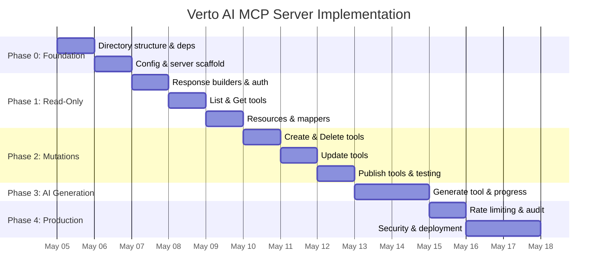

# Detailed Phased Implementation Plan — Verto AI MCP Server

> **Document**: `02-detailed-phased-implementation.md`
> **Version**: 1.0.0-draft
> **Last Updated**: 2026-05-02

---

## Overview

This document breaks the MCP server implementation into **5 phases** with concrete tasks, dependencies, estimated effort, acceptance criteria, and milestones. Each phase is designed to deliver incremental, testable value.

```
Phase 0: Foundation & Infrastructure Setup        (~2 days)
Phase 1: Core Server + Read-Only Tools            (~3 days)
Phase 2: Mutation Tools (Create, Update, Delete)   (~3 days)
Phase 3: AI Generation + Long-Running Operations   (~2 days)
Phase 4: Production Hardening & Deployment         (~3 days)
─────────────────────────────────────────────────
Total Estimated Effort:                            ~13 days
```

---

## Phase 0: Foundation & Infrastructure Setup

**Goal**: Set up the project structure, dependencies, configuration, and foundational abstractions.

**Duration**: ~2 days

### Task 0.1: Create MCP Module Directory Structure

Create the following directory tree inside the existing monorepo:

```
src/
└── mcp/
    ├── server.ts                    # McpServer initialization & capability declaration
    ├── index.ts                     # Entry point — wires server + transport + connects
    │
    ├── config/
    │   ├── env.ts                   # Zod-validated environment config
    │   ├── constants.ts             # Server name, version, rate limit defaults
    │   └── capabilities.ts          # Server capability declarations
    │
    ├── auth/
    │   ├── api-key.ts               # API key validation (stdio transport)
    │   ├── clerk-session.ts         # Clerk session-based auth (HTTP transport)
    │   ├── middleware.ts            # Auth middleware factory
    │   └── types.ts                 # AuthContext type definitions
    │
    ├── tools/
    │   ├── registry.ts              # Central tool registration (plugin pattern)
    │   ├── presentation/
    │   │   ├── index.ts             # Registers all presentation tools
    │   │   ├── list.ts              # presentation_list tool
    │   │   ├── get.ts               # presentation_get tool
    │   │   ├── create.ts            # presentation_create tool
    │   │   ├── delete.ts            # presentation_delete tool
    │   │   ├── recover.ts           # presentation_recover tool
    │   │   ├── delete-permanently.ts # presentation_delete_permanently tool
    │   │   ├── update-slides.ts     # presentation_update_slides tool
    │   │   ├── update-theme.ts      # presentation_update_theme tool
    │   │   ├── publish.ts           # presentation_publish tool
    │   │   ├── unpublish.ts         # presentation_unpublish tool
    │   │   ├── generate.ts          # presentation_generate tool
    │   │   ├── schemas.ts           # Shared Zod schemas for all presentation tools
    │   │   └── mappers.ts           # DB model → MCP response mappers
    │   └── _shared/
    │       ├── pagination.ts        # Cursor-based pagination utilities
    │       ├── response.ts          # Standard MCP response builders
    │       └── errors.ts            # Typed error factories
    │
    ├── resources/
    │   ├── registry.ts              # Central resource registration
    │   ├── presentations.ts         # verto://presentations resource
    │   ├── templates.ts             # verto://templates resource
    │   └── themes.ts                # verto://themes resource
    │
    ├── middleware/
    │   ├── rate-limiter.ts          # In-memory + Redis rate limiting
    │   ├── audit-logger.ts          # Structured request/response logging
    │   ├── request-context.ts       # Per-request context (user, traceId)
    │   └── error-handler.ts         # Global error boundary
    │
    ├── transport/
    │   ├── http.ts                  # Streamable HTTP transport setup (Next.js API route adapter)
    │   ├── stdio.ts                 # stdio transport setup (standalone CLI entry)
    │   └── session-store.ts         # Session management for HTTP transport
    │
    ├── lib/
    │   ├── prisma-client.ts         # Re-export existing Prisma client
    │   ├── user-resolver.ts         # Resolve authenticated user from auth context
    │   └── usage-guard.ts           # Re-use existing usage limit checks
    │
    └── __tests__/
        ├── tools/
        │   └── presentation/
        │       ├── list.test.ts
        │       ├── get.test.ts
        │       ├── create.test.ts
        │       └── ...
        ├── auth/
        │   └── api-key.test.ts
        └── middleware/
            └── rate-limiter.test.ts
```

**Acceptance Criteria**:
- [ ] All directories and placeholder files exist
- [ ] TypeScript compiles with zero errors
- [ ] No impact on existing Next.js application

---

### Task 0.2: Install Dependencies

```bash
bun add @modelcontextprotocol/sdk zod
bun add -d @types/node vitest
```

**Decision**: We use the **official MCP TypeScript SDK** (`@modelcontextprotocol/sdk ^2.x`), not third-party adapters. This gives us full control over transport, auth, and middleware.

**Note**: `zod` is already installed (`^3.24.4`). The SDK requires `zod/v4` compatibility — verify version alignment.

---

### Task 0.3: Environment Configuration

Create `src/mcp/config/env.ts`:

```typescript
import { z } from 'zod';

const mcpEnvSchema = z.object({
  // MCP Server Config
  MCP_SERVER_NAME: z.string().default('verto-ai'),
  MCP_SERVER_VERSION: z.string().default('1.0.0'),

  // Authentication
  VERTO_MCP_API_KEY_HASH: z.string().optional(),    // bcrypt hash of the API key
  CLERK_SECRET_KEY: z.string(),                      // Already exists in .env

  // Rate Limiting
  MCP_RATE_LIMIT_RPM: z.coerce.number().default(120),
  MCP_RATE_LIMIT_CONCURRENT: z.coerce.number().default(10),

  // Database
  DATABASE_URL: z.string().url(),                    // Already exists
});

export type McpEnv = z.infer<typeof mcpEnvSchema>;

export function validateMcpEnv(): McpEnv {
  const result = mcpEnvSchema.safeParse(process.env);
  if (!result.success) {
    console.error('❌ MCP Server: Invalid environment configuration');
    console.error(result.error.format());
    throw new Error('MCP environment validation failed');
  }
  return result.data;
}
```

**Acceptance Criteria**:
- [ ] Server fails fast with descriptive errors on missing env vars
- [ ] All existing env vars are re-used (no duplication)
- [ ] New MCP-specific vars documented in `.env.example`

---

### Task 0.4: Server Initialization Scaffold

Create `src/mcp/server.ts`:

```typescript
import { McpServer } from '@modelcontextprotocol/server';
import { validateMcpEnv } from './config/env';

export function createMcpServer() {
  const env = validateMcpEnv();

  const server = new McpServer(
    {
      name: env.MCP_SERVER_NAME,
      version: env.MCP_SERVER_VERSION,
    },
    {
      capabilities: {
        tools: {},
        resources: {},
        logging: {},
      },
      instructions: `
        You are connected to Verto AI's presentation management server.
        
        WORKFLOW:
        1. Use 'presentation_list' to browse existing presentations
        2. Use 'presentation_get' to read a specific presentation's content
        3. Use 'presentation_create' to create new presentations
        4. Use 'presentation_generate' for AI-powered generation (30-90s)
        5. Use 'presentation_update_slides' and 'presentation_update_theme' to modify
        6. Use 'presentation_publish' to make presentations publicly shareable
        
        RESOURCES:
        - Read 'verto://themes' before changing themes
        - Read 'verto://templates' to see available templates
        
        IMPORTANT:
        - presentation_delete is a soft-delete (recoverable)
        - presentation_delete_permanently requires confirm: true
        - presentation_generate is a long-running operation
      `.trim(),
    }
  );

  return server;
}
```

**Acceptance Criteria**:
- [ ] `McpServer` instance created with proper metadata
- [ ] Instructions guide LLM behavior effectively
- [ ] Capabilities declared for tools, resources, and logging

---

### Task 0.5: API Route Handler for Streamable HTTP

Create `src/app/api/mcp/route.ts`:

```typescript
// Next.js App Router API handler for MCP Streamable HTTP transport
// This is the production entry point for remote MCP clients

import { createMcpServer } from '@/mcp/server';
import { registerAllTools } from '@/mcp/tools/registry';
import { registerAllResources } from '@/mcp/resources/registry';
import { StreamableHTTPServerTransport } from '@modelcontextprotocol/server/streamableHttp';

// ... HTTP handler implementation
```

**Acceptance Criteria**:
- [ ] `/api/mcp` endpoint responds to MCP JSON-RPC messages
- [ ] Added to Clerk middleware's public route matcher
- [ ] CORS configured for allowed origins
- [ ] Health check: `GET /api/mcp` returns server info

---

## Phase 1: Core Server + Read-Only Tools

**Goal**: Implement the server skeleton with read-only tools and resources. Zero mutation risk — safe to test.

**Duration**: ~3 days

**Dependencies**: Phase 0 complete

### Task 1.1: Response Builder Utilities

Create `src/mcp/tools/_shared/response.ts`:

```typescript
// Standard success/error response factories
export function mcpSuccess(data: unknown) { ... }
export function mcpError(code: string, message: string, suggestion?: string) { ... }
export function mcpPaginated(data: unknown[], pagination: PaginationMeta) { ... }
```

**Why**: Every tool handler imports these — build them first.

---

### Task 1.2: Auth Middleware

Create `src/mcp/auth/`:

| File | Purpose |
|------|---------|
| `api-key.ts` | Validate `VERTO_API_KEY` for stdio transport |
| `clerk-session.ts` | Extract Clerk user from HTTP request context |
| `middleware.ts` | Factory that picks auth strategy based on transport |
| `types.ts` | `AuthContext { userId, clerkId, email, tier }` |

**Key Design Decision**: MCP tools receive an `AuthContext` object — they never touch Clerk directly. This keeps tools transport-agnostic.

```typescript
// src/mcp/auth/types.ts
export interface AuthContext {
  userId: string;      // Internal DB UUID
  clerkId: string;     // Clerk user ID
  email: string;
  tier: 'free' | 'pro' | 'enterprise';
}
```

---

### Task 1.3: Implement `presentation_list` Tool

File: `src/mcp/tools/presentation/list.ts`

**Mapping to existing code**:
- Reuses logic from `src/actions/projects.ts → getAllProjects()`
- Adds cursor-based pagination (not present in current server action)
- Strips `slides` JSON from response (token efficiency)

**Test scenarios**:
- [ ] Returns paginated results with proper cursor
- [ ] `include_deleted: true` shows soft-deleted projects
- [ ] Empty result set returns valid empty array (not 404)
- [ ] Unauthorized request returns structured error

---

### Task 1.4: Implement `presentation_get` Tool

File: `src/mcp/tools/presentation/get.ts`

**Mapping to existing code**:
- Reuses `src/actions/projects.ts → getProjectById()`
- Adds `include_slides` flag to control response size
- Maps DB model to `PresentationMCPResponse` format

---

### Task 1.5: Implement Resources

| File | Existing Code Reused |
|------|---------------------|
| `presentations.ts` | `getAllProjects()` — lightweight metadata listing |
| `templates.ts` | `src/actions/templates.ts` — template catalog |
| `themes.ts` | `src/lib/constants.ts` — theme definitions |

---

### Task 1.6: Response Mapper Layer

Create `src/mcp/tools/presentation/mappers.ts`:

```typescript
import { Project } from '@/generated/prisma';

// Transform DB model to MCP-safe response
export function projectToPresentation(project: Project, options?: {
  includeSlides?: boolean;
  baseUrl?: string;
}): PresentationMCPResponse {
  return {
    id: project.id,
    title: project.title,
    created_at: project.createdAt.toISOString(),
    updated_at: project.updatedAt.toISOString(),
    slide_count: Array.isArray(project.slides) ? project.slides.length : 0,
    theme_name: project.themeName,
    is_published: project.isPublished,
    is_deleted: project.isDeleted,
    share_url: project.isPublished ? `${options?.baseUrl}/share/${project.id}` : null,
    outlines: project.outlines,
    slides: options?.includeSlides ? project.slides : undefined,
  };
}
```

**Why a mapper layer?**
1. Never leak internal DB fields (e.g., `userId`, `varientId`) to the MCP client
2. Rename fields to snake_case (MCP convention)
3. Compute derived fields (`slide_count`, `share_url`)
4. Single place to update when Prisma schema changes

---

### Milestone: Phase 1 Complete ✓

```
✅ MCP server starts and connects via stdio
✅ presentation_list returns paginated results
✅ presentation_get returns full presentation data
✅ Resources serve project, template, and theme data
✅ Auth context propagated to all tool handlers
✅ 100% of read operations tested
```

---

## Phase 2: Mutation Tools (Create, Update, Delete)

**Goal**: Implement all write operations with proper validation, ownership enforcement, and idempotency.

**Duration**: ~3 days

**Dependencies**: Phase 1 complete

### Task 2.1: Implement `presentation_create`

File: `src/mcp/tools/presentation/create.ts`

**Mapping to existing code**:
- Reuses `src/actions/projects.ts → createProject()`
- Adds `request_id` for idempotent creation
- Integrates `checkAndIncrementUsage()` from `src/lib/usage-limit.ts`

**Idempotency implementation**:
```typescript
// If request_id is provided, check for existing project with matching request metadata
// Store request_id in a separate MCP-specific table or project metadata
```

---

### Task 2.2: Implement `presentation_delete` and `presentation_recover`

Files: `src/mcp/tools/presentation/delete.ts`, `recover.ts`

**Mapping to existing code**:
- `delete` → `src/actions/projects.ts → deleteProject()` (soft-delete)
- `recover` → `src/actions/projects.ts → recoverProject()`

Both enforce ownership via `getOwnedProject()`.

---

### Task 2.3: Implement `presentation_delete_permanently`

File: `src/mcp/tools/presentation/delete-permanently.ts`

**Mapping to existing code**:
- Reuses `src/actions/projects.ts → deleteAllProjects()`
- Requires `confirm: true` in input — prevents LLM hallucination from causing data loss
- Logs to audit trail with user ID, deleted project IDs, and timestamp

**Security considerations**:
- Hard limit of 20 projects per call
- Audit log is immutable (append-only)
- Confirmation flag is `z.literal(true)` — not a boolean

---

### Task 2.4: Implement `presentation_update_slides`

File: `src/mcp/tools/presentation/update-slides.ts`

**Mapping to existing code**:
- Reuses `src/actions/projects.ts → updateSlides()`
- Validates slide array structure against Zod schema

**Important note for LLM context**:
> The `slides` field is a complete replacement — not a patch. Agents should always `presentation_get` first, modify the array, then `presentation_update_slides` with the full array.

---

### Task 2.5: Implement `presentation_update_theme`

File: `src/mcp/tools/presentation/update-theme.ts`

**Mapping to existing code**:
- Reuses `src/actions/projects.ts → updateTheme()`
- Validates theme name against available themes list

---

### Task 2.6: Implement `presentation_publish` and `presentation_unpublish`

Files: `src/mcp/tools/presentation/publish.ts`, `unpublish.ts`

**Mapping to existing code**:
- `publish` → `src/actions/project-share.ts → publishProject()`
- `unpublish` → `src/actions/project-share.ts → unpublishProject()`

---

### Milestone: Phase 2 Complete ✓

```
✅ All 10 tools implemented and registered
✅ Ownership enforcement on all mutation tools
✅ Idempotent creation with request_id
✅ Destructive operations require explicit confirmation
✅ Usage limits enforced for creation
✅ All mutation operations tested
```

---

## Phase 3: AI Generation + Long-Running Operations

**Goal**: Integrate the 8-agent LangGraph pipeline as an MCP tool with proper progress reporting.

**Duration**: ~2 days

**Dependencies**: Phase 2 complete

### Task 3.1: Implement `presentation_generate`

File: `src/mcp/tools/presentation/generate.ts`

**Mapping to existing code**:
- Wraps `src/actions/generatePresentation.ts → generatePresentationAction()`
- Creates a `PresentationGenerationRun` for progress tracking
- Returns immediately with `generation_run_id` and final result

**Long-running operation pattern**:
```
1. Client calls presentation_generate
2. Server creates a generation run (PENDING)
3. Server starts the LangGraph pipeline (async)
4. Server waits for completion (with timeout)
5. Returns final result with presentation_id + generation_run_id
```

**Timeout handling**:
- Default timeout: 120 seconds
- If pipeline hasn't completed, return generation_run_id with status: "RUNNING"
- Client can poll using `presentation_get` with the `project_id` from generation run

---

### Task 3.2: Progress Resource (Optional Enhancement)

Consider a dynamic resource for generation progress:

```
verto://generation/{runId}/progress
```

This allows agents to read real-time progress without a tool call, keeping the interaction lightweight.

---

### Milestone: Phase 3 Complete ✓

```
✅ presentation_generate triggers full AI pipeline
✅ Generation progress tracked in database
✅ Long-running operations handle timeouts gracefully
✅ Usage limits enforced for generation
```

---

## Phase 4: Production Hardening & Deployment

**Goal**: Add rate limiting, audit logging, error handling, security hardening, and deployment configuration.

**Duration**: ~3 days

**Dependencies**: Phase 3 complete

### Task 4.1: Rate Limiting

File: `src/mcp/middleware/rate-limiter.ts`

**Implementation**: Sliding window counter with in-memory store (production: Redis via Upstash)

```typescript
interface RateLimitConfig {
  windowMs: number;    // 60000 (1 minute)
  maxRequests: number; // Tier-based
  keyGenerator: (ctx: AuthContext) => string;
}
```

**Behavior on limit exceeded**:
```json
{
  "content": [{
    "type": "text",
    "text": "{\"error\": {\"code\": \"RATE_LIMITED\", \"message\": \"Rate limit exceeded. You can make 120 requests per minute.\", \"retry_after_seconds\": 12}}"
  }],
  "isError": true
}
```

---

### Task 4.2: Audit Logger

File: `src/mcp/middleware/audit-logger.ts`

**Every tool invocation is logged with**:
```typescript
interface AuditLogEntry {
  timestamp: string;
  trace_id: string;        // UUID per request
  user_id: string;
  tool_name: string;
  tool_input: object;      // Sanitized (no secrets)
  tool_output_status: 'success' | 'error';
  latency_ms: number;
  transport: 'stdio' | 'http';
  client_info?: string;    // e.g., "Claude Desktop 4.2"
}
```

**Storage**: Initially structured console logs (`console.error` for MCP stdio safety). Production: ship to external logging service.

---

### Task 4.3: Error Boundary

File: `src/mcp/middleware/error-handler.ts`

**Design**: Catch-all wrapper for every tool handler that:
1. Catches unhandled exceptions
2. Logs the full error with stack trace
3. Returns a sanitized, LLM-parsable error response
4. Never exposes internal implementation details

```typescript
export function withErrorBoundary(
  toolName: string,
  handler: ToolHandler
): ToolHandler {
  return async (args, context) => {
    try {
      return await handler(args, context);
    } catch (error) {
      auditLogger.error({ toolName, error });
      return mcpError(
        'INTERNAL_ERROR',
        'An unexpected error occurred. The Verto AI team has been notified.',
        'Try again, or contact support if the issue persists.'
      );
    }
  };
}
```

---

### Task 4.4: Clerk Middleware Update

Update `src/middleware.ts` to allow MCP API route:

```typescript
const isPublicRoute = createRouteMatcher([
  "/sign-in(.*)",
  "/sign-up(.*)",
  "/api/webhook(.*)",
  "/api/inngest(.*)",
  "/api/mobile-design/inngest(.*)",
  "/api/mcp(.*)",           // ← ADD THIS
  "/features(.*)",
  "/",
]);
```

**Note**: MCP auth is handled separately (API key or Clerk session), not via Clerk middleware.

---

### Task 4.5: Security Hardening Checklist

| Check | Status | Notes |
|-------|--------|-------|
| Input validation via Zod on every tool | ⬜ | Prevents injection attacks |
| Ownership enforcement on all mutations | ⬜ | Via `getOwnedProject()` |
| API key hashing (bcrypt) | ⬜ | Never store plaintext keys |
| Rate limiting per user | ⬜ | Sliding window counter |
| Audit logging of all operations | ⬜ | Immutable audit trail |
| CORS configuration for HTTP transport | ⬜ | Restrict allowed origins |
| Request size limits | ⬜ | Max 10MB per request |
| No internal error leakage | ⬜ | Error boundary sanitizes |
| Slide JSON depth limit | ⬜ | Prevent DoS via deeply nested JSON |

---

### Task 4.6: stdio Entry Point for CLI Distribution

Create `src/mcp/transport/stdio.ts`:

```typescript
#!/usr/bin/env node
// Standalone entry point for stdio-based MCP clients
// This can be distributed as an npm package: verto-mcp-server

import { StdioServerTransport } from '@modelcontextprotocol/server/stdio';
import { createMcpServer } from '../server';
import { registerAllTools } from '../tools/registry';
import { registerAllResources } from '../resources/registry';

async function main() {
  const server = createMcpServer();
  registerAllTools(server);
  registerAllResources(server);

  const transport = new StdioServerTransport();
  await server.connect(transport);
  console.error('Verto AI MCP Server running on stdio');
}

main().catch(console.error);
```

---

### Task 4.7: Package.json Updates

Add MCP-related scripts:

```json
{
  "scripts": {
    "mcp:dev": "npx tsx src/mcp/transport/stdio.ts",
    "mcp:inspect": "npx @modelcontextprotocol/inspector npx tsx src/mcp/transport/stdio.ts"
  }
}
```

---

### Milestone: Phase 4 Complete ✓

```
✅ Rate limiting active (in-memory, Redis-ready)
✅ Audit logging for all tool invocations
✅ Error boundary catches and sanitizes all errors
✅ Clerk middleware updated for MCP route
✅ stdio entry point works with Claude Desktop/Cursor
✅ HTTP endpoint deployed and accessible
✅ Security hardening checklist 100% complete
```

---

## Phase Summary & Timeline



---

## Decision Log

| # | Decision | Rationale | Alternatives Considered |
|---|----------|-----------|-------------------------|
| D1 | Use official MCP SDK, not `mcp-handler` adapter | Full control over transport, auth, and middleware | `mcp-handler`, `@vercel/mcp-adapter` |
| D2 | Feature-based tool organization | Each domain is self-contained and extensible | Layer-based (controllers/services) |
| D3 | Cursor-based pagination | Stable during concurrent mutations | Offset-based, keyset |
| D4 | API key auth for stdio, Clerk for HTTP | Match existing auth strategy | OAuth 2.1 (future) |
| D5 | In-memory rate limiter with Redis interface | Works for MVP, swap Redis for production | Redis-only, external gateway |
| D6 | Mapper layer between Prisma and MCP | Never leak internal models, consistent API | Direct model exposure |
| D7 | `z.literal(true)` for destructive ops | Prevents LLM hallucination from causing data loss | Boolean confirmation |

---

## Risk Register

| Risk | Likelihood | Impact | Mitigation |
|------|-----------|--------|------------|
| LLM hallucinates destructive actions | Medium | High | `confirm: true` flag, audit logging |
| Rate limit bypass via multiple sessions | Low | Medium | Per-user rate limiting (not per-session) |
| Slide JSON too large for MCP response | Medium | Medium | `include_slides: false` default for lists |
| stdio transport blocks on long generation | Medium | Low | Async generation with run ID polling |
| Zod version mismatch (v3 vs v4) | Low | Medium | Pin `zod` version, test schema compat |

> **Next Document**: [03-architecture-security-tooling.md](./03-architecture-security-tooling.md) — Deep-dive into architecture, security model, tooling, repository patterns, and operational concerns.
