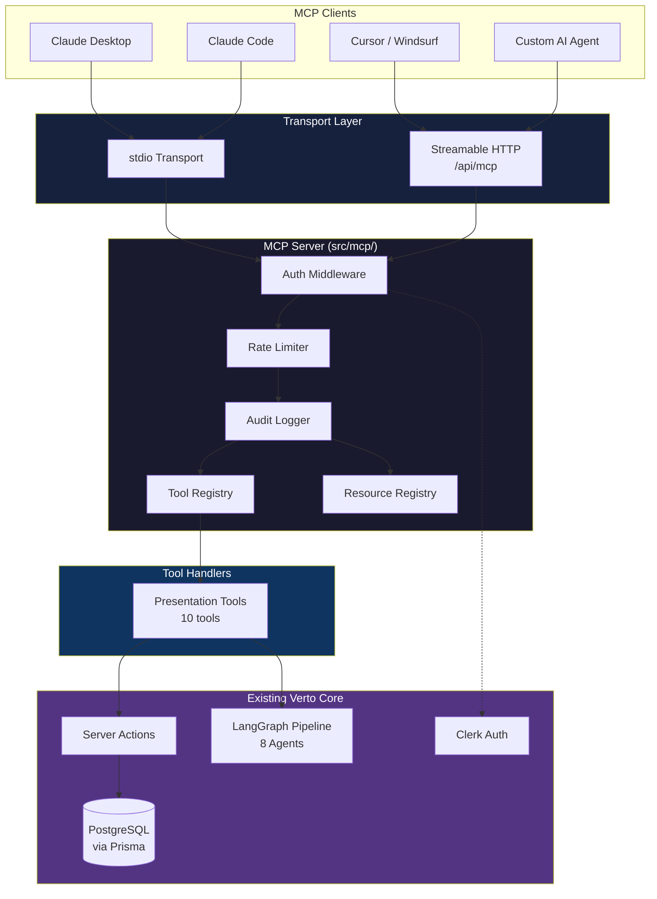
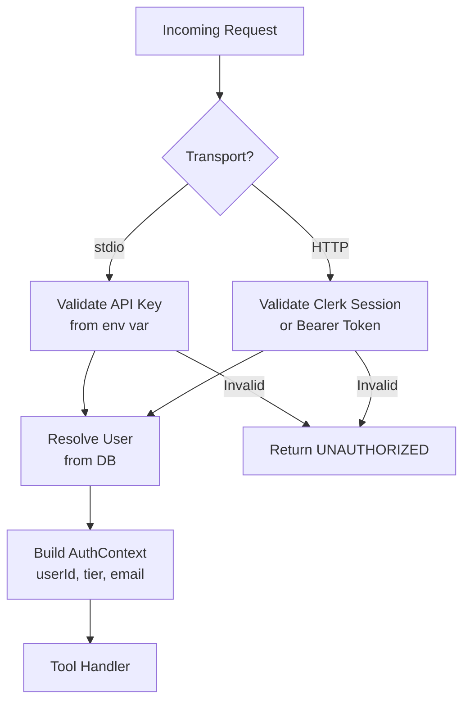

# Architecture, Security, Tooling & Repository Patterns — Verto AI MCP Server

> **Document**: `03-architecture-security-tooling.md`
> **Version**: 1.0.0-draft
> **Last Updated**: 2026-05-02

---

## 1. System Architecture

### 1.1 High-Level Architecture Diagram



### 1.2 Request Flow (Streamable HTTP)

```
Client POST /api/mcp
  → Next.js API Route Handler
    → Session validation (Mcp-Session-Id)
    → Auth middleware (API key or Clerk)
    → Rate limiter check
    → JSON-RPC message parsing
    → Tool/Resource dispatch
    → Handler execution (with AuthContext)
    → Response serialization
    → Audit log entry
  ← JSON-RPC response
```

### 1.3 Request Flow (stdio)

```
Client writes to stdin
  → StdioServerTransport reads JSON-RPC
    → Auth middleware (env API key)
    → Tool/Resource dispatch
    → Handler execution
    → Response serialization
    → Audit log (stderr)
  ← JSON-RPC via stdout
```

### 1.4 Layered Architecture

| Layer | Responsibility | Files |
|-------|---------------|-------|
| **Transport** | Protocol translation (HTTP ↔ JSON-RPC, stdio ↔ JSON-RPC) | `transport/` |
| **Middleware** | Cross-cutting concerns (auth, rate-limit, logging, errors) | `middleware/`, `auth/` |
| **Registry** | Tool/resource discovery and registration | `tools/registry.ts`, `resources/registry.ts` |
| **Handlers** | Business logic per tool (delegates to core) | `tools/presentation/*.ts` |
| **Mappers** | DB model → MCP response transformation | `tools/presentation/mappers.ts` |
| **Core** | Existing server actions + Prisma + LangGraph | `src/actions/`, `src/agentic-workflow-v2/` |

**Key Principle**: The MCP layer **never** accesses Prisma directly. It always delegates to existing server actions or creates thin service wrappers. This prevents business logic duplication.

---

## 2. Security Model

### 2.1 Threat Model

| Threat | Vector | Severity | Mitigation |
|--------|--------|----------|------------|
| **Unauthorized access** | Missing/stolen API key | Critical | Bcrypt-hashed keys, key rotation, per-user keys |
| **Prompt injection** | LLM-crafted malicious tool arguments | High | Zod validation, parameterized queries, no eval() |
| **Data exfiltration** | Agent reads other users' presentations | High | Ownership enforcement on every query |
| **Denial of Service** | Runaway agent loop | Medium | Rate limiting, concurrency caps, request timeouts |
| **Privilege escalation** | Agent attempts admin operations | Medium | Tool catalog limited to user-scoped operations |
| **Data destruction** | LLM hallucinates delete commands | Medium | `confirm: true` literal, audit trail, soft-delete default |

### 2.2 Authentication Architecture



**API Key Strategy** (for stdio / headless agents):

```typescript
// Key format: vk_live_<random 32 chars>
// Storage: bcrypt hash in UserApiKey model (new Prisma model)
// Rotation: Users generate new keys from dashboard, old keys invalidated
// Scoping: Each key is tied to a single user and inherits their permissions
```

**Future OAuth 2.1 Flow** (for third-party integrations):

```
Authorization Code + PKCE flow
Scopes: presentations:read, presentations:write, presentations:generate
Token lifetime: 1 hour (access), 30 days (refresh)
```

### 2.3 Input Validation Rules

Every tool input passes through **three validation layers**:

```
Layer 1: Zod Schema Validation
  → Type checking, string length limits, enum constraints
  → Reject malformed inputs before any business logic

Layer 2: Semantic Validation  
  → Does the referenced presentation exist?
  → Does the user own this resource?
  → Is the theme name valid?

Layer 3: Business Rule Validation
  → Has the user exceeded their usage limit?
  → Is the presentation in a valid state for this operation?
```

### 2.4 Secrets Management

| Secret | Storage | Access |
|--------|---------|--------|
| `DATABASE_URL` | `.env` / platform env vars | Server-side only |
| `CLERK_SECRET_KEY` | `.env` / platform env vars | Auth middleware only |
| `VERTO_MCP_API_KEY_HASH` | Database (`UserApiKey` model) | Auth middleware only |
| User AI keys | Encrypted in DB (AES-256-GCM) | Already implemented |

**Rule**: No secrets are ever included in MCP responses, tool descriptions, or error messages.

---

## 3. Tooling & Developer Experience

### 3.1 Development Workflow

```bash
# 1. Start the MCP server in stdio mode for local testing
bun run mcp:dev

# 2. Use MCP Inspector for interactive testing
bun run mcp:inspect

# 3. Test with Claude Desktop (add to config)
# ~/Library/Application Support/Claude/claude_desktop_config.json
{
  "mcpServers": {
    "verto-ai": {
      "command": "npx",
      "args": ["tsx", "src/mcp/transport/stdio.ts"],
      "cwd": "/path/to/verto-ai",
      "env": { "VERTO_API_KEY": "vk_dev_..." }
    }
  }
}

# 4. Test HTTP transport locally
curl -X POST http://localhost:3000/api/mcp \
  -H "Content-Type: application/json" \
  -H "Authorization: Bearer vk_dev_..." \
  -d '{"jsonrpc":"2.0","method":"tools/list","id":1}'
```

### 3.2 Testing Strategy

| Level | Tool | Scope |
|-------|------|-------|
| **Unit** | Vitest | Individual tool handlers with mocked Prisma |
| **Integration** | Vitest + MCP Client SDK | Full tool execution through MCP protocol |
| **E2E** | MCP Inspector | Manual verification of tool catalog and responses |
| **Contract** | Zod schemas | Input/output shape validation |

**Unit test pattern**:
```typescript
// src/mcp/__tests__/tools/presentation/list.test.ts
import { describe, it, expect, vi } from 'vitest';
import { handlePresentationList } from '@/mcp/tools/presentation/list';

describe('presentation_list', () => {
  it('returns paginated presentations for authenticated user', async () => {
    // Mock Prisma, mock AuthContext, assert response shape
  });

  it('returns empty array when user has no presentations', async () => {
    // Should NOT return 404 — empty is a valid result
  });

  it('rejects unauthenticated requests', async () => {
    // Assert UNAUTHORIZED error code
  });
});
```

### 3.3 Recommended Tooling

| Tool | Purpose | Command |
|------|---------|---------|
| **MCP Inspector** | Interactive tool testing GUI | `npx @modelcontextprotocol/inspector` |
| **mcp-cli** | Command-line MCP client | `npx @wong2/mcp-cli` |
| **Vitest** | Unit and integration testing | `bunx vitest` |
| **Pino** (future) | Structured production logging | `import pino from 'pino'` |
| **tsx** | TypeScript execution for stdio | `npx tsx src/mcp/transport/stdio.ts` |

### 3.4 Observability

**Structured log format** (JSON lines to stderr):

```json
{
  "level": "info",
  "timestamp": "2026-05-02T08:30:00.000Z",
  "trace_id": "abc-123",
  "component": "mcp",
  "event": "tool_invocation",
  "tool": "presentation_create",
  "user_id": "usr_xyz",
  "latency_ms": 145,
  "status": "success"
}
```

**Metrics to track**:
- Tool invocation count (by tool name)
- Tool latency p50/p95/p99
- Error rate (by error code)
- Rate limit hits
- Active sessions (HTTP transport)

---

## 4. Repository & Code Patterns

### 4.1 Plugin Registration Pattern

The tool registry uses a **plugin pattern** so new tool domains can be added without modifying core server code:

```typescript
// src/mcp/tools/registry.ts
import type { McpServer } from '@modelcontextprotocol/server';

type ToolPlugin = {
  name: string;
  register: (server: McpServer) => void;
};

const plugins: ToolPlugin[] = [];

export function registerToolPlugin(plugin: ToolPlugin) {
  plugins.push(plugin);
}

export function registerAllTools(server: McpServer) {
  for (const plugin of plugins) {
    plugin.register(server);
    console.error(`[MCP] Registered tool plugin: ${plugin.name}`);
  }
}
```

```typescript
// src/mcp/tools/presentation/index.ts
import { registerToolPlugin } from '../registry';
import type { McpServer } from '@modelcontextprotocol/server';

registerToolPlugin({
  name: 'presentation',
  register: (server: McpServer) => {
    // Register all 10 presentation tools
    registerListTool(server);
    registerGetTool(server);
    registerCreateTool(server);
    // ... etc
  },
});
```

**Adding a new domain** (e.g., templates):
```typescript
// src/mcp/tools/templates/index.ts
registerToolPlugin({
  name: 'templates',
  register: (server) => { /* register template tools */ },
});
```

### 4.2 Handler Pattern

Every tool handler follows this consistent signature:

```typescript
// Standard tool handler pattern
type ToolHandler<TInput> = (
  args: TInput,
  auth: AuthContext
) => Promise<McpToolResponse>;

// Example implementation
export const handlePresentationGet: ToolHandler<PresentationGetInput> = async (
  args,
  auth
) => {
  // 1. Validate ownership
  const project = await getOwnedProjectForMcp(args.presentation_id, auth.userId);
  if (!project) return mcpError('NOT_FOUND', '...');

  // 2. Transform to MCP response
  const presentation = projectToPresentation(project, {
    includeSlides: args.include_slides,
  });

  // 3. Return standard success
  return mcpSuccess(presentation);
};
```

### 4.3 Error Factory Pattern

```typescript
// src/mcp/tools/_shared/errors.ts
export class McpToolError extends Error {
  constructor(
    public code: string,
    public userMessage: string,
    public suggestion?: string,
    public httpEquiv?: number
  ) {
    super(userMessage);
  }
}

export const Errors = {
  notFound: (resource: string, id: string) =>
    new McpToolError(
      'NOT_FOUND',
      `${resource} with ID '${id}' was not found.`,
      `Use presentation_list to get valid IDs.`,
      404
    ),
  unauthorized: () =>
    new McpToolError('UNAUTHORIZED', 'Authentication required.', undefined, 401),
  forbidden: (resource: string) =>
    new McpToolError('FORBIDDEN', `You don't have access to this ${resource}.`, undefined, 403),
  rateLimited: (retryAfter: number) =>
    new McpToolError('RATE_LIMITED', `Rate limit exceeded.`, `Retry after ${retryAfter} seconds.`, 429),
} as const;
```

### 4.4 Prisma Schema Addition

Add a model for MCP API keys:

```prisma
model McpApiKey {
  id          String   @id @default(cuid())
  userId      String   @db.Uuid
  name        String   @default("Default")  // Human-readable label
  keyHash     String                         // bcrypt hash
  keyPrefix   String                         // First 8 chars for identification
  lastUsedAt  DateTime?
  expiresAt   DateTime?
  isRevoked   Boolean  @default(false)
  createdAt   DateTime @default(now())
  updatedAt   DateTime @updatedAt

  user User @relation(fields: [userId], references: [id], onDelete: Cascade)

  @@index([keyHash])
  @@index([userId])
}
```

---

## 5. Deployment Topology

### 5.1 Monorepo (Current Approach)

The MCP server lives inside the existing Next.js monorepo:

```
Pros:
  ✅ Shares Prisma client, types, and server actions
  ✅ No code duplication
  ✅ Single deployment pipeline
  ✅ Consistent dependency versions

Cons:
  ⚠️ MCP server scales with Next.js (not independently)
  ⚠️ stdio entry point must be carefully isolated
```

### 5.2 Future: Standalone Package

When the MCP server needs independent scaling:

```
verto-ai/
├── apps/
│   ├── web/          # Next.js frontend + API
│   └── mcp-server/   # Standalone MCP server (npm package)
├── packages/
│   ├── db/           # Shared Prisma client
│   ├── core/         # Shared business logic
│   └── types/        # Shared TypeScript types
```

### 5.3 npm Distribution (Future)

```json
{
  "name": "verto-mcp-server",
  "version": "1.0.0",
  "bin": {
    "verto-mcp-server": "./dist/stdio.js"
  }
}
```

Users install globally: `npx -y verto-mcp-server`

---

## 6. Comparison with Industry MCP Servers

| Aspect | Cloudflare MCP | Stripe MCP | **Verto AI MCP** |
|--------|---------------|------------|-----------------|
| **Transport** | Streamable HTTP (Workers) | stdio + HTTP | Both (stdio dev, HTTP prod) |
| **Auth** | Cloudflare API Token | Stripe API Key | API Key + Clerk Session |
| **Tool Count** | ~15 (DNS, Workers, KV) | ~20 (Charges, Customers) | 10 (Presentations) |
| **Pagination** | Cursor-based | Cursor-based | Cursor-based |
| **Rate Limiting** | Cloudflare-level | Stripe API limits | Custom per-tier |
| **Error Format** | Structured JSON | Structured JSON | Structured JSON with suggestions |
| **Destructive Ops** | Require confirmation | Require confirmation | `confirm: true` literal |
| **Observability** | Workers Analytics | Stripe Dashboard | Structured logging |

---

## 7. Checklist: Production Readiness

| Category | Requirement | Status |
|----------|-------------|--------|
| **Security** | Zod validation on all tool inputs | ⬜ |
| **Security** | Ownership enforcement on all mutations | ⬜ |
| **Security** | API key hashing (bcrypt, never plaintext) | ⬜ |
| **Security** | No internal errors leaked to clients | ⬜ |
| **Security** | CORS configured for HTTP transport | ⬜ |
| **Performance** | Rate limiting per user/tier | ⬜ |
| **Performance** | Pagination on all list operations | ⬜ |
| **Performance** | Response size limits (no full slide dumps in lists) | ⬜ |
| **Observability** | Structured audit logging | ⬜ |
| **Observability** | Latency tracking per tool | ⬜ |
| **Operations** | Health check endpoint | ⬜ |
| **Operations** | Graceful shutdown handling | ⬜ |
| **Operations** | Error boundary on all handlers | ⬜ |
| **Documentation** | Tool descriptions optimized for LLMs | ⬜ |
| **Documentation** | Client configuration examples | ⬜ |
| **Testing** | Unit tests for all 10 tools | ⬜ |
| **Testing** | Integration test with MCP Inspector | ⬜ |

---

> **Related Documents**:
> - [01-specs.md](./01-specs.md) — Complete MCP tool/resource specifications
> - [02-detailed-phased-implementation.md](./02-detailed-phased-implementation.md) — Phase-by-phase build plan
