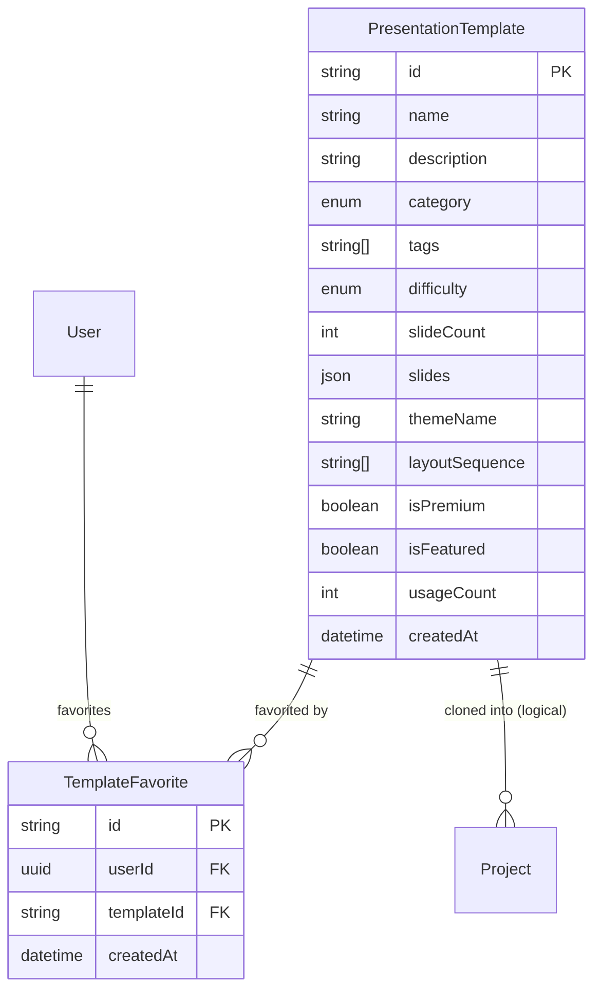
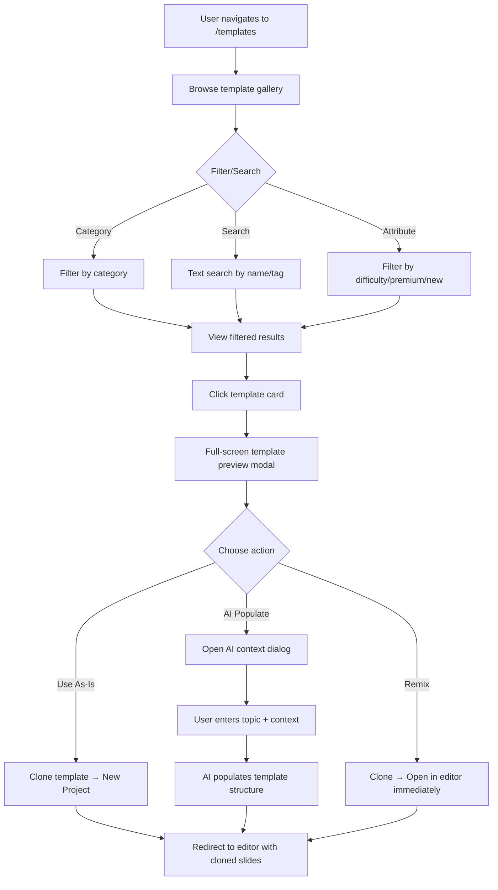
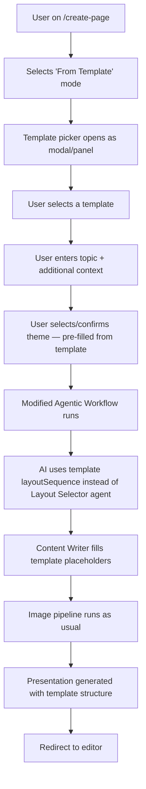
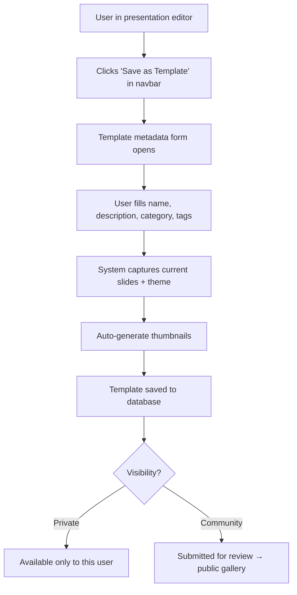

# Templates Feature — Complete Specification

> Feature specification for the `/templates` system in Verto AI.  
> Status: **Draft** · Author: AI · Last Updated: 2026-04-18

---

## Table of Contents

- [1. Executive Summary](#1-executive-summary)
- [2. Problem Statement](#2-problem-statement)
- [3. Feature Concept](#3-feature-concept)
- [4. Template Taxonomy](#4-template-taxonomy)
- [5. Data Model](#5-data-model)
- [6. Template JSON Structure](#6-template-json-structure)
- [7. User Flows](#7-user-flows)
- [8. UI/UX Design](#8-uiux-design)
- [9. API & Server Actions](#9-api--server-actions)
- [10. Frontend Architecture](#10-frontend-architecture)
- [11. AI Integration](#11-ai-integration)
- [12. Template Authoring (Editor Sidebar)](#12-template-authoring-editor-sidebar)
- [13. Marketplace & Premium Gating](#13-marketplace--premium-gating)
- [14. Performance & Caching](#14-performance--caching)
- [15. Implementation Roadmap](#15-implementation-roadmap)
- [16. Acceptance Criteria](#16-acceptance-criteria)
- [17. Edge Cases & Risks](#17-edge-cases--risks)

---

## 1. Executive Summary

The **Templates** feature introduces a curated library of pre-designed, fully-structured presentation decks that users can browse, preview, and use as starting points — either as-is or enhanced by AI. Unlike the current `layoutTemplates.ts` (which defines per-slide layouts for AI generation), **Templates** are complete multi-slide presentation blueprints with pre-populated content, theming, and structure.

**Key Differentiator:**

| Concept | What it is | Where it lives |
|---------|-----------|----------------|
| **Layout** | A single-slide structural skeleton (e.g., "Two Columns", "Bento Grid") | `src/agentic-workflow-v2/lib/layoutTemplates.ts` |
| **Theme** | A color/font/style configuration applied globally | `src/lib/constants.ts` (themes array) |
| **Template** *(new)* | A complete multi-slide presentation blueprint with layouts + content + theme bound together | `src/lib/templates/` + Database |

---

## 2. Problem Statement

### Current User Friction Points

1. **Cold Start Problem** — Users who choose "Start from Scratch" face a blank canvas with no structural guidance. They must manually add slides, pick layouts, write content, and configure styling.

2. **AI Unpredictability** — The "Agentic Workflow" mode generates excellent content, but users have no control over the structural blueprint the AI follows. They can't say "generate a pitch deck structured like a YC Demo Day deck."

3. **Industry-Specific Gaps** — A teacher creating a lesson plan and a startup founder building a pitch deck need fundamentally different slide structures, but the current system treats all topics identically.

4. **Theme-Layout Disconnect** — Users can pick themes (30+ options), but themes are purely cosmetic. There's no way to get a theme + structure bundle that "just works" together.

---

## 3. Feature Concept

### What Templates Provide

A **Template** is a **complete presentation blueprint** containing:

```
Template = {
  metadata        →  name, description, category, tags, thumbnail, difficulty
  slides[]        →  pre-built slide JSON (ContentItem trees) with placeholder content
  theme           →  bound theme configuration (colors, fonts, accent)
  layoutSequence  →  the ordered list of layout types used
  slideCount      →  number of slides in the template
  aiEnhanceable   →  flag indicating if AI can populate this template with user content
}
```

### Three Usage Modes

| Mode | Description |
|------|-------------|
| **Use As-Is** | Clone the template into a new project. User edits the placeholder content manually. |
| **AI Populate** | User provides a topic/context. The AI uses the template's structure as a blueprint and fills each slide with relevant content while preserving layouts. |
| **Remix** | User selects a template, then modifies the slide order, swaps layouts, changes theme — treating it as a starting scaffold. |

---

## 4. Template Taxonomy

### 4.1 Template Categories

Templates are organized into **11 categories** that cover the most common presentation use cases:

| # | Category | Icon | Description | Example Templates |
|---|----------|------|-------------|-------------------|
| 1 | **Business & Corporate** | 💼 | Formal business presentations | Company Overview, Quarterly Review, Board Meeting, Annual Report |
| 2 | **Startup & Pitch** | 🚀 | Fundraising and investor decks | YC-Style Pitch Deck, Seed Round Pitch, Product-Market Fit, Investor Update |
| 3 | **Education & Academic** | 📚 | Teaching and learning materials | Lesson Plan, Research Presentation, Course Overview, Student Report |
| 4 | **Marketing & Sales** | 📊 | Go-to-market and sales materials | Product Launch, Sales Pitch, Market Analysis, Social Media Strategy |
| 5 | **Creative & Portfolio** | 🎨 | Design and creative showcases | Photography Portfolio, Design Case Study, Brand Guidelines, Mood Board |
| 6 | **Technology & Engineering** | ⚙️ | Technical presentations | System Architecture, API Documentation, Sprint Review, Tech Roadmap |
| 7 | **Project Management** | 📋 | Project planning and status | Project Kickoff, Status Update, Retrospective, Gantt Roadmap |
| 8 | **Personal & Events** | 🎉 | Personal use and events | Wedding Slideshow, Birthday Party, Travel Journal, Recipe Collection |
| 9 | **Data & Research** | 📈 | Data-heavy analytical presentations | Data Analysis Report, Survey Results, Financial Model, Research Findings |
| 10 | **Training & Onboarding** | 🏫 | Internal training materials | Employee Onboarding, Safety Training, Process Guide, Compliance Training |
| 11 | **Minimal & Clean** | ✨ | Simple, elegant templates | Zen Minimal, Swiss Design, One Idea Per Slide, Photo Essay |

### 4.2 Template Attributes

Each template carries these metadata attributes for filtering and discovery:

| Attribute | Type | Purpose |
|-----------|------|---------|
| `category` | enum | Primary category assignment |
| `tags` | string[] | Searchable tags (e.g., `["fundraising", "startup", "investor"]`) |
| `slideCount` | number | Total slides in the template (e.g., 8, 12, 16) |
| `difficulty` | enum | `beginner` \| `intermediate` \| `advanced` |
| `aspectRatio` | enum | `16:9` \| `4:3` \| `1:1` (future) |
| `isPremium` | boolean | Requires subscription |
| `isNew` | boolean | Recently added (auto-expiry after 30 days) |
| `isFeatured` | boolean | Editorially curated |
| `usageCount` | number | How many times this template has been used |
| `rating` | number | Average user rating (1-5) |

---

## 5. Data Model

### 5.1 New Prisma Models

```prisma
enum TemplateCategory {
  BUSINESS
  STARTUP_PITCH
  EDUCATION
  MARKETING
  CREATIVE
  TECHNOLOGY
  PROJECT_MANAGEMENT
  PERSONAL_EVENTS
  DATA_RESEARCH
  TRAINING
  MINIMAL
}

enum TemplateDifficulty {
  BEGINNER
  INTERMEDIATE
  ADVANCED
}

model PresentationTemplate {
  id             String             @id @default(cuid())
  name           String
  description    String             @db.Text
  category       TemplateCategory
  tags           String[]
  difficulty     TemplateDifficulty @default(BEGINNER)
  slideCount     Int
  
  // Content
  slides         Json               // Complete Slide[] JSON (same structure as Project.slides)
  themeName      String             // Reference to theme name in constants.ts
  layoutSequence String[]           // Ordered layout types used ["creativeHero", "twoColumns", ...]
  outlines       String[]           // Slide outline/names for AI context
  
  // Visual
  thumbnail      String?            // Generated preview image URL
  previewImages  String[]           // Multiple slide preview images
  
  // Flags
  isPremium      Boolean            @default(false)
  isNew          Boolean            @default(true)
  isFeatured     Boolean            @default(false)
  isPublished    Boolean            @default(true)
  aiEnhanceable  Boolean            @default(true)
  
  // Analytics
  usageCount     Int                @default(0)
  ratingSum      Float              @default(0)
  ratingCount    Int                @default(0)
  
  // Authorship
  authorId       String?            @db.Uuid  // null = system template
  authorName     String             @default("Verto AI")
  
  // Timestamps
  createdAt      DateTime           @default(now())
  updatedAt      DateTime           @updatedAt
  
  // Relations
  favorites      TemplateFavorite[]
  
  @@index([category])
  @@index([isPremium])
  @@index([isFeatured])
  @@index([usageCount])
  @@index([createdAt])
}

model TemplateFavorite {
  id         String   @id @default(cuid())
  userId     String   @db.Uuid
  templateId String
  createdAt  DateTime @default(now())
  
  // Relations
  user     User                  @relation(fields: [userId], references: [id], onDelete: Cascade)
  template PresentationTemplate  @relation(fields: [templateId], references: [id], onDelete: Cascade)
  
  @@unique([userId, templateId])
  @@index([userId])
}
```

### 5.2 User Model Update

Add a relation to the existing `User` model:

```prisma
model User {
  // ... existing fields ...
  TemplateFavorites TemplateFavorite[]
}
```

### 5.3 ER Diagram Addition



---

## 6. Template JSON Structure

A template's `slides` field uses the **exact same `Slide[]` / `ContentItem` tree** as `Project.slides`. This means templates are fully compatible with the existing editor, renderer, and MasterRecursiveComponent.

### 6.1 Template Slide Example (YC Pitch Deck — Slide 1)

```json
{
  "id": "tmpl-yc-slide-1",
  "slideName": "Title Slide",
  "type": "creativeHero",
  "slideOrder": 0,
  "className": "h-full w-full p-8",
  "content": {
    "id": "root-1",
    "type": "column",
    "name": "Root Column",
    "className": "flex flex-col justify-center items-center h-full gap-4",
    "content": [
      {
        "id": "hero-title",
        "type": "heading1",
        "name": "Company Name",
        "content": "{{company_name}}",
        "className": "text-5xl font-bold text-center",
        "placeholder": "Your Company Name"
      },
      {
        "id": "hero-tagline",
        "type": "paragraph",
        "name": "Tagline",
        "content": "{{tagline}}",
        "className": "text-xl text-center opacity-80 max-w-2xl",
        "placeholder": "One-line description of what you do"
      },
      {
        "id": "hero-image",
        "type": "image",
        "name": "Product Screenshot",
        "content": "https://images.unsplash.com/placeholder-hero",
        "alt": "Product hero image",
        "className": "w-full max-w-lg rounded-xl shadow-lg mt-4"
      }
    ]
  }
}
```

### 6.2 Placeholder Convention

Template content uses a **double-mustache** placeholder system:

| Placeholder | Purpose | AI Replacement |
|-------------|---------|----------------|
| `{{company_name}}` | Company/project name | Extracted from user input |
| `{{tagline}}` | One-line description | AI-generated |
| `{{section_title}}` | Slide section heading | AI-generated per outline |
| `{{bullet_point_N}}` | Numbered bullet content | AI-generated per context |
| `{{stat_value}}` | Statistic number | AI-generated |
| `{{stat_label}}` | Statistic label | AI-generated |
| `{{image_placeholder}}` | Image to be replaced | Unsplash search by AI |
| `{{quote}}` | Inspirational quote | AI-selected |

When a user selects **"Use As-Is"**, placeholders remain visible as editable placeholder text. When **"AI Populate"** is selected, the AI replaces all `{{...}}` tokens with generated content.

---

## 7. User Flows

### 7.1 Flow A: Browse → Preview → Clone



### 7.2 Flow B: AI-Enhanced Template (from Create Page)



### 7.3 Flow C: Save As Template (from Editor)



---

## 8. UI/UX Design

### 8.1 Route Structure

```
/templates                          → Main template gallery page
/templates?category=STARTUP_PITCH   → Filtered by category
/templates?search=pitch+deck        → Search results
/templates/[templateId]             → Template detail/preview page (optional, or modal)
```

### 8.2 Gallery Layout

```
┌───────────────────────────────────────────────────────────────────┐
│  🎨 Templates                                          [Search🔍] │
├───────────────────────────────────────────────────────────────────┤
│                                                                   │
│  [All] [Business] [Startup] [Education] [Marketing] [Creative]... │
│                                                                   │
│  ┌─ Featured ─────────────────────────────────────────────────┐   │
│  │  ┌────────────┐  ┌────────────┐  ┌────────────┐           │   │
│  │  │  ★ HERO    │  │  ★ HERO    │  │  ★ HERO    │  →scroll  │   │
│  │  │  Thumbnail │  │  Thumbnail │  │  Thumbnail │           │   │
│  │  │            │  │            │  │            │           │   │
│  │  │ YC Pitch   │  │ Course     │  │ Quarterly  │           │   │
│  │  │ Deck       │  │ Overview   │  │ Review     │           │   │
│  │  │ 12 slides  │  │ 8 slides   │  │ 16 slides  │           │   │
│  │  │ ⭐ 4.8     │  │ ⭐ 4.6     │  │ ⭐ 4.5     │           │   │
│  │  └────────────┘  └────────────┘  └────────────┘           │   │
│  └────────────────────────────────────────────────────────────┘   │
│                                                                   │
│  ┌─ All Templates ────────────────────────────────────────────┐   │
│  │  ┌──────┐  ┌──────┐  ┌──────┐  ┌──────┐  ┌──────┐       │   │
│  │  │Thumb │  │Thumb │  │Thumb │  │Thumb │  │Thumb │       │   │
│  │  │      │  │  PRO │  │  NEW │  │      │  │      │       │   │
│  │  │Name  │  │Name  │  │Name  │  │Name  │  │Name  │       │   │
│  │  │8 sld │  │12sld │  │10sld │  │6 sld │  │14sld │       │   │
│  │  └──────┘  └──────┘  └──────┘  └──────┘  └──────┘       │   │
│  │  ┌──────┐  ┌──────┐  ┌──────┐  ┌──────┐  ┌──────┐       │   │
│  │  │      │  │      │  │      │  │      │  │      │       │   │
│  │  └──────┘  └──────┘  └──────┘  └──────┘  └──────┘       │   │
│  └────────────────────────────────────────────────────────────┘   │
│                                                                   │
│                     [Load More]                                   │
└───────────────────────────────────────────────────────────────────┘
```

### 8.3 Template Preview Modal

```
┌──────────────────────────────────────────────────────────────────────┐
│  ← Back                                        ❤️ Favorite  [×]    │
├──────────────────────────────────────────────────────────────────────┤
│                                                                      │
│  ┌─────────────────────────────────────────┐  ┌───────────────────┐ │
│  │                                         │  │ YC-Style Pitch    │ │
│  │       Live Slide Preview                │  │ Deck              │ │
│  │       (Rendered via                     │  │                   │ │
│  │        MasterRecursiveComponent         │  │ 🚀 Startup & Pitch│ │
│  │        at 0.3x scale)                   │  │ 📊 12 slides      │ │
│  │                                         │  │ ⭐ 4.8 (127 uses) │ │
│  │                                         │  │ 🟢 Beginner       │ │
│  │                                         │  │                   │ │
│  └─────────────────────────────────────────┘  │ Theme:            │ │
│                                                │ [Midnight Navy ▼] │ │
│  ← Slide 3 of 12 →                           │                   │ │
│  [●][○][○][○][○][○][○][○][○][○][○][○]         │ Layouts used:     │ │
│                                                │ creativeHero,     │ │
│                                                │ twoColumns,       │ │
│                                                │ bigNumberLayout,  │ │
│                                                │ comparisonLayout, │ │
│                                                │ processFlow, ...  │ │
│                                                │                   │ │
│                                                │ Tags:             │ │
│                                                │ [startup] [pitch] │ │
│                                                │ [fundraising]     │ │
│                                                │ [investor]        │ │
│                                                │                   │ │
│                                                │ ┌───────────────┐ │ │
│                                                │ │  Use As-Is    │ │ │
│                                                │ └───────────────┘ │ │
│                                                │ ┌───────────────┐ │ │
│                                                │ │ AI Populate 🤖│ │ │
│                                                │ └───────────────┘ │ │
│                                                │ ┌───────────────┐ │ │
│                                                │ │  Remix ✏️     │ │ │
│                                                │ └───────────────┘ │ │
│                                                └───────────────────┘ │
└──────────────────────────────────────────────────────────────────────┘
```

### 8.4 Slide Thumbnail Strip

Below the main preview, show a horizontal scrollable strip of all slide thumbnails — clicking any thumbnail jumps the main preview to that slide.

---

## 9. API & Server Actions

### 9.1 New Server Actions (`src/actions/templates.ts`)

```typescript
// ─── Read Operations ───

/** Get paginated templates with filters */
getTemplates(filters: {
  category?: TemplateCategory;
  search?: string;
  isPremium?: boolean;
  isFeatured?: boolean;
  difficulty?: TemplateDifficulty;
  sortBy?: 'popular' | 'newest' | 'rating';
  page?: number;
  limit?: number;
}): Promise<{ templates: Template[]; total: number; hasMore: boolean }>

/** Get single template by ID (with slides JSON) */
getTemplateById(templateId: string): Promise<Template | null>

/** Get featured/hero templates for gallery header */
getFeaturedTemplates(): Promise<Template[]>

/** Get user's favorited templates */
getUserFavorites(): Promise<Template[]>

/** Get templates by category counts (for sidebar badges) */
getTemplateCategoryCounts(): Promise<Record<TemplateCategory, number>>

// ─── Write Operations ───

/** Clone template into a new Project */
cloneTemplateToProject(templateId: string, options: {
  title?: string;
  themeName?: string;
}): Promise<{ projectId: string }>

/** Clone template + run AI population */
cloneAndPopulateTemplate(templateId: string, options: {
  topic: string;
  additionalContext?: string;
  themeName?: string;
}): Promise<{ projectId: string; runId: string }>

/** Toggle favorite on a template */
toggleTemplateFavorite(templateId: string): Promise<{ isFavorited: boolean }>

/** Save current project as a template (by project owner) */
saveProjectAsTemplate(projectId: string, metadata: {
  name: string;
  description: string;
  category: TemplateCategory;
  tags: string[];
  difficulty: TemplateDifficulty;
  isPublic: boolean;
}): Promise<{ templateId: string }>

// ─── Analytics ───

/** Increment template usage counter (called on clone) */
incrementTemplateUsage(templateId: string): Promise<void>

/** Rate a template (1-5 stars) */
rateTemplate(templateId: string, rating: number): Promise<void>
```

### 9.2 AI Population Flow (Modified Agentic Workflow)

When a user selects **"AI Populate"**, the system runs a **modified version of the agentic workflow** that skips certain agents:

| Agent | Normal Flow | Template-Populated Flow |
|-------|-------------|------------------------|
| `projectInitializer` | ✅ Runs | ✅ Runs (creates project from template clone) |
| `outlineGenerator` | ✅ Runs | ⏭️ **SKIPPED** — uses template's `outlines[]` |
| `layoutSelector` | ✅ Runs | ⏭️ **SKIPPED** — uses template's `layoutSequence[]` |
| `contentWriter` | ✅ Runs | ✅ Runs (fills `{{placeholders}}` with topic-aware content) |
| `imageQueryGenerator` | ✅ Runs | ✅ Runs |
| `imageFetcher` | ✅ Runs | ✅ Runs |
| `jsonCompiler` | ✅ Runs | 🔀 **MODIFIED** — merges AI content into template structure |
| `databasePersister` | ✅ Runs | ✅ Runs |

This gives users a **faster generation** (skips 2 agents) while preserving the template's visual blueprint.

---

## 10. Frontend Architecture

### 10.1 New Files

```
src/
├── app/(protected)/(pages)/(dashboardPages)/
│   └── templates/                          # NEW route group
│       ├── page.tsx                        # Gallery page
│       └── _components/
│           ├── TemplateGallery.tsx          # Main gallery grid
│           ├── TemplateCategoryTabs.tsx     # Category tab bar
│           ├── TemplateCard.tsx             # Individual template card
│           ├── TemplatePreviewModal.tsx     # Full preview modal
│           ├── TemplateSlidePreview.tsx     # Slide renderer at scale
│           ├── TemplateSearchBar.tsx        # Search + filter controls
│           ├── TemplateFeaturedCarousel.tsx # Featured hero section
│           └── TemplateAIPopulateDialog.tsx # AI population input dialog
├── actions/
│   └── templates.ts                        # Server actions (see §9.1)
├── store/
│   └── useTemplateStore.tsx                # Zustand store for template state
├── lib/
│   └── templates/
│       ├── index.ts                        # Template registry & helpers
│       ├── seed-templates/                 # Seed template JSON files
│       │   ├── yc-pitch-deck.json
│       │   ├── quarterly-review.json
│       │   ├── lesson-plan.json
│       │   ├── product-launch.json
│       │   └── ... (30+ seed templates)
│       └── template-utils.ts              # Placeholder replacement, validation
└── components/
    └── presentation/
        └── TemplateSlideRenderer.tsx       # Reusable scaled slide renderer
```

### 10.2 Zustand Store (`useTemplateStore.tsx`)

```typescript
interface TemplateState {
  // Gallery State
  templates: Template[];
  featuredTemplates: Template[];
  selectedCategory: TemplateCategory | 'ALL';
  searchQuery: string;
  sortBy: 'popular' | 'newest' | 'rating';
  isLoading: boolean;
  hasMore: boolean;
  page: number;

  // Preview State
  previewTemplate: Template | null;
  previewSlideIndex: number;
  isPreviewOpen: boolean;

  // Actions
  setCategory: (category: TemplateCategory | 'ALL') => void;
  setSearch: (query: string) => void;
  setSortBy: (sort: 'popular' | 'newest' | 'rating') => void;
  loadTemplates: () => Promise<void>;
  loadMore: () => Promise<void>;
  openPreview: (template: Template) => void;
  closePreview: () => void;
  setPreviewSlide: (index: number) => void;
}
```

### 10.3 Navigation Integration

Add `Templates` to the dashboard sidebar navigation alongside existing items:

```
Dashboard
├── Home
├── Create ✨
├── Templates 📐    ← NEW
├── Presentations
├── Mobile Designs
├── Trash
└── Settings
```

---

## 11. AI Integration

### 11.1 Template Recommendation Engine

When a user types a topic in the Create page, the AI can **recommend templates** that match:

```typescript
// Flow: User types "AI startup funding round" in Create page
// System calls:
recommendTemplatesForTopic(topic: string): Promise<{
  recommended: Template[];
  reasoning: string;
}>
```

The recommendation uses embeddings or keyword matching against template `tags[]` and `description` to surface the most relevant templates.

### 11.2 Smart Placeholder Population

The AI population system understands placeholder semantics:

```typescript
interface PlaceholderContext {
  templateId: string;
  userTopic: string;
  additionalContext?: string;
  placeholders: {
    key: string;        // e.g., "{{company_name}}"
    slideIndex: number; // which slide it appears in
    contentType: string; // heading1, paragraph, statBox, etc.
    surrounding: string; // nearby content for context
  }[];
}
```

The `contentWriter` agent receives this context and generates content that:
1. Respects the placeholder's content type (a `heading1` placeholder gets a short heading, not a paragraph)
2. Maintains narrative flow across slides (the template's outline provides structure)
3. Preserves the template's layout constraints (e.g., a `bigNumberLayout` placeholder gets `statValue` + `statLabel`)

### 11.3 Template-Aware jsonCompiler

A new mode for the `jsonCompiler` agent:

```typescript
// Normal mode: builds slide JSON from scratch
// Template mode: merges AI-generated content INTO existing template JSON
function compileTemplateSlides(
  templateSlides: Slide[],
  generatedContent: SlideGenerationData[],
  images: Record<string, string>
): Slide[]
```

This function walks the template's ContentItem tree, finds `{{placeholder}}` tokens, and replaces them with AI-generated content while preserving all structural properties (className, type, layout nesting).

---

## 12. Template Authoring (Editor Sidebar)

### 12.1 "Save as Template" Button in Editor Navbar

Add a new action to the editor's top navbar:

```
[← Back] [Undo] [Redo]  |  Slide 3/12  |  [Theme ▼] [Export PDF] [Save as Template 📐] [Present ▶]
```

### 12.2 Template Metadata Form

When "Save as Template" is clicked, a modal collects:

| Field | Input Type | Required | Notes |
|-------|-----------|----------|-------|
| Template Name | Text input | ✅ | Max 80 chars |
| Description | Textarea | ✅ | Max 500 chars, supports markdown |
| Category | Select dropdown | ✅ | From TemplateCategory enum |
| Tags | Tag input (chips) | ✅ | Min 2, max 8 tags |
| Difficulty | Radio buttons | ✅ | Beginner / Intermediate / Advanced |
| Visibility | Toggle | ✅ | Private (only me) / Community (public) |

### 12.3 Auto-Placeholderization

When saving as template, offer an optional **"Convert to Placeholders"** step that:
1. Scans all text content items
2. Detects likely placeholder-worthy items (slide titles, stats values, proper nouns)
3. Suggests converting them to `{{placeholder}}` tokens
4. User can accept/reject each suggestion

---

## 13. Marketplace & Premium Gating

### 13.1 Free vs Premium Templates

| Aspect | Free | Premium (Subscription) |
|--------|------|----------------------|
| Template count | ~20 basic templates | Full library (50+) |
| Categories | All 11 categories | All 11 categories |
| AI Populate | ✅ | ✅ |
| Save as Template | ❌ | ✅ |
| Community Gallery | View only | Submit + view |
| Custom templates | — | Up to 25 private templates |

### 13.2 Integration with Existing Subscription

Use the existing `hasActiveSubscription()` helper from `src/actions/subscription.ts`:

```typescript
// In template server actions
const canAccessPremium = await hasActiveSubscription();
if (template.isPremium && !canAccessPremium) {
  throw new Error("Premium template requires an active subscription");
}
```

### 13.3 Premium Badge UI

Premium templates display a `PRO` badge on their card and a lock icon on the "Use" buttons. Clicking shows an upsell dialog that links to the subscription checkout (Lemon Squeezy).

---

## 14. Performance & Caching

### 14.1 Gallery Performance

| Concern | Solution |
|---------|----------|
| **Template list fetching** | Paginated queries with `cursor`-based pagination (20 per page) |
| **Thumbnail rendering** | Pre-generated static thumbnails stored as URLs, not rendered live |
| **Preview modal rendering** | Render slides using `MasterRecursiveComponent` at 0.3x scale with `transform: scale()` |
| **Search** | PostgreSQL `tsvector` full-text search on `name`, `description`, `tags` |
| **Category counts** | Cached in Zustand store, refreshed on page load only |

### 14.2 Template JSON Size

A typical 12-slide template JSON is ~15-25KB. Mitigation:
- Gallery list queries return metadata only (no `slides` field) — use Prisma `select` to exclude `slides`
- Full `slides` JSON is loaded only on preview/clone (single template fetch)
- Consider compressing the `slides` JSON with `JSON.stringify` → `gzip` in the DB if templates exceed 100KB

### 14.3 Seed Template Distribution

Initial seed templates (30+) should be:
1. Defined as JSON files in `src/lib/templates/seed-templates/`
2. Loaded into the database via a **seed script** (`prisma/seed.ts`)
3. Not shipped to the client bundle (database-only after seeding)

---

## 15. Implementation Roadmap

### Phase 1: Foundation (Week 1-2)

> **Goal:** Data model + static template gallery with "Use As-Is" cloning

- [ ] Add `PresentationTemplate` and `TemplateFavorite` to Prisma schema
- [ ] Run migration
- [ ] Create 10 seed templates (2 per top-5 categories) as JSON files
- [ ] Write seed script to populate templates
- [ ] Implement basic server actions: `getTemplates`, `getTemplateById`, `cloneTemplateToProject`
- [ ] Build `/templates` gallery page with category tabs
- [ ] Build `TemplateCard` component with thumbnail, name, badge
- [ ] Build `TemplatePreviewModal` with slide navigation
- [ ] Add "Templates" to dashboard sidebar navigation
- [ ] Implement "Use As-Is" clone flow (template → new project → redirect to editor)

### Phase 2: AI Population (Week 3-4)

> **Goal:** Users can use templates as structural blueprints for AI generation

- [ ] Implement `cloneAndPopulateTemplate` server action
- [ ] Create modified agentic workflow mode that accepts template constraints
- [ ] Implement placeholder detection and replacement in `jsonCompiler`
- [ ] Build `TemplateAIPopulateDialog.tsx` (topic + context input)
- [ ] Integrate template selection into Create page as a 4th create mode
- [ ] Write template recommendation logic
- [ ] Add progress tracking for template-based generation runs

### Phase 3: Authoring & Community (Week 5-6)

> **Goal:** Users can create and share their own templates

- [ ] Build "Save as Template" flow in editor navbar
- [ ] Implement `saveProjectAsTemplate` server action
- [ ] Build template metadata form modal
- [ ] Implement auto-placeholderization suggestions
- [ ] Add favorite/unfavorite functionality
- [ ] Add rating functionality
- [ ] Build user's "My Templates" section
- [ ] Implement community template gallery (public templates from other users)

### Phase 4: Premium & Polish (Week 7-8)

> **Goal:** Monetization, analytics, and polish

- [ ] Add premium gating to template actions
- [ ] Build premium upsell dialog
- [ ] Implement template usage analytics (most popular, trending)
- [ ] Add search with full-text search
- [ ] Add sorting (popular, newest, highest rated)
- [ ] Create 20+ additional seed templates to fill all categories
- [ ] Performance optimization (pagination, lazy loading, thumbnail pre-gen)
- [ ] Write E2E tests for template flows
- [ ] Documentation update

---

## 16. Acceptance Criteria

### Must Have (P0)

1. ✅ Users can browse a gallery of 30+ templates organized by category
2. ✅ Users can preview all slides of a template before using it
3. ✅ Users can clone a template into a new project and edit it in the existing editor
4. ✅ Users can provide a topic and have AI populate the template with relevant content
5. ✅ Template cloning preserves all layout structures, component types, and theme
6. ✅ Gallery loads within 2 seconds with pagination
7. ✅ Every template works correctly with the existing `MasterRecursiveComponent` renderer

### Should Have (P1)

8. ✅ Users can save their own presentations as templates
9. ✅ Users can favorite templates for quick access
10. ✅ Premium templates are gated behind subscription
11. ✅ Template-based AI generation skips outline and layout agents (faster generation)
12. ✅ Templates display usage count and rating

### Nice to Have (P2)

13. ✅ AI-powered template recommendation based on user's topic
14. ✅ Auto-placeholderization when saving as template
15. ✅ Community gallery of user-submitted templates
16. ✅ Template version history
17. ✅ Template A/B testing (which templates convert best)

---

## 17. Edge Cases & Risks

### Edge Cases

| Case | Handling |
|------|----------|
| Template references a theme that was removed | Fallback to "Default" theme |
| Template uses a layout type not recognized by current `jsonCompiler` | Graceful degradation to `blank-card` with console warning |
| User clones a template then the template is deleted | Cloned project is independent — no cascading delete |
| AI population fails mid-way through a template | Standard error recovery: mark run as FAILED, user can retry or use the template as-is |
| Template has 0 slides (corrupted data) | Validation in `getTemplateById` — reject templates with empty `slides[]` |
| User tries to save a 1-slide project as a template | Allow it but show a warning ("Templates work best with 3+ slides") |
| Premium user's subscription expires with private templates | Templates remain but become read-only; no new templates can be created |

### Risks

| Risk | Mitigation |
|------|-----------|
| Template JSON format diverges from `Project.slides` format | **Both use the same `Slide[]` / `ContentItem` types** — enforce via shared Zod validation |
| Seed template maintenance burden | Create a template authoring tool in the admin panel; version stamp templates |
| Performance degradation with large template gallery | Pagination + metadata-only list queries + CDN-hosted thumbnails |
| User-generated templates with inappropriate content | Moderation flag on community submissions; admin approval queue |
| Template-based AI generation produces lower quality than free-form | Extensive prompt engineering in the modified `contentWriter`; A/B test quality |

---

*Related docs:*
- [01-architecture-overview.md](file:///c:/Users/adity/Documents/PPT%20Gen/pptmaker/docs/01-architecture-overview.md) — system context
- [03-agentic-workflow.md](file:///c:/Users/adity/Documents/PPT%20Gen/pptmaker/docs/03-agentic-workflow.md) — AI pipeline details
- [04-data-model.md](file:///c:/Users/adity/Documents/PPT%20Gen/pptmaker/docs/04-data-model.md) — existing database schema
- [06-frontend-architecture.md](file:///c:/Users/adity/Documents/PPT%20Gen/pptmaker/docs/06-frontend-architecture.md) — UI component patterns
